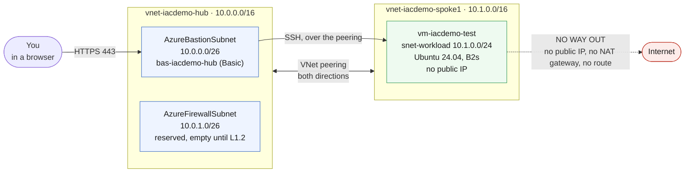

# L1.1 — Core Deployment 🟢

**📍 [Level 1 · Deploy](https://github.com/saulpatinojr/Demo-IaC_Demo_with_VSCode/wiki/Curriculum-Level-1-Deploy)** · Chapter 1 of 4 &nbsp;·&nbsp; Previous: [Start-Here Checklist](https://github.com/saulpatinojr/Demo-IaC_Demo_with_VSCode/wiki/Start-Here-Checklist) &nbsp;·&nbsp; Next: [L2.1 — Monitoring Fundamentals](https://github.com/saulpatinojr/Demo-IaC_Demo_with_VSCode/wiki/Curriculum-L2-1-Monitoring-Fundamentals) &nbsp;·&nbsp; Go deeper: [L1.2 — Architecture Expansion](https://github.com/saulpatinojr/Demo-IaC_Demo_with_VSCode/wiki/Curriculum-L1-2-Architecture-Expansion)

---

**Goal:** deploy the network foundation every later lab builds on — a hub VNet, a peered spoke VNet, Azure Bastion for secure access, and one Linux test VM.

| Who this is for | Time | You need first | Cost while it runs |
|---|---|---|---|
| Lab 1 of 4 · everyone | ~15 min, 10 of it Bastion | A browser, your workshop GitHub account, and your pre-created resource group (named after your account) | 🟢 ~$0.24/hr running total |

> [!IMPORTANT]
> **Your resource group must already exist.** Every lab deploys *into* one; none of them create it. In the classroom yours is already there, named exactly like your GitHub account (e.g. `User01-TechCon`) — there is nothing to create. Self-hosted on your own subscription, create it once:
> ```powershell
> az group create --name "<your-resource-group>" --location eastus2
> ```

## What you're building



<details><summary>Text description of this diagram</summary>

Two virtual networks, peered in both directions. The **hub**
(`vnet-iacdemo-hub`, `10.0.0.0/16`) holds two subnets: `AzureBastionSubnet`
(`10.0.0.0/26`) running the Basic Bastion host, and `AzureFirewallSubnet`
(`10.0.1.0/26`), which L1.1 creates but leaves empty — L1.2 puts the firewall
there. The **spoke** (`vnet-iacdemo-spoke1`, `10.1.0.0/16`) holds
`snet-workload` (`10.1.0.0/24`) with one Ubuntu VM that has no public IP.

You reach the VM by browsing to Bastion over HTTPS; Bastion reaches the VM by
SSH across the peering. Nothing else can reach it.

The dashed red line is the point of this lab: the VM has **no route to the
internet at all**. No public IP, no NAT gateway, and no route table sending
traffic anywhere. In the classroom your prefix is derived from your GitHub
account (`User01-TechCon` → `user01`), so you'll see `vnet-user01-hub` and so
on; `iacdemo` is only the default when running the bare CLI commands without
setting `AZURE_PREFIX`.

</details>

**Source:** [`curriculum/L1.1-core-deployment/main.bicep`](https://github.com/saulpatinojr/Demo-IaC_Demo_with_VSCode/blob/main/curriculum/L1.1-core-deployment/main.bicep) · [`curriculum/L1.1-core-deployment/main.bicepparam`](https://github.com/saulpatinojr/Demo-IaC_Demo_with_VSCode/blob/main/curriculum/L1.1-core-deployment/main.bicepparam)

> [!NOTE]
> **Why Bastion and not a VPN Gateway?** A gateway is the real-world hybrid entry point, but takes 30–45 minutes to deploy. Bastion gives you the same "no public IP on the VM" story in about ten. The commented-out gateway module at the bottom of `main.bicep` shows what the real thing looks like.

<br>

## 🚀 Deploy it — pick any one of three ways

All three deploy the **same** template and give the **same** result. Choose the one you're most comfortable with.

<table>
<tr>
<td align="center" width="240"><br><br><b>1 · Bicep CLI</b><br><sub>Copy-paste in the terminal</sub></td>
<td align="center" width="240"><br><br><b>2 · GitHub Actions</b><br><sub>One button in the browser</sub></td>
<td align="center" width="240"><br><br><b>3 · GitHub Copilot</b><br><sub>Ask AI in plain English</sub></td>
</tr>
</table>

<br>

---

> [!NOTE]
> **🏫 Classroom: use Option 2 (GitHub Actions).** Your Azure account holds Reader, so the local `az deployment` commands in Options 1 and 3 will be refused — deploys go through your fork's workflow, which uses the shared workshop identity automatically. Compiling locally (`az bicep build`) works for everyone.

## &nbsp; Option 1 · Bicep from the terminal

**Best if you like the command line** and want to watch each step happen. Self-hosted only — a classroom (Reader) account can't run `az deployment` locally.

### Do this once (self-hosted)

**Classroom students configure nothing** — the workflow in Option 2 derives everything from your fork: target resource group = your account name (`User01-TechCon`), `AZURE_PREFIX` = its first segment lowercased (`user01`), and the VM and SQL admin passwords default to your account name followed by two exclamation marks (`User01-TechCon!!`). Skip straight to Option 2.

Self-hosted with the CLI, fill in one small file instead of typing variables into every command.

<details><summary><b>Self-hosted only · lab-settings.csv</b></summary>

Copy `lab-settings.csv.example` to **`lab-settings.csv`** in the repo root and fill in the row — it opens in Excel or VS Code:

| Column | What goes in it |
|---|---|
| `AZURE_PREFIX` | Your short name. Lowercase, max 12 characters — it prefixes every resource name. |
| `AZURE_LOCATION` | `eastus2` unless told otherwise. |
| `AZURE_RESOURCE_GROUP` | The group from the callout above. |
| `VM_ADMIN_PASSWORD` | You choose it. **This is the password you SSH with below.** |
| `SQL_ADMIN_PASSWORD` | You choose it. Not used until L1.3, but set it now. |
| `ALERT_EMAIL` | Where L1.3 sends its alert. |

Then load it. Leave `-Persist` off and the values last for this terminal only; add it and they survive new terminals:

```powershell
./scripts/Load-LabSettings.ps1            # this terminal only
./scripts/Load-LabSettings.ps1 -Persist   # also save for future terminals
```

`lab-settings.csv` is in `.gitignore`, so your passwords are never committed.

> [!IMPORTANT]
> **`-Persist` writes your passwords to this machine in plain text** (Windows registry, `HKCU\Environment`), and they stay until removed. **Remove them when you finish:**
> ```powershell
> ./scripts/Load-LabSettings.ps1 -Clear          # just the saved values
> ./scripts/Clear-LabCredentials.ps1             # also sign out of az and gh
> ```
> This workshop is **Windows 11 only**. If you try it on macOS or Linux anyway, `-Persist` does nothing at all — only Windows has a user environment store for it to write to. Re-run the plain command in each new terminal; `lab-settings.csv` is the persistence. Full details on [Cleanup & Reset](https://github.com/saulpatinojr/Demo-IaC_Demo_with_VSCode/wiki/Cleanup-and-Reset).

</details>

### Then deploy

Preview first, then create. Run both from the repo root:

```powershell
az deployment group what-if --resource-group $env:AZURE_RESOURCE_GROUP --parameters curriculum/L1.1-core-deployment/main.bicepparam
az deployment group create  --resource-group $env:AZURE_RESOURCE_GROUP --parameters curriculum/L1.1-core-deployment/main.bicepparam
```

**You should see:** `what-if` lists the resources it would create and changes nothing. `create` takes about ten minutes — Bastion is the slow part — and ends with `"provisioningState": "Succeeded"`.

<br>

---

## &nbsp; Option 2 · GitHub Actions (push-button)

**Best if you'd rather click a button** and let the cloud do the work — and the only option a classroom (Reader) account can use.

> [!NOTE]
> **Classroom: already wired up — nothing to run.** Your fork deploys with the shared workshop identity, and the workflow derives the resource group, prefix and passwords from your fork's owner. No repo secrets or variables are needed — `gh secret list` showing *no secrets found* is the normal, correct state. **Self-hosted:** run the one-time `./scripts/Setup-Oidc.ps1` per the [Deployment Guide](https://github.com/saulpatinojr/Demo-IaC_Demo_with_VSCode/wiki/Deployment-Guide).

### Then deploy

On GitHub: **Actions → "Curriculum L1.1 - Core Deployment" → Run workflow**. Prefer the terminal? `gh workflow run curriculum-l1-1-core-deployment.yml`.

**You should see:** three steps run in order — **Lint → What-if → Deploy** — and a green tick. It signs in with OIDC, so no password is stored anywhere.

<br>

---

## &nbsp; Option 3 · GitHub Copilot (plain English)

**Best if you'd rather describe what you want** and have AI change the template and deploy it for you. The deploy step is self-hosted only (classroom accounts hold Reader) — though Copilot's *editing* and `az bicep build` work for everyone.

Copilot runs the deploy **locally**, so (self-hosted) load your values once first — same file as Option 1: `./scripts/Load-LabSettings.ps1`.

Open **Copilot Chat → Agent mode** and paste:

> Deploy `curriculum/L1.1-core-deployment/main.bicep` to my lab resource group (`$env:AZURE_RESOURCE_GROUP`) with `az deployment group create`.

**Want to change something first?** Just ask — for example:

> Add a `snet-data` subnet `10.1.2.0/24` to the spoke VNet, run `az bicep build` to check it, then deploy.

Copilot edits the Bicep, verifies it compiles, and runs the deploy. If a command errors, paste the message back and it fixes it.

<br>

---

## ✅ Verify it

1. **Reach the VM through Bastion** — in the Portal, open `vm-<your prefix>-test` → **Connect → Bastion**, and sign in as `azureuser` with your VM password: your account name followed by two exclamation marks (e.g. `User01-TechCon!!`) unless you overrode the secret. (Self-hosted: the `VM_ADMIN_PASSWORD` you set.)

   **You should see:** a shell prompt in your browser. The VM has no public IP, so this is the only way in.

2. **Confirm there is no way out yet** — in that SSH session:

   ```bash
   curl -s -m 5 ifconfig.me || echo "NO EGRESS - as designed"
   ```

   **You should see:** the command hang for five seconds and print `NO EGRESS - as designed`. **That is the correct result.** The VM has no public IP, no NAT gateway and no route to a firewall, and [default outbound access was retired on 30 September 2025](https://azure.microsoft.com/en-us/updates?id=default-outbound-access-for-vms-in-azure-will-be-retired-transition-to-a-new-method-of-internet-access) — so a VM in a new VNet gets no internet unless you give it one explicitly. L1.2 is what gives it one. You will run this exact command again at the end of L2.

3. **Confirm the peering is live** — from your machine:

   ```powershell
   az network vnet peering list --resource-group $env:AZURE_RESOURCE_GROUP --vnet-name "vnet-$env:AZURE_PREFIX-spoke1" -o table
   ```

   **You should see:** one peering with `PeeringState` of `Connected`. Anything else means traffic between the VNets will not flow.

>  **GitHub feature spotlight · Manual workflows and the run log**
>
> **You just used it:** every deploy workflow here is `workflow_dispatch` only — it runs when a person clicks **Run workflow**, never automatically on a push. Nobody deploys to Azure by accident.
> **Find it:** the **Actions** tab → *Deploy L1.1 - Hub & Spoke* → your run. Expand any step to see the exact `az` command and everything it printed.
> **Beyond the lab:** that run is a permanent, timestamped, linkable record of who deployed what and when — an audit trail you get for free, instead of screenshots and "who ran the deploy?" in chat.
> [Docs →](https://docs.github.com/actions/using-workflows/manually-running-a-workflow)

<br>

---

## ➡️ What carries forward

L1.2 deploys an Azure Firewall into the hub's reserved `AzureFirewallSubnet`, adds a `snet-web` subnet to this spoke, and routes **this** subnet's traffic through the firewall too — which is what finally gives the test VM its internet access.


## 🧭 Where next?

| Your situation | Go to |
|---|---|
| **Continue the main path — monitor what you just built** | **[L2.1 — Monitoring Fundamentals](https://github.com/saulpatinojr/Demo-IaC_Demo_with_VSCode/wiki/Curriculum-L2-1-Monitoring-Fundamentals)** |
| Go deeper in Level 1 instead — add the firewall + web tier ($1.25/hr!) | [L1.2 — Architecture Expansion](https://github.com/saulpatinojr/Demo-IaC_Demo_with_VSCode/wiki/Curriculum-L1-2-Architecture-Expansion) |
| Skip ahead to the app tier — L1.3 doesn't need L1.2 | [L1.3 — Multi-Service Application](https://github.com/saulpatinojr/Demo-IaC_Demo_with_VSCode/wiki/Curriculum-L1-3-Multi-Service-Application) |
| Done for the day — Bastion bills while idle | [Cleanup & Reset](https://github.com/saulpatinojr/Demo-IaC_Demo_with_VSCode/wiki/Cleanup-and-Reset) |
| Something didn't work | [Troubleshooting](https://github.com/saulpatinojr/Demo-IaC_Demo_with_VSCode/wiki/Troubleshooting) |
| See every chapter, cost and prerequisite | [🗺️ Curriculum Map](https://github.com/saulpatinojr/Demo-IaC_Demo_with_VSCode/wiki/Curriculum-Map) |
