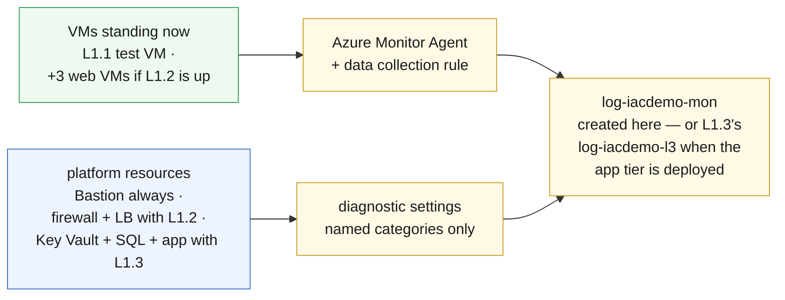

# L2.1 — Monitoring Fundamentals 🔵

**📍 [Level 2 · Monitor](https://github.com/saulpatinojr/Demo-IaC_Demo_with_VSCode/wiki/Curriculum-Level-2-Monitor)** · Chapter 1 of 4 &nbsp;·&nbsp; Previous: [L1.1 — Core Deployment](https://github.com/saulpatinojr/Demo-IaC_Demo_with_VSCode/wiki/Curriculum-L1-1-Core-Deployment) &nbsp;·&nbsp; Next: [L3.1 — Security Foundation](https://github.com/saulpatinojr/Demo-IaC_Demo_with_VSCode/wiki/Curriculum-L3-1-Security-Foundation) · Go deeper: [L2.2 — Operational Visibility](https://github.com/saulpatinojr/Demo-IaC_Demo_with_VSCode/wiki/Curriculum-L2-2-Operational-Visibility)

---

**Goal:** point everything you've built so far at **one** Log Analytics
workspace. Nothing here has an hourly rate — from this chapter on you pay per
**GB collected**.

**The IaC lesson:** one template wires up whatever is standing — agent
installs and diagnostic settings that would otherwise be dozens of portal
clicks, done identically every time.

<br>

| Who this is for | Time | You need first | Cost while it runs |
|---|---|---|---|
| Chapter 1 of Level 2 · everyone | ~15 min | **L1.1 only** | 🔵 ~$0.06/hr added · ~$1.90/hr running total |

> [!IMPORTANT]
> **Only L1.1 needs to be deployed.** On the main path this template creates
> its own small workspace, `log-<prefix>-mon`, and monitors the core estate —
> the test VM gets the agent and a data collection rule, Bastion gets a
> diagnostic setting. If you went south in Level 1 first, flip the workflow's
> **`include_web_tier`** / **`include_app_tier`** switches to monitor those
> tiers too; the app-tier switch also moves everything onto `log-<prefix>-l3`,
> the workspace L1.3 made, so the estate keeps **one** workspace for L5's
> Sentinel later.

<br>

## What you're building

Two collection paths, one destination. VMs get an **agent** that gathers what
a **data collection rule** tells it to. Platform resources (Bastion always;
firewall and load balancer with the web tier; Key Vault, SQL and container app
with the app tier) get **diagnostic settings** — no agent, nothing to install.
Both paths land in one workspace: `log-<prefix>-mon`, which this template
creates, or L1.3's `log-<prefix>-l3` when the app tier is standing.



<details><summary>Text description of this diagram</summary>

Two collection paths converge on one workspace.

Every VM standing gets the Azure Monitor Agent extension, associated with the
data collection rule `dcr-iacdemo-vm`. On the main path that is one VM — the
L1.1 test VM; with L1.2 deployed and `include_web_tier` ticked, the three web
VMs join it. The rule decides *what* the agent gathers — six performance
counters every 60 seconds and syslog at warning level and above.

The platform resources each get a diagnostic setting that forwards named log
categories. No agent involved. Bastion is always included; the firewall and
internal load balancer join with the web tier, and Key Vault, SQL database
and the container app join with the app tier.

Where it all lands depends on which mode you are in. On the main path
(L1.1 → L2.1) the template creates a small workspace of its own,
`log-iacdemo-mon`, so the chapter stands on the core alone. With
`include_app_tier` on, it instead reuses `log-iacdemo-l3` — the workspace
**L1.3 already created** — promoting it from an app-scoped workspace to the
platform workspace for the whole estate rather than creating a second one.
That reuse is the architectural teaching point once the app tier exists.

</details>

**Source:** [`curriculum/L2.1-monitoring-fundamentals/main.bicep`](https://github.com/saulpatinojr/Demo-IaC_Demo_with_VSCode/blob/main/curriculum/L2.1-monitoring-fundamentals/main.bicep) · [`main.bicepparam`](https://github.com/saulpatinojr/Demo-IaC_Demo_with_VSCode/blob/main/curriculum/L2.1-monitoring-fundamentals/main.bicepparam)

<br>

<details><summary><b>🔍 Going deeper — why named categories, not <code>allLogs</code></b></summary>

<br>

`allLogs` on the firewall alone would out-ingest everything else in this
chapter combined, for data no later chapter reads. The template collects
`AZFWNetworkRule` and `AZFWApplicationRule` — "what did it allow" and "what
did it block" — which is exactly what the L2.2 queries need.

Choosing categories *is* the cost control. That single decision is what lets
Level 5 put Microsoft Sentinel on a workspace that already has the whole
estate in it, instead of starting again.

</details>

<details><summary><b>🔍 Going deeper — the permissions this needs</b></summary>

<table>
<tr>
<td width="72" align="center" valign="top"></td>
<td valign="top">
<b>Azure RBAC</b><br><br>
<b>Contributor</b> on the lab resource group — held by the <i>shared workshop deploy identity</i> your fork's workflow signs in as. Classroom accounts themselves hold <b>Reader</b>, which is why deploys go through GitHub Actions.<br>
<sub>Why: the template installs a VM extension, creates a data collection rule and writes diagnostic settings onto resources another template owns. All three are ordinary resource writes. <b>Monitoring Contributor</b> plus <b>Virtual Machine Contributor</b> is the least-privilege equivalent for production.</sub>
</td>
</tr>
<tr>
<td width="72" align="center" valign="top"></td>
<td valign="top">
<b>Microsoft Entra ID roles</b><br><br>
<b>None.</b><br>
<sub>Nothing here touches directory objects. The agent authenticates with the VM's own managed identity, which already exists.</sub>
</td>
</tr>
</table>

<sub><a href="https://learn.microsoft.com/azure/role-based-access-control/built-in-roles/monitor">For more info</a> — Azure built-in roles for monitoring</sub>

</details>

<br>

---

> [!NOTE]
> **🏫 Classroom: use the GitHub Actions option.** Your Azure account holds Reader, so local `az deployment` commands will be refused — deploys go through your fork's workflow, which uses the shared workshop identity automatically. Compiling locally (`az bicep build`) works for everyone.

## 🚀 Deploy it — pick any one of three ways

All three deploy the **same** template and give the **same** result.

<table>
<tr>
<td align="center" width="240"><br><br><b>1 · Bicep CLI</b><br><sub>Copy-paste in the terminal</sub></td>
<td align="center" width="240"><br><br><b>2 · GitHub Actions</b><br><sub>One button in the browser</sub></td>
<td align="center" width="240"><br><br><b>3 · GitHub Copilot</b><br><sub>Ask AI in plain English</sub></td>
</tr>
</table>

<br>

---

## &nbsp; Option 1 · Bicep from the terminal

Your values are already loaded from `lab-settings.csv` (set up in L1.1) — nothing
to re-type.

```powershell
az deployment group what-if --resource-group $env:AZURE_RESOURCE_GROUP --parameters curriculum/L2.1-monitoring-fundamentals/main.bicepparam
az deployment group create  --resource-group $env:AZURE_RESOURCE_GROUP --parameters curriculum/L2.1-monitoring-fundamentals/main.bicepparam
```

**You should see:** a `monitoredVmNames` output listing every VM standing, and
a `diagnosticSettingsApplied` count to match — on the main path that is one VM
and 1 setting (Bastion); with every tier up, four VMs and 6 settings.

**Match the switches to what is actually deployed** — skipped or tore down
L1.2? Deployed L1.3 and want its resources monitored (and its workspace
reused)?

```powershell
$env:CURRICULUM_INCLUDE_WEB_TIER = "false"
$env:CURRICULUM_INCLUDE_APP_TIER = "true"
```

<br>

---

## &nbsp; Option 2 · GitHub Actions (push-button)

On GitHub: **Actions → "Curriculum L2 - Operations & Monitoring" → Run
workflow**, then pick **L2.1 - Monitoring Fundamentals** from the dropdown.

Three inputs matter, and the tier switches **default to off** — the main-path
run needs no ticking at all:

- **`include_web_tier`** — tick only while L1.2's firewall and web VMs stand.
- **`include_app_tier`** — tick only when L1.3 is deployed; it also switches
  everything onto L1.3's workspace instead of creating `log-<prefix>-mon`.
- **Stop after what-if** — shows every change and deploys nothing. Worth one
  run on its own: this is the first template in the curriculum that changes
  resources somebody else's template owns.

**You should see:** **Lint → What-if → Deploy**, then a run summary with the
template outputs.

<br>

---

## &nbsp; Option 3 · GitHub Copilot (plain English)

Copilot runs the deploy **locally**, so load your values once first (same file
as Option 1): `./scripts/Load-LabSettings.ps1`.

Open **Copilot Chat → Agent mode**:

> Deploy `curriculum/L2.1-monitoring-fundamentals/main.bicep` to my lab resource group (`$env:AZURE_RESOURCE_GROUP`) with `az deployment group create`.

**Want to see the cost dial move?** Ask:

> In `curriculum/L2.1-monitoring-fundamentals/main.bicep`, add the `AZFWDnsQuery` category to the firewall diagnostic setting, run `az bicep build`, then show me a what-if.

Then decide whether you want it. That is the whole skill this chapter teaches.

<br>

---

## ✅ Verify it

1. **The agents are reporting** — every VM should appear within about 10
   minutes. On the main path the workspace is `log-<prefix>-mon`; if you
   deployed with `include_app_tier` on, query `log-<prefix>-l3` instead:

   ```powershell
   $WS = az monitor log-analytics workspace show -g $env:AZURE_RESOURCE_GROUP `
     -n "log-$env:AZURE_PREFIX-mon" --query customerId -o tsv
   az monitor log-analytics query --workspace $WS `
     --analytics-query "Heartbeat | summarize LastSeen=max(TimeGenerated) by Computer" -o table
   ```

   **You should see:** one row per VM standing — just the L1.1 test VM on the
   main path, four rows once the L1.2 web VMs are in play.

2. **The rule is actually attached** — an unassociated agent collects nothing,
   and it is the most common "why is there no data?" in Azure Monitor:

   ```powershell
   az monitor data-collection rule association list-by-rule `
     --rule-name "dcr-$env:AZURE_PREFIX-vm" -g $env:AZURE_RESOURCE_GROUP -o table
   ```

   **You should see:** one association per VM.

3. **Platform logs are arriving** — the diagnostic settings path, no agent
   involved:

   ```powershell
   az monitor log-analytics query --workspace $WS `
     --analytics-query "union AzureDiagnostics, AZFWNetworkRule, AZFWApplicationRule | summarize Rows=count() by Type" -o table
   ```

   **You should see:** on the main path, Bastion rows in `AzureDiagnostics`
   once you have opened a Bastion session to the test VM. With the web tier
   on, the firewall tables appear too once traffic has passed through it —
   quiet firewall, no rows; generate some by curling out from a web VM, the
   same test you ran in L1.2.

4. **Find out what it costs** — the point of the chapter:

   ```powershell
   az monitor log-analytics query --workspace $WS `
     --analytics-query "Usage | where TimeGenerated > ago(24h) | summarize GB=sum(Quantity)/1000 by DataType | order by GB desc" -o table
   ```

   **You should see:** a ranked list of what you are paying for. At $2.76/GB,
   multiply the total by 2.76 for a daily rate. Write the number down — L2.4
   asks you to beat it.

<br>

>  **GitHub feature spotlight · One workflow, many chapters**
>
> **You just used it:** the Actions run asked you *which chapter* instead of
> making you find one of eighteen near-identical workflows. That is a
> `workflow_dispatch` **choice input**, and the chapter-to-path mapping lives in
> a single `case` statement in the workflow.
> **Find it:** `.github/workflows/curriculum-l2-operations.yml` — adding a
> chapter is two lines, one option and one case.
> **Beyond the lab:** typed inputs (choice, boolean) turn a workflow into a
> small internal tool, and the `include_web_tier` / `include_app_tier`
> booleans are the same mechanism a real pipeline uses for environment flags.
> [Docs →](https://docs.github.com/actions/using-workflows/workflow-syntax-for-github-actions#onworkflow_dispatchinputs)

<br>

---

## ➡️ What carries forward

On the main path, L3.1 checks the security of the estate you have now
instrumented. If you go deeper instead, L2.2 writes queries against exactly
this data — the perf counters, the syslog, and whatever categories you chose
here. Anything you did not collect in this chapter is a query you cannot
write there.

<br>

## 🧭 Where next?

| Your situation | Go to |
|---|---|
| **Continue the main path — check the security of what you built** | **[L3.1 — Security Foundation](https://github.com/saulpatinojr/Demo-IaC_Demo_with_VSCode/wiki/Curriculum-L3-1-Security-Foundation)** |
| Go deeper — turn this data into answers | [L2.2 — Operational Visibility](https://github.com/saulpatinojr/Demo-IaC_Demo_with_VSCode/wiki/Curriculum-L2-2-Operational-Visibility) (needs L1.3) |
| See every chapter, cost and prerequisite | [🗺️ Curriculum Map](https://github.com/saulpatinojr/Demo-IaC_Demo_with_VSCode/wiki/Curriculum-Map) |
| Want the big picture of this level first | [Level 2 · Monitor overview](https://github.com/saulpatinojr/Demo-IaC_Demo_with_VSCode/wiki/Curriculum-Level-2-Monitor) |
| Done for the day — the estate bills while idle | [Cleanup & Reset](https://github.com/saulpatinojr/Demo-IaC_Demo_with_VSCode/wiki/Cleanup-and-Reset) |
| Something didn't work | [Troubleshooting](https://github.com/saulpatinojr/Demo-IaC_Demo_with_VSCode/wiki/Troubleshooting) |
