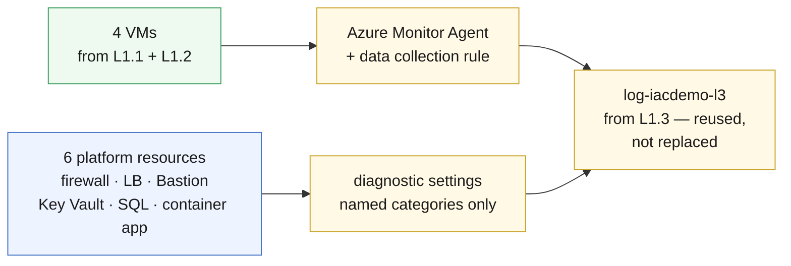

# L2.1 — Monitoring Fundamentals 🔵

**📍 [Level 2 · Monitor](https://github.com/saulpatinojr/Demo-IaC_Demo_with_VSCode/wiki/Curriculum-Level-2-Monitor)** · Chapter 1 of 4 &nbsp;·&nbsp; Previous: [L1.4 — Production-Ready Platform](https://github.com/saulpatinojr/Demo-IaC_Demo_with_VSCode/wiki/Curriculum-L1-4-Production-Platform) &nbsp;·&nbsp; Next: [L2.2 — Operational Visibility](https://github.com/saulpatinojr/Demo-IaC_Demo_with_VSCode/wiki/Curriculum-L2-2-Operational-Visibility)

---

**Goal:** point everything Level 1 built at **one** Log Analytics workspace.
Nothing new gets deployed and nothing here has an hourly rate — from this
chapter on you pay per **GB collected**.

**The IaC lesson:** one template wires up an entire estate — four agent
installs and six diagnostic settings that would otherwise be forty portal
clicks, done identically every time.

<br>

| Who this is for | Time | You need first | Cost while it runs |
|---|---|---|---|
| Chapter 1 of Level 2 · everyone | ~15 min | **All of Level 1** (chapters L1.1–L1.4) | 🔵 ~$0.06/hr added · ~$1.90/hr running total |

> [!IMPORTANT]
> **Level 1 must already be deployed.** This template creates no workspace — it
> reuses `log-<prefix>-l3`, the one L1.3 made.

<br>

## What you're building

Two collection paths, one destination. VMs get an **agent** that gathers what
a **data collection rule** tells it to. Platform resources (firewall, load
balancer, Bastion, Key Vault, SQL, container app) get **diagnostic settings** —
no agent, nothing to install. Both land in the workspace L1.3 already created.



<details><summary>Text description of this diagram</summary>

Two collection paths converge on one workspace.

The four VMs (the L1.1 test VM and the three L1.2 web VMs) get the Azure
Monitor Agent extension, associated with the data collection rule
`dcr-iacdemo-vm`. The rule decides *what* the agent gathers — six performance
counters every 60 seconds and syslog at warning level and above.

The six platform resources (firewall, internal load balancer, Bastion host,
Key Vault, SQL database, container app) each get a diagnostic setting that
forwards named log categories. No agent involved.

Both paths land in `log-iacdemo-l3` — the workspace **L1.3 already created**.
This chapter promotes it from an app-scoped workspace to the platform
workspace for the whole estate rather than creating a second one.

</details>

**Source:** [`curriculum/L2.1-monitoring-fundamentals/main.bicep`](https://github.com/saulpatinojr/Demo-IaC_Demo_with_VSCode/blob/main/curriculum/L2.1-monitoring-fundamentals/main.bicep) · [`main.bicepparam`](https://github.com/saulpatinojr/Demo-IaC_Demo_with_VSCode/blob/main/curriculum/L2.1-monitoring-fundamentals/main.bicepparam)

<br>

<details><summary><b>🔍 Going deeper — why named categories, not <code>allLogs</code></b></summary>

<br>

`allLogs` on the firewall alone would out-ingest everything else in this
chapter combined, for data no later chapter reads. The template collects
`AZFWNetworkRule` and `AZFWApplicationRule` — "what did it allow" and "what
did it block" — which is exactly what the L2.2 queries need.

Choosing categories *is* the cost control. That single decision is what lets
Level 5 put Microsoft Sentinel on a workspace that already has the whole
estate in it, instead of starting again.

</details>

<details><summary><b>🔍 Going deeper — the permissions this needs</b></summary>

<table>
<tr>
<td width="72" align="center" valign="top"></td>
<td valign="top">
<b>Azure RBAC</b><br><br>
<b>Contributor</b> on the lab resource group — what <code>Setup-Oidc.ps1</code> already granted you.<br>
<sub>Why: the template installs a VM extension, creates a data collection rule and writes diagnostic settings onto resources another template owns. All three are ordinary resource writes. <b>Monitoring Contributor</b> plus <b>Virtual Machine Contributor</b> is the least-privilege equivalent for production.</sub>
</td>
</tr>
<tr>
<td width="72" align="center" valign="top"></td>
<td valign="top">
<b>Microsoft Entra ID roles</b><br><br>
<b>None.</b><br>
<sub>Nothing here touches directory objects. The agent authenticates with the VM's own managed identity, which already exists.</sub>
</td>
</tr>
</table>

<sub><a href="https://learn.microsoft.com/azure/role-based-access-control/built-in-roles/monitor">For more info</a> — Azure built-in roles for monitoring</sub>

</details>

<br>

---

## 🚀 Deploy it — pick any one of three ways

All three deploy the **same** template and give the **same** result.

<table>
<tr>
<td align="center" width="240"><br><br><b>1 · Bicep CLI</b><br><sub>Copy-paste in the terminal</sub></td>
<td align="center" width="240"><br><br><b>2 · GitHub Actions</b><br><sub>One button in the browser</sub></td>
<td align="center" width="240"><br><br><b>3 · GitHub Copilot</b><br><sub>Ask AI in plain English</sub></td>
</tr>
</table>

<br>

---

## &nbsp; Option 1 · Bicep from the terminal

Your values are already loaded from `lab-settings.csv` (set up in L1.1) — nothing
to re-type.

```powershell
az deployment group what-if --resource-group $env:AZURE_RESOURCE_GROUP --parameters curriculum/L2.1-monitoring-fundamentals/main.bicepparam
az deployment group create  --resource-group $env:AZURE_RESOURCE_GROUP --parameters curriculum/L2.1-monitoring-fundamentals/main.bicepparam
```

**You should see:** a `monitoredVmNames` output listing four VMs, and
`diagnosticSettingsApplied` of 6.

**Tore L1.2 down to save money?** Then say so, and the firewall, load balancer
and three web VMs are skipped:

```powershell
$env:CURRICULUM_INCLUDE_WEB_TIER = "false"
```

<br>

---

## &nbsp; Option 2 · GitHub Actions (push-button)

On GitHub: **Actions → "Curriculum L2 - Operations & Monitoring" → Run
workflow**, then pick **L2.1 - Monitoring Fundamentals** from the dropdown.

Two inputs matter:

- **L1.2 is still deployed** — untick if you tore the firewall down.
- **Stop after what-if** — shows every change and deploys nothing. Worth one
  run on its own: this is the first template in the curriculum that changes
  resources somebody else's template owns.

**You should see:** **Lint → What-if → Deploy**, then a run summary with the
template outputs.

<br>

---

## &nbsp; Option 3 · GitHub Copilot (plain English)

Copilot runs the deploy **locally**, so load your values once first (same file
as Option 1): `./scripts/Load-LabSettings.ps1`.

Open **Copilot Chat → Agent mode**:

> Deploy `curriculum/L2.1-monitoring-fundamentals/main.bicep` to my lab resource group (`$env:AZURE_RESOURCE_GROUP`) with `az deployment group create`.

**Want to see the cost dial move?** Ask:

> In `curriculum/L2.1-monitoring-fundamentals/main.bicep`, add the `AZFWDnsQuery` category to the firewall diagnostic setting, run `az bicep build`, then show me a what-if.

Then decide whether you want it. That is the whole skill this chapter teaches.

<br>

---

## ✅ Verify it

1. **The agents are reporting** — every VM should appear within about 10 minutes:

   ```powershell
   $WS = az monitor log-analytics workspace show -g $env:AZURE_RESOURCE_GROUP `
     -n "log-$env:AZURE_PREFIX-l3" --query customerId -o tsv
   az monitor log-analytics query --workspace $WS `
     --analytics-query "Heartbeat | summarize LastSeen=max(TimeGenerated) by Computer" -o table
   ```

   **You should see:** four rows — the L1.1 test VM and the three L1.2 web VMs.

2. **The rule is actually attached** — an unassociated agent collects nothing,
   and it is the most common "why is there no data?" in Azure Monitor:

   ```powershell
   az monitor data-collection rule association list-by-rule `
     --rule-name "dcr-$env:AZURE_PREFIX-vm" -g $env:AZURE_RESOURCE_GROUP -o table
   ```

   **You should see:** one association per VM.

3. **Platform logs are arriving** — the diagnostic settings path, no agent
   involved:

   ```powershell
   az monitor log-analytics query --workspace $WS `
     --analytics-query "union AzureDiagnostics, AZFWNetworkRule, AZFWApplicationRule | summarize Rows=count() by Type" -o table
   ```

   **You should see:** at least the firewall tables once traffic has passed
   through it. Quiet firewall, no rows — generate some by curling out from a
   web VM, the same test you ran in L1.2.

4. **Find out what it costs** — the point of the chapter:

   ```powershell
   az monitor log-analytics query --workspace $WS `
     --analytics-query "Usage | where TimeGenerated > ago(24h) | summarize GB=sum(Quantity)/1000 by DataType | order by GB desc" -o table
   ```

   **You should see:** a ranked list of what you are paying for. At $2.76/GB,
   multiply the total by 2.76 for a daily rate. Write the number down — L2.4
   asks you to beat it.

<br>

>  **GitHub feature spotlight · One workflow, many chapters**
>
> **You just used it:** the Actions run asked you *which chapter* instead of
> making you find one of eighteen near-identical workflows. That is a
> `workflow_dispatch` **choice input**, and the chapter-to-path mapping lives in
> a single `case` statement in the workflow.
> **Find it:** `.github/workflows/curriculum-l2-operations.yml` — adding a
> chapter is two lines, one option and one case.
> **Beyond the lab:** typed inputs (choice, boolean) turn a workflow into a
> small internal tool, and the boolean you ticked for "L1.2 is still deployed"
> is the same mechanism a real pipeline uses for environment flags.
> [Docs →](https://docs.github.com/actions/using-workflows/workflow-syntax-for-github-actions#onworkflow_dispatchinputs)

<br>

---

## ➡️ What carries forward

L2.2 writes queries against exactly this data — the perf counters, the syslog,
and the firewall categories you chose here. Anything you did not collect in
this chapter is a query you cannot write in the next one.

<br>

## 🧭 Where next?

| Your situation | Go to |
|---|---|
| Ready to keep going — turn this data into answers | **[L2.2 — Operational Visibility](https://github.com/saulpatinojr/Demo-IaC_Demo_with_VSCode/wiki/Curriculum-L2-2-Operational-Visibility)** |
| Want the big picture of this level first | [Level 2 · Monitor overview](https://github.com/saulpatinojr/Demo-IaC_Demo_with_VSCode/wiki/Curriculum-Level-2-Monitor) |
| Done for the day — the estate bills while idle | [Cleanup & Reset](https://github.com/saulpatinojr/Demo-IaC_Demo_with_VSCode/wiki/Cleanup-and-Reset) |
| Something didn't work | [Troubleshooting](https://github.com/saulpatinojr/Demo-IaC_Demo_with_VSCode/wiki/Troubleshooting) |
