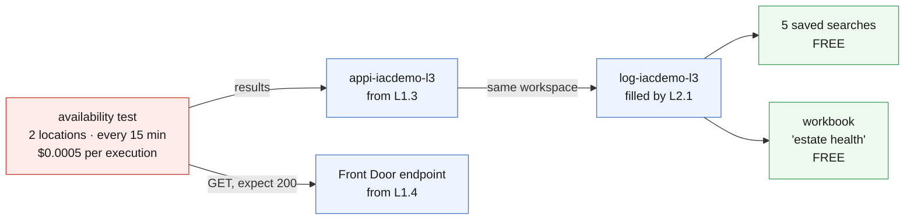

# L2.2 — Operational Visibility 🔵

**📍 [Level 2 · Monitor](https://github.com/saulpatinojr/Demo-IaC_Demo_with_VSCode/wiki/Curriculum-Level-2-Monitor)** · Chapter 2 of 4 &nbsp;·&nbsp; Previous: [L2.1 — Monitoring Fundamentals](https://github.com/saulpatinojr/Demo-IaC_Demo_with_VSCode/wiki/Curriculum-L2-1-Monitoring-Fundamentals) &nbsp;·&nbsp; Next: [L2.3 — Proactive Operations](https://github.com/saulpatinojr/Demo-IaC_Demo_with_VSCode/wiki/Curriculum-L2-3-Proactive-Operations)

---

**Goal:** turn the data L2.1 started collecting into answers — a query library
saved into the workspace, a workbook that puts the whole estate on one page,
and an availability test against L1.4's Front Door endpoint.

**The IaC lesson:** dashboards as code. The workbook is a Bicep object, so
"someone changed the dashboard" is a reviewable diff with an author — not a
mystery portal edit.

<br>

| Who this is for | Time | You need first | Cost while it runs |
|---|---|---|---|
| Chapter 2 of Level 2 · everyone | ~15 min | **L2.1**, plus L1.3 and L1.4 | 🔵 ~$0.02/hr added · ~$1.92/hr running total |

> [!IMPORTANT]
> **L2.1 must already be deployed.** There is nothing to query otherwise — the
> workbook would render five empty tiles.

<br>

## What you're building

Queries, workbooks and saved searches are **free** — in the Analytics tier you
pay on the way in, not to look. The availability test is the only meter in
this chapter, and its frequency is the whole bill.



<details><summary>Text description of this diagram</summary>

Two halves, split by whether they cost anything.

On the free side, the workspace that L2.1 filled gets five **saved searches**
(VM heartbeat, VM CPU, syslog errors, firewall verdicts, and ingestion cost by
table) and a **workbook** that renders four of them on one page.

On the paid side, a **standard availability test** issues a GET against the
Front Door endpoint L1.4 created, from two Azure regions every fifteen
minutes, expecting HTTP 200 and a certificate with at least a week left.
Results flow into the Application Insights component from L1.3, which writes
to the same workspace — so a failed probe is queryable next to the firewall
logs that might explain it.

The red box is the only meter in the chapter: $0.0005 per execution.

</details>

**Source:** [`curriculum/L2.2-operational-visibility/main.bicep`](https://github.com/saulpatinojr/Demo-IaC_Demo_with_VSCode/blob/main/curriculum/L2.2-operational-visibility/main.bicep) · [`main.bicepparam`](https://github.com/saulpatinojr/Demo-IaC_Demo_with_VSCode/blob/main/curriculum/L2.2-operational-visibility/main.bicepparam)

<br>

<details><summary><b>🔍 Going deeper — the arithmetic of a probe</b></summary>

<br>

The cost is `(3600 ÷ frequency) × locations × $0.0005` per hour:

| Cadence | Locations | Executions/hr | Cost |
|---|---|---|---|
| 15 min *(this template)* | 2 | 8 | ~$0.004/hr (~$2.90/mo) |
| 5 min *(portal default)* | 5 | 60 | ~$0.03/hr (~$21.90/mo) |

The portal default costs more per hour than every other thing Level 2 adds
put together. It is the right answer for a revenue-bearing endpoint and the
wrong one for a lab — knowing which you are looking at is the skill.

</details>

<details><summary><b>🔍 Going deeper — the permissions this needs</b></summary>

<table>
<tr>
<td width="72" align="center" valign="top"></td>
<td valign="top">
<b>Azure RBAC</b><br><br>
<b>Contributor</b> on the lab resource group.<br>
<sub>Why: workbooks, saved searches and availability tests are all ordinary resources. <b>Monitoring Contributor</b> alone covers every one of them — the first chapter where the least-privilege role is genuinely enough.</sub>
</td>
</tr>
<tr>
<td width="72" align="center" valign="top"></td>
<td valign="top">
<b>Microsoft Entra ID roles</b><br><br>
<b>None.</b><br>
<sub>Availability tests run from Microsoft-operated regions and need no identity of yours.</sub>
</td>
</tr>
</table>

<sub><a href="https://learn.microsoft.com/azure/role-based-access-control/built-in-roles/monitor">For more info</a> — Azure built-in roles for monitoring</sub>

</details>

<br>

---

## 🚀 Deploy it — pick any one of three ways

<table>
<tr>
<td align="center" width="240"><br><br><b>1 · Bicep CLI</b><br><sub>Copy-paste in the terminal</sub></td>
<td align="center" width="240"><br><br><b>2 · GitHub Actions</b><br><sub>One button in the browser</sub></td>
<td align="center" width="240"><br><br><b>3 · GitHub Copilot</b><br><sub>Ask AI in plain English</sub></td>
</tr>
</table>

<br>

---

## &nbsp; Option 1 · Bicep from the terminal

```powershell
az deployment group what-if --resource-group $env:AZURE_RESOURCE_GROUP --parameters curriculum/L2.2-operational-visibility/main.bicepparam
az deployment group create  --resource-group $env:AZURE_RESOURCE_GROUP --parameters curriculum/L2.2-operational-visibility/main.bicepparam
```

**You should see:** `savedQueryCount` of 5 and
`availabilityTestExecutionsPerHour` of 8. Multiply that by $0.0005 — the
template prints the number so you never have to guess.

**Skipped L1.4, or want this chapter to cost nothing?**

```powershell
$env:CURRICULUM_AVAILABILITY_TEST = "false"
```

<br>

---

## &nbsp; Option 2 · GitHub Actions (push-button)

**Actions → "Curriculum L2 - Operations & Monitoring" → Run workflow**, then
pick **L2.2 - Operational Visibility**.

**You should see:** **Lint → What-if → Deploy**, then a run summary carrying
the execution count and its cost basis.

<br>

---

## &nbsp; Option 3 · GitHub Copilot (plain English)

Load your values first: `./scripts/Load-LabSettings.ps1`. Then in
**Copilot Chat → Agent mode**:

> Deploy `curriculum/L2.2-operational-visibility/main.bicep` to my lab resource group (`$env:AZURE_RESOURCE_GROUP`) with `az deployment group create`.

**Add your own query to the library:**

> In `curriculum/L2.2-operational-visibility/main.bicep`, add a saved search to `savedQueries` that lists the top 10 denied firewall flows by destination in the last hour, add a matching tile to the workbook, run `az bicep build`, then deploy.

The workbook is a Bicep object serialised with `string()`, not a pasted JSON
blob — which is exactly why Copilot can edit it and you can read the diff.

<br>

---

## ✅ Verify it

1. **The query library is there** — this is what a colleague inherits:

   ```powershell
   az monitor log-analytics workspace saved-search list `
     -g $env:AZURE_RESOURCE_GROUP -n "log-$env:AZURE_PREFIX-l3" `
     --query "[?category=='L2.2 Operational Visibility'].displayName" -o table
   ```

   **You should see:** five names. Find them in the portal under
   **Log Analytics → Logs → Queries**.

2. **The workbook renders** — open **Azure Monitor → Workbooks →
   `L2.2 — <prefix> estate health`**.

   **You should see:** heartbeat and CPU tiles populated from L2.1's agent
   data, a firewall verdict chart, and a cost tile. An empty firewall chart
   means no traffic has crossed the firewall since L2.1 — not a broken
   deployment.

3. **The availability test is bound to Application Insights** — the binding is
   a tag, and getting it wrong is the classic failure:

   ```powershell
   az monitor app-insights web-test list -g $env:AZURE_RESOURCE_GROUP -o table
   ```

   **You should see:** `webtest-<prefix>-frontdoor`, enabled. Results appear
   under **Application Insights → Availability** within about 15 minutes. If
   the test exists but the portal shows nothing, the `hidden-link` tag is
   missing.

4. **Break it on purpose** — the only way to know a probe works is to fail one:

   ```powershell
   az afd endpoint update -g $env:AZURE_RESOURCE_GROUP `
     --profile-name "afd-$env:AZURE_PREFIX-$(az afd profile list -g $env:AZURE_RESOURCE_GROUP --query '[0].name' -o tsv | ForEach-Object { $_.Split('-')[-1] })" `
     --endpoint-name "fde-$env:AZURE_PREFIX" --enabled-state Disabled
   ```

   **You should see:** the availability chart drop to 0% within two probe
   intervals, from both locations at once — which is how you tell a real
   outage from one bad network path. Re-enable it afterwards with
   `--enabled-state Enabled`.

<br>

>  **GitHub feature spotlight · Dashboards that live in git**
>
> **You just used it:** the workbook is defined as a Bicep object and serialised
> at compile time, so "someone changed the dashboard" is a diff with an author
> and a reason, not a mystery. A workbook edited in the portal is invisible to
> everyone who was not watching.
> **Find it:** the `workbookContent` variable — the queries in it are the same
> strings as the saved searches, declared once.
> **Beyond the lab:** the same argument applies to alert rules, detections and
> policy. If it changes behaviour, it belongs in a pull request.
> [Docs →](https://docs.github.com/pull-requests/collaborating-with-pull-requests/reviewing-changes-in-pull-requests)

<br>

---

## ➡️ What carries forward

L2.3 turns the queries you just saved into alert rules. The queries that make
good dashboard tiles and the ones that make good alerts are **not the same
set** — that is the argument the next chapter opens with.

<br>

## 🧭 Where next?

| Your situation | Go to |
|---|---|
| Ready to keep going — stop having to look | **[L2.3 — Proactive Operations](https://github.com/saulpatinojr/Demo-IaC_Demo_with_VSCode/wiki/Curriculum-L2-3-Proactive-Operations)** |
| Want the big picture of this level | [Level 2 · Monitor overview](https://github.com/saulpatinojr/Demo-IaC_Demo_with_VSCode/wiki/Curriculum-Level-2-Monitor) |
| Done for the day — the estate bills while idle | [Cleanup & Reset](https://github.com/saulpatinojr/Demo-IaC_Demo_with_VSCode/wiki/Cleanup-and-Reset) |
| Something didn't work | [Troubleshooting](https://github.com/saulpatinojr/Demo-IaC_Demo_with_VSCode/wiki/Troubleshooting) |
