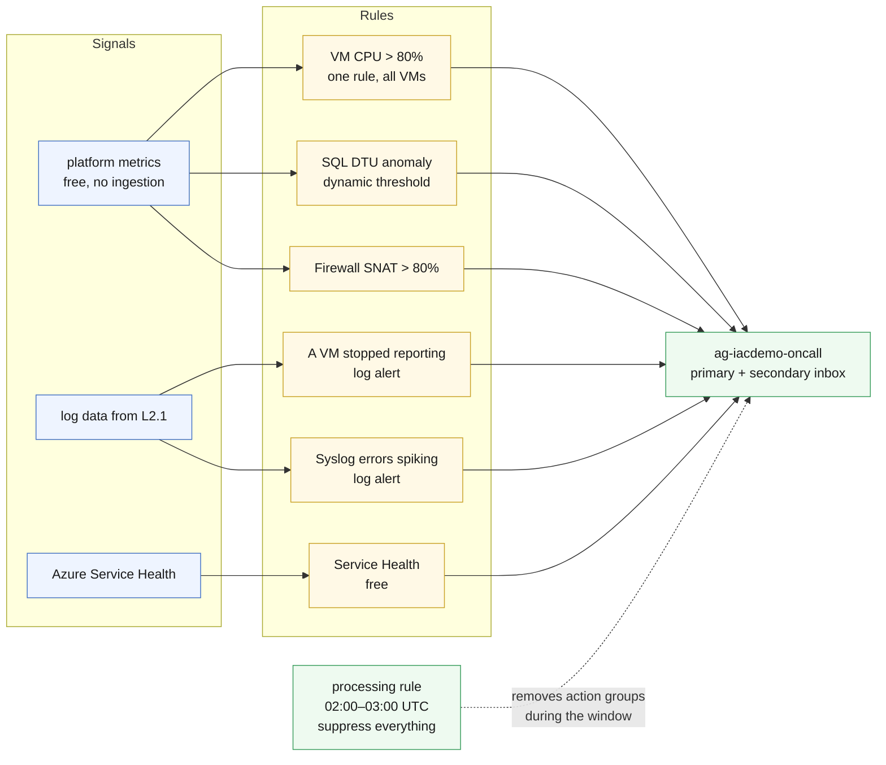

# L2.3 — Proactive Operations 🔵

**Goal:** stop having to look. Metric alerts on the VMs, the database and the
firewall; log alerts on the data L2.1 collects; a Service Health alert for the
failures that are Azure's fault; and an alert processing rule so the nightly
maintenance window does not page anyone.

| Who this is for | Time | You need first | Cost while it runs |
|---|---|---|---|
| Chapter 3 of Level 2 · everyone | ~20 min | **L2.1** and **L2.2** | 🔵 ~$0.01/hr added · ~$1.93/hr running total |

> [!IMPORTANT]
> This chapter creates its **own** action group, `ag-<prefix>-oncall`. It does
> not edit `ag-<prefix>-ops`, the one L1.3 created — two templates owning one
> resource means whichever deployed last wins, and the next L1.3 redeploy would
> silently revert your work. Adding a resource is cheap. Sharing ownership is
> not.

## What you're building



<details><summary>Text description of this diagram</summary>

Three signal sources feed six rules, which all notify one action group.

**Platform metrics** — free, already collected, no ingestion charge — drive
three metric alerts: CPU above 80% across every VM as a single multi-resource
rule, a dynamic-threshold rule on SQL DTU consumption, and SNAT port
utilisation on the firewall.

**Log data from L2.1** drives two scheduled query rules. These catch what
metrics structurally cannot: a VM that stopped reporting emits no metric to
threshold, so only a query over `Heartbeat` can notice its absence.

**Service Health** drives a free activity-log alert — the only rule here that
fires for something you cannot fix, which is exactly why you want it before you
spend an hour debugging your own template.

Everything notifies `ag-iacdemo-oncall`, which has a primary and an optional
secondary inbox. The dotted line is the alert processing rule: between 02:00 and
03:00 UTC it strips the action groups off every alert in the resource group, so
maintenance does not page anyone.

</details>

**Source:** [`curriculum/L2.3-proactive-operations/main.bicep`](https://github.com/saulpatinojr/Demo-IaC_Demo_with_VSCode/blob/main/curriculum/L2.3-proactive-operations/main.bicep) · [`main.bicepparam`](https://github.com/saulpatinojr/Demo-IaC_Demo_with_VSCode/blob/main/curriculum/L2.3-proactive-operations/main.bicepparam)

> [!NOTE]
> **Where is autoscale?** The learning objective is real, but this estate has
> nowhere honest to put it. Azure Monitor autoscale targets virtual machine
> scale sets and App Service plans; the only elastic thing here is the container
> app, and its scale rules live inside `labs/L3-containers/main.bicep` — the
> template that owns it. Adding them from this chapter would recreate exactly
> the shared-ownership problem the callout above warns about. Read the scale
> block in L1.3's template instead, and change it there.

<br>

## 🚀 Deploy it — pick any one of three ways

<table>
<tr>
<td align="center" width="240"><br><br><b>1 · Bicep CLI</b><br><sub>Copy-paste in the terminal</sub></td>
<td align="center" width="240"><br><br><b>2 · GitHub Actions</b><br><sub>One button in the browser</sub></td>
<td align="center" width="240"><br><br><b>3 · GitHub Copilot</b><br><sub>Ask AI in plain English</sub></td>
</tr>
</table>

<br>

---

## &nbsp; Option 1 · Bicep from the terminal

```powershell
az deployment group what-if --resource-group $env:AZURE_RESOURCE_GROUP --parameters curriculum/L2.3-proactive-operations/main.bicepparam
az deployment group create  --resource-group $env:AZURE_RESOURCE_GROUP --parameters curriculum/L2.3-proactive-operations/main.bicepparam
```

**You should see:** `metricAlertCount` 3, `logAlertCount` 2, and a
`monthlyAlertCostBasis` string spelling out what you just signed up for.

**Want a second inbox?** Set it before deploying:

```powershell
$env:ALERT_EMAIL_SECONDARY = "someone.else@example.com"
```

<br>

---

## &nbsp; Option 2 · GitHub Actions (push-button)

**Actions → "Curriculum L2 - Operations & Monitoring" → Run workflow →
L2.3 - Proactive Operations**.

The addresses come from repository variables `ALERT_EMAIL` and
`ALERT_EMAIL_SECONDARY` — the first is the same one the L3 lab already uses, so
a class that set it once does not set it again.

<br>

---

## &nbsp; Option 3 · GitHub Copilot (plain English)

Load your values first: `./scripts/Load-LabSettings.ps1`. Then in
**Copilot Chat → Agent mode**:

> Deploy `curriculum/L2.3-proactive-operations/main.bicep` to my lab resource group (`$env:AZURE_RESOURCE_GROUP`) with `az deployment group create`.

**Turn one of L2.2's saved queries into a rule:**

> In `curriculum/L2.3-proactive-operations/main.bicep`, add a scheduled query rule that fires when the firewall denies more than 50 flows in 15 minutes, using the same query as the `firewall-verdicts` saved search in L2.2. Keep the evaluation frequency at PT15M. Run `az bicep build`, then show me a what-if.

Notice what you had to decide: a threshold, a window, and whether it is worth
$0.50 a month. Every one of those is a judgement, not a lookup.

<br>

---

## ✅ Verify it

1. **The rules exist and are enabled:**

   ```powershell
   az monitor metrics alert list -g $env:AZURE_RESOURCE_GROUP -o table
   az monitor scheduled-query list -g $env:AZURE_RESOURCE_GROUP -o table
   ```

   **You should see:** three metric rules (two if you skipped L1.2) and two
   scheduled query rules.

2. **Make one fire** — load a VM through Bastion and wait for the window:

   ```bash
   sudo apt-get install -y stress-ng && stress-ng --cpu 2 --timeout 900s
   ```

   **You should see:** the CPU rule move to *Fired* within about 15 minutes, and
   mail at your alert address. The rule averages over 15 minutes on purpose — a
   one-minute spike is not an incident, and paging on one is how alert fatigue
   starts.

3. **Prove the log alert catches what metrics cannot** — stop a VM entirely:

   ```powershell
   az vm deallocate -g $env:AZURE_RESOURCE_GROUP -n "vm-$env:AZURE_PREFIX-web2"
   ```

   **You should see:** *A VM stopped reporting* fire within about 15 minutes.
   The CPU metric rule stays silent throughout — a VM that is gone emits no
   metric to threshold. That difference is the whole reason both rule types
   exist. Start it again with `az vm start` afterwards.

4. **Check the suppression window is real:**

   ```powershell
   az monitor alert-processing-rule list -g $env:AZURE_RESOURCE_GROUP -o table
   ```

   **You should see:** `apr-<prefix>-maintenance-window`, enabled, 02:00–03:00
   UTC. Worth saying out loud: during that hour, genuine alerts are swallowed
   too. Suppression is a governance decision, not a convenience.

5. **What it costs:** metric alerts bill $0.10 per monitored metric per month —
   a multi-resource rule over four VMs is four monitored metrics, not one rule.
   Log alerts are $0.50 each at 15-minute evaluation and $1.50 at five. The set
   above is about **$2.30/month**. Service Health and the processing rule are
   free.

>  **GitHub feature spotlight · Repository variables as the notification path**
>
> **You just used it:** `ALERT_EMAIL` and `ALERT_EMAIL_SECONDARY` are repository
> variables, not values baked into a template. The same Bicep deploys to a class
> of thirty people and pages thirty different inboxes.
> **Find it:** **Settings → Secrets and variables → Actions → Variables**. Note
> which one is *not* a secret — an email address is configuration, and treating
> it as a secret would only make it harder to review.
> **Beyond the lab:** the boundary between "secret" and "variable" is the same
> boundary as "who can see the audit log" — get it wrong in either direction and
> something either leaks or becomes unreviewable.
> [Docs →](https://docs.github.com/actions/learn-github-actions/variables#defining-configuration-variables-for-multiple-workflows)

<br>

---

## ➡️ What carries forward

L2.4 asks the governing question: which of these rules would you keep if you ran
a hundred of these environments, what would you collect to feed them, and what
would you stop collecting? It is the first chapter in the curriculum designed to
*reduce* the bill.

**Leave it deployed** → **[back to Level 2 · Monitor](https://github.com/saulpatinojr/Demo-IaC_Demo_with_VSCode/wiki/Curriculum-Level-2-Monitor)**.
