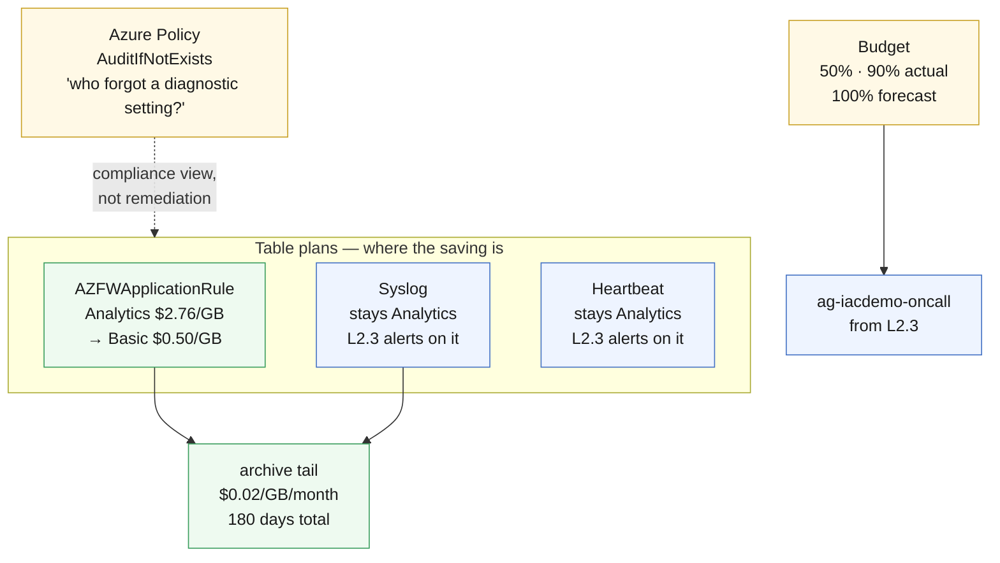

# L2.4 — Enterprise Monitoring Strategy 🔵

**Goal:** decide what a hundred of these environments would collect, and prove
the decision with numbers. This is the only chapter in the curriculum that
should **end with a smaller bill than it started**: high-volume tables move to
the Basic plan, the long tail moves to archive, a policy audits what everyone
forgot, and a budget puts a number on the whole thing.

| Who this is for | Time | You need first | Cost while it runs |
|---|---|---|---|
| Chapter 4 of Level 2 · everyone | ~20 min | **L2.1** and **L2.3** | 🔵 −$0.02/hr net · ~$1.91/hr running total |

> [!TIP]
> Before you deploy, write down today's number:
>
> ```powershell
> az monitor log-analytics query --workspace $WS `
>   --analytics-query "Usage | where TimeGenerated > ago(24h) and IsBillable | summarize GB=sum(Quantity)/1000" -o table
> ```
>
> Come back tomorrow and run it again. This chapter is graded on the difference,
> not on whether the deployment succeeded.

## What you're building



<details><summary>Text description of this diagram</summary>

Three tables, treated differently on purpose.

`AZFWApplicationRule` — the highest-volume table L2.1 turned on — moves to the
**Basic** plan at $0.50/GB instead of $2.76/GB, an 82% cut on that table. It can
move because nothing queries it interactively: it is evidence, not signal.

`Syslog` and `Heartbeat` **stay on Analytics**, and that is not an oversight.
L2.3's alert rules query both, and alert rules cannot read Basic tables. Moving
`Syslog` would save $2.26/GB and silently break a rule someone is relying on —
which is the trap this chapter exists to teach.

Both retained tables get a 180-day total retention, so data past the included 31
days falls into the archive at $0.02/GB/month instead of $0.12.

Alongside the tables, an **AuditIfNotExists** policy reports which resources
have no diagnostic setting at all, and a **budget** with two actual thresholds
and one forecast threshold notifies the action group L2.3 built.

</details>

**Source:** [`curriculum/L2.4-monitoring-strategy/main.bicep`](https://github.com/saulpatinojr/Demo-IaC_Demo_with_VSCode/blob/main/curriculum/L2.4-monitoring-strategy/main.bicep) · [`main.bicepparam`](https://github.com/saulpatinojr/Demo-IaC_Demo_with_VSCode/blob/main/curriculum/L2.4-monitoring-strategy/main.bicepparam)

> [!IMPORTANT]
> **Why audit and not auto-fix?** A `DeployIfNotExists` policy needs a managed
> identity, and giving that identity permissions needs a role assignment —
> which **Contributor cannot create**. Classroom participants hold Contributor
> on their resource group, so a DINE assignment would fail at deployment. That
> is not a lab limitation to apologise for; it is the actual boundary between
> "team that runs a workload" and "team that governs a platform", and it is
> worth ten minutes of discussion.

<br>

## 🚀 Deploy it — pick any one of three ways

<table>
<tr>
<td align="center" width="240"><br><br><b>1 · Bicep CLI</b><br><sub>Copy-paste in the terminal</sub></td>
<td align="center" width="240"><br><br><b>2 · GitHub Actions</b><br><sub>One button in the browser</sub></td>
<td align="center" width="240"><br><br><b>3 · GitHub Copilot</b><br><sub>Ask AI in plain English</sub></td>
</tr>
</table>

<br>

---

## &nbsp; Option 1 · Bicep from the terminal

```powershell
az deployment group what-if --resource-group $env:AZURE_RESOURCE_GROUP --parameters curriculum/L2.4-monitoring-strategy/main.bicepparam
az deployment group create  --resource-group $env:AZURE_RESOURCE_GROUP --parameters curriculum/L2.4-monitoring-strategy/main.bicepparam
```

**You should see:** `basicPlanTable` naming the table that moved, and
`tablesLeftOnAnalytics` naming the two that did not — with `whyTablesStayed`
explaining it, so the answer survives being read six months later.

**Set a budget you would actually notice:**

```powershell
$env:CURRICULUM_MONTHLY_BUDGET = "200"
```

A budget above anything you would ever spend never fires, which is the same as
not having one.

<br>

---

## &nbsp; Option 2 · GitHub Actions (push-button)

**Actions → "Curriculum L2 - Operations & Monitoring" → Run workflow →
L2.4 - Enterprise Monitoring Strategy**.

Worth running with **Stop after what-if** ticked first: a table plan change is
one of the few edits in this curriculum that is awkward to reverse — moving a
table back to Analytics does not restore the interactive retention the Basic
period dropped.

<br>

---

## &nbsp; Option 3 · GitHub Copilot (plain English)

Load your values first: `./scripts/Load-LabSettings.ps1`. Then in
**Copilot Chat → Agent mode**:

> Deploy `curriculum/L2.4-monitoring-strategy/main.bicep` to my lab resource group (`$env:AZURE_RESOURCE_GROUP`) with `az deployment group create`.

**Then argue with it:**

> In `curriculum/L2.4-monitoring-strategy/main.bicep`, move the Syslog table to the Basic plan as well.

Copilot will happily do it. **Do not deploy that.** Go and check which L2.3 rule
breaks, then say so in the chat. Knowing when to reject a correct-looking change
is the actual skill this chapter is teaching.

<br>

---

## ✅ Verify it

1. **The plan actually changed:**

   ```powershell
   az monitor log-analytics workspace table show -g $env:AZURE_RESOURCE_GROUP `
     --workspace-name "log-$env:AZURE_PREFIX-l3" -n AZFWApplicationRule `
     --query "{plan:plan, retention:retentionInDays, total:totalRetentionInDays}" -o table
   ```

   **You should see:** `Basic`, retention 30 (fixed — Basic ignores what you
   ask for), total 180.

2. **Prove the trade-off is real** — try to query the Basic table the way an
   alert rule would:

   ```powershell
   az monitor log-analytics query --workspace $WS `
     --analytics-query "AZFWApplicationRule | join kind=inner (Heartbeat) on \$left.TimeGenerated == \$right.TimeGenerated | take 5" -o table
   ```

   **You should see:** an error. Basic tables support simple filters and not
   much else. That restriction *is* the discount — you are paying less because
   you promised to ask less.

3. **The policy is reporting:**

   ```powershell
   az policy state summarize -g $env:AZURE_RESOURCE_GROUP `
     --query "value[0].results" -o json
   ```

   **You should see:** a compliance summary within about 30 minutes. Non-
   compliant resources are ones with no diagnostic setting — if L2.1 did its
   job, the list should be short and everything on it should be a resource
   Level 1 created after L2.1 ran.

4. **The budget exists and has three thresholds:**

   ```powershell
   az consumption budget list --query "[].{name:name, amount:amount, notifications:keys(notifications)}" -o json
   ```

   **You should see:** 50% actual, 90% actual, 100% forecast. The forecast one is
   the only one that gives you time to act — the other two tell you about money
   already spent.

5. **Come back tomorrow.** Re-run the Usage query from the top of this page. The
   firewall application-rule table should have moved from $2.76/GB to $0.50/GB
   without losing a single row. That difference, annualised across an estate, is
   the argument this chapter exists to let you make.

>  **GitHub feature spotlight · Making a cost decision reviewable**
>
> **You just used it:** "we moved firewall logs to the Basic plan" is a diff with
> an author, a date, and a comment explaining which alert rules constrained the
> choice. Six months from now, when someone asks why `Syslog` is still on the
> expensive plan, the answer is in `git log` rather than in someone's memory.
> **Find it:** the comment above `syslogTable` in this chapter's template.
> **Beyond the lab:** cost decisions rot faster than code does — the workload
> changes and the reasoning is lost. Writing the constraint next to the setting
> is what stops the next person from "optimising" a table an alert depends on.
> [Docs →](https://docs.github.com/pull-requests/committing-changes-to-your-project/viewing-and-comparing-commits/differences-between-commit-views)

<br>

---

## ➡️ What carries forward

Level 2 is complete: the estate is collected, visible, alerting and governed,
for about **$0.07/hr** on top of Level 1 — less than 6% of what the firewall
alone costs.

Level 3 puts Microsoft Defender for Cloud on top of this, and sends its findings
into **this workspace**, using **these** table plans and **this** action group.
The discipline you just applied is what keeps Level 5's Sentinel bill from
becoming the largest line in the curriculum.

**Leave it deployed** → **[continue to Level 3 · Secure](https://github.com/saulpatinojr/Demo-IaC_Demo_with_VSCode/wiki/Curriculum-Level-3-Secure)**.
