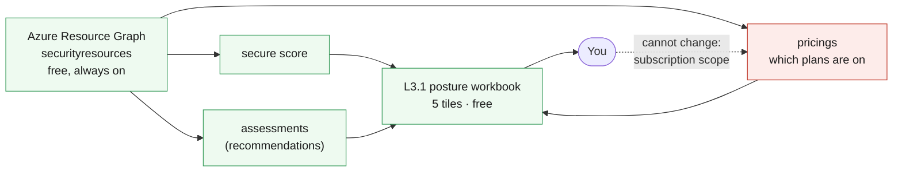

# L3.1 — Security Foundation 🟡

**Goal:** find out where this environment actually stands, using only free
capability, before spending anything. You deploy one workbook and buy nothing.

| Who this is for | Time | You need first | Cost while it runs |
|---|---|---|---|
| Chapter 1 of Level 3 · everyone | ~20 min | **Levels 1 and 2** | 🟢 **$0.00/hr** — nothing in this chapter is billable |

> [!IMPORTANT]
> **Defender plans are not enabled here, and you cannot enable them.**
> `Microsoft.Security/pricings` is a **subscription**-scoped resource, and this
> lab grants you Contributor on **one resource group**. Turning plans on is an
> instructor job — `scripts/admin/Enable-DefenderPlans.ps1`, run once per lab
> subscription. That is not a gap in the lab; it is the same separation of
> duties every real organisation has, and L3.2 is built around what you *can*
> configure yourself.

## What you're building



<details><summary>Text description of this diagram</summary>

One workbook, fed entirely by Azure Resource Graph rather than by Log
Analytics. Three query sources: the **secure score** for the subscription, the
**assessments** behind it (what Defender for Cloud calls recommendations), and
the **pricings** resource showing which Defender plans are enabled.

The dotted line records the permission boundary. You can *read* the plan state —
and you should, because it decides what half of Level 3 can detect — but you
cannot change it with Contributor on a resource group.

Everything here is free: foundational CSPM, secure score, recommendations,
Resource Graph and workbooks all cost nothing on any subscription.

</details>

**Source:** [`curriculum/L3.1-security-foundation/main.bicep`](https://github.com/saulpatinojr/Demo-IaC_Demo_with_VSCode/blob/main/curriculum/L3.1-security-foundation/main.bicep) · [`main.bicepparam`](https://github.com/saulpatinojr/Demo-IaC_Demo_with_VSCode/blob/main/curriculum/L3.1-security-foundation/main.bicepparam) · [`scripts/admin/Enable-DefenderPlans.ps1`](https://github.com/saulpatinojr/Demo-IaC_Demo_with_VSCode/blob/main/scripts/admin/Enable-DefenderPlans.ps1)

> [!NOTE]
> **Why Resource Graph and not the workspace?** L2.2's workbook queried Log
> Analytics, and the obvious move here is to do the same against
> `SecurityRecommendation` and `SecurityAlert`. Those tables are **empty** until
> L3.3 turns on continuous export — a workspace-driven workbook in this chapter
> would render five blank tiles. Secure score and assessments live in Resource
> Graph's `securityresources` table from the moment foundational CSPM is on,
> which is by default. Knowing which store holds which security data is worth
> more than the workbook itself.

<br>

## 🚀 Deploy it — pick any one of three ways

<table>
<tr>
<td align="center" width="240"><br><br><b>1 · Bicep CLI</b><br><sub>Copy-paste in the terminal</sub></td>
<td align="center" width="240"><br><br><b>2 · GitHub Actions</b><br><sub>One button in the browser</sub></td>
<td align="center" width="240"><br><br><b>3 · GitHub Copilot</b><br><sub>Ask AI in plain English</sub></td>
</tr>
</table>

<br>

---

## &nbsp; Option 1 · Bicep from the terminal

```powershell
az deployment group what-if --resource-group $env:AZURE_RESOURCE_GROUP --parameters curriculum/L3.1-security-foundation/main.bicepparam
az deployment group create  --resource-group $env:AZURE_RESOURCE_GROUP --parameters curriculum/L3.1-security-foundation/main.bicepparam
```

**You should see:** a `costOfThisChapter` output reading `$0.00/hr`, and a
`whatIsNotHere` output naming the subscription-scoped thing you cannot deploy.

<br>

---

## &nbsp; Option 2 · GitHub Actions (push-button)

**Actions → "Curriculum L3 - Security & Defender for Cloud" → Run workflow →
L3.1 - Security Foundation**.

The run summary prints which Defender plans are on for the subscription. If the
identity cannot read them, it says so rather than implying they are off — a
blank list and "no permission to look" are very different answers, and confusing
them is how people conclude a subscription is unprotected when it isn't.

<br>

---

## &nbsp; Option 3 · GitHub Copilot (plain English)

Load your values first: `./scripts/Load-LabSettings.ps1`. Then in
**Copilot Chat → Agent mode**:

> Deploy `curriculum/L3.1-security-foundation/main.bicep` to my lab resource group (`$env:AZURE_RESOURCE_GROUP`) with `az deployment group create`.

**Then ask it for something it cannot have:**

> Add a resource to `curriculum/L3.1-security-foundation/main.bicep` that enables Defender for Servers Plan 2.

Copilot will write it, and it will look right. It will also fail to deploy,
because `Microsoft.Security/pricings` needs subscription scope and this template
targets a resource group. Read the error, then read the parameter comments —
this is the most common class of mistake an AI assistant makes with Azure, and
catching it is a Level 3 skill.

<br>

---

## ✅ Verify it

1. **Open the workbook** — **Azure Monitor → Workbooks →
   `L3.1 — <prefix> security posture`**.

   **You should see:** a secure score out of 100-ish, a ranked list of unhealthy
   recommendations, and the resource each one lands on.

2. **Read the score honestly:**

   ```powershell
   az graph query -q "securityresources | where type == 'microsoft.security/securescores' | project name, current = properties.score.current, max = properties.score.max" -o table
   ```

   **You should see:** a number well short of the maximum. Now find the ones
   Level 1 already earned — private endpoints on SQL and Key Vault, no public IP
   on the test VM, managed identity instead of a stored secret. Those were
   architecture decisions, not security work, and they are worth more score than
   anything you can buy in L3.2.

3. **Check what is actually switched on:**

   ```powershell
   az security pricing list --query "value[].{Plan:name, Tier:pricingTier}" -o table
   ```

   **You should see:** `Free` for most or all plans, unless your instructor has
   run the enablement script. Everything in this chapter worked anyway — that is
   the point. Foundational CSPM costs nothing and does most of the assessing.

4. **Map a finding to a control.** Pick the worst recommendation in the workbook
   and find its Microsoft Cloud Security Benchmark control in the portal under
   **Defender for Cloud → Regulatory compliance**.

   **You should be able to say:** which control it belongs to, whether fixing it
   needs a paid plan, and which template in this repository owns the resource it
   lands on. A finding you cannot trace to a file is a finding nobody will fix.

>  **GitHub feature spotlight · Least privilege in the pipeline, too**
>
> **You just hit it:** the OIDC identity this repo creates holds Contributor on
> one resource group — deliberately. That is why this chapter's workflow can
> deploy a workbook and cannot enable a Defender plan, and why the deploy fails
> loudly instead of quietly widening its own access.
> **Find it:** `scripts/Setup-Oidc.ps1`, which says in its own header that it
> has no subscription-scoped mode.
> **Beyond the lab:** a CI identity that can do everything is the fastest way to
> turn a compromised workflow into a compromised tenant. The right amount of
> friction here is *some*.
> [Docs →](https://docs.github.com/actions/deployment/security-hardening-your-deployments/about-security-hardening-with-openid-connect)

<br>

---

## ➡️ What carries forward

L3.2 turns on the protection a Contributor genuinely can — per-resource Defender
settings on the SQL server, and just-in-time access on the VMs — and prices each
one before enabling it. The recommendations you ranked here are the list it
works from.

**Leave it deployed** → **[back to Level 3 · Secure](https://github.com/saulpatinojr/Demo-IaC_Demo_with_VSCode/wiki/Curriculum-Level-3-Secure)**.
