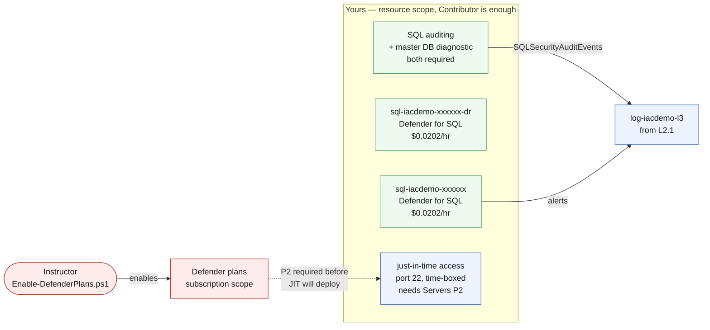

# L3.2 — Workload Protection 🟡

**📍 [Level 3 · Secure](https://github.com/saulpatinojr/Demo-IaC_Demo_with_VSCode/wiki/Curriculum-Level-3-Secure)** · Chapter 2 of 4 &nbsp;·&nbsp; Previous: [L3.1 — Security Foundation](https://github.com/saulpatinojr/Demo-IaC_Demo_with_VSCode/wiki/Curriculum-L3-1-Security-Foundation) &nbsp;·&nbsp; Next: [L3.3 — Security Operations](https://github.com/saulpatinojr/Demo-IaC_Demo_with_VSCode/wiki/Curriculum-L3-3-Security-Operations)

---

**Goal:** turn on the protection you can actually turn on, one resource at a
time, with the meter visible. Defender for SQL at server scope, SQL auditing
into the Level 2 workspace, and just-in-time VM access.

**The IaC lesson:** deployment outputs can carry more than resource IDs — this
template prints its own running cost (`sqlDefenderHourlyCost`), so the price of
a change is visible in the pipeline before it ever reaches an invoice.

<br>

| Who this is for | Time | You need first | Cost while it runs |
|---|---|---|---|
| Chapter 2 of Level 3 · everyone | ~25 min | **L3.1**, plus L1.3/L1.4 and L2.1 | 🟡 ~$0.04/hr added · ~$1.95/hr running total |

> [!IMPORTANT]
> **Enabling this costs money the moment it deploys.** Defender for SQL bills
> **$0.0202/instance/hr (~$14.72/month)** per server — two servers after L1.4,
> so this chapter adds about **$0.04/hr**.

<br>

## What you're building

Everything in the green box is yours to deploy with Contributor: Defender for
SQL on both servers, SQL auditing flowing into the Level 2 workspace, and —
conditionally — a just-in-time VM access policy. The subscription-wide Defender
plans stay with the instructor, and the one dotted line shows exactly where
that boundary blocks you: JIT does nothing without Defender for Servers Plan 2.



<details><summary>Text description of this diagram</summary>

The green box is everything a resource-group Contributor can deploy: Defender
for SQL on both servers (resource-level enablement, which bills per instance
regardless of the subscription plan), SQL auditing, and — conditionally — a
just-in-time VM access policy.

The red box is what you cannot touch. Subscription-wide Defender plans are the
instructor's job, and the dotted line shows the one place that blocks you:
just-in-time access requires **Defender for Servers Plan 2**, so the JIT policy
is off by default and deploying it without P2 fails.

SQL auditing needs **two** resources, not one: the auditing setting on the
server *and* a diagnostic setting on that server's `master` database selecting
the `SQLSecurityAuditEvents` category. Either one alone sends nothing, which is
the most common reason a SQL audit log turns out to be silently empty.

</details>

**Source:** [`curriculum/L3.2-workload-protection/main.bicep`](https://github.com/saulpatinojr/Demo-IaC_Demo_with_VSCode/blob/main/curriculum/L3.2-workload-protection/main.bicep) · [`main.bicepparam`](https://github.com/saulpatinojr/Demo-IaC_Demo_with_VSCode/blob/main/curriculum/L3.2-workload-protection/main.bicepparam)

<br>

<details><summary><b>🔍 Going deeper — how resource-level Defender billing works</b></summary>

<br>

A `securityAlertPolicies` resource on a SQL server turns on Defender for SQL
**for that server** and bills **$0.0202/instance/hr (~$14.72/month)** whether
or not the subscription-wide plan is on. After L1.4 there are two servers, so
this chapter adds about **$0.04/hr**. Every Defender plan has a 30-day free
trial per subscription — running Level 3 inside it makes this free once.

</details>

<details><summary><b>🔍 Going deeper — why the container app gets no workload plan</b></summary>

<br>

The container app from L1.3 gets no workload plan in this chapter — **Defender
for Containers protects AKS, Arc-enabled Kubernetes and registry images, and
does not provide runtime protection for Azure Container Apps.** It is covered
by CSPM posture only. That is a real gap in a real architecture, and the honest
thing to do with it is name it, price the alternative (moving the workload to
AKS, which is a different lab and a different bill), and move on.

</details>

<details><summary><b>🔍 Going deeper — the permissions this needs</b></summary>

<table>
<tr>
<td width="72" align="center" valign="top"></td>
<td valign="top">
<b>Azure RBAC — the minimum this chapter needs</b><br><br>
<b>Contributor</b> on the lab resource group. <b>SQL Security Manager</b> is the least-privilege alternative for the SQL half.<br>
<sub>Why: <code>securityAlertPolicies</code> and <code>auditingSettings</code> are child resources of the SQL server, so ordinary resource rights are enough — which is exactly how a resource-level Defender plan can start billing without anyone touching the subscription. Just-in-time access is different: the policy deploys with Contributor but does nothing without <b>Defender for Servers Plan 2</b>, and only an instructor can turn that on.</sub>
</td>
</tr>
<tr>
<td width="72" align="center" valign="top"></td>
<td valign="top">
<b>Microsoft Entra ID roles</b><br><br>
<b>None.</b><br>
<sub>Note what this means for the SQL server: it still has a SQL-authentication admin from L1.3. Moving it to Microsoft Entra-only authentication would need a directory reader to resolve the admin principal — a genuine hardening step this chapter does not take.</sub>
</td>
</tr>
</table>

<sub><a href="https://learn.microsoft.com/azure/defender-for-cloud/permissions">For more info</a> — Microsoft Defender for Cloud roles and permissions</sub>

</details>

<br>

---

## 🚀 Deploy it — pick any one of three ways

<table>
<tr>
<td align="center" width="240"><br><br><b>1 · Bicep CLI</b><br><sub>Copy-paste in the terminal</sub></td>
<td align="center" width="240"><br><br><b>2 · GitHub Actions</b><br><sub>One button in the browser</sub></td>
<td align="center" width="240"><br><br><b>3 · GitHub Copilot</b><br><sub>Ask AI in plain English</sub></td>
</tr>
</table>

<br>

---

## &nbsp; Option 1 · Bicep from the terminal

```powershell
az deployment group what-if --resource-group $env:AZURE_RESOURCE_GROUP --parameters curriculum/L3.2-workload-protection/main.bicepparam
az deployment group create  --resource-group $env:AZURE_RESOURCE_GROUP --parameters curriculum/L3.2-workload-protection/main.bicepparam
```

**You should see:** `sqlDefenderHourlyCost` stating the bill in both per-hour
and per-month terms, and `jitNote` telling you exactly what to do if JIT was
skipped.

**Stopped at L1.3?** There is no DR server to protect:

```powershell
$env:CURRICULUM_SECONDARY_REGION = "false"
```

<br>

---

## &nbsp; Option 2 · GitHub Actions (push-button)

**Actions → "Curriculum L3 - Security & Defender for Cloud" → Run workflow →
L3.2 - Workload Protection**.

Three toggles matter: whether L1.2's web tier is still up, whether L1.4's second
region exists, and whether to attempt JIT. Leave JIT off until someone has run
`Enable-DefenderPlans.ps1 -ServersPlan P2`.

<br>

---

## &nbsp; Option 3 · GitHub Copilot (plain English)

Load your values first: `./scripts/Load-LabSettings.ps1`. Then in
**Copilot Chat → Agent mode**:

> Deploy `curriculum/L3.2-workload-protection/main.bicep` to my lab resource group (`$env:AZURE_RESOURCE_GROUP`) with `az deployment group create`.

**Ask it the question the chapter is really about:**

> Read `curriculum/L3.2-workload-protection/main.bicep` and tell me exactly what this deployment will cost per month, and which parts of it would still bill if I deleted the SQL databases but left the servers.

Check the answer against the rate table on the
[Curriculum Cost Model](https://github.com/saulpatinojr/Demo-IaC_Demo_with_VSCode/wiki/Curriculum-Cost-Model).
Defender for SQL bills per **server instance**, not per database — so the answer
is "all of it".

<br>

---

## ✅ Verify it

1. **Defender for SQL is on, per server:**

   ```powershell
   az sql server list -g $env:AZURE_RESOURCE_GROUP --query "[].name" -o tsv | ForEach-Object {
     az sql server threat-policy show -g $env:AZURE_RESOURCE_GROUP -n $_ --query "{server:'$_', state:state}" -o table
   }
   ```

   **You should see:** `Enabled` on each server. That state *is* the billing
   switch — there is no separate "start charging" step.

2. **Audit events are actually arriving** — this is the two-resource trap:

   ```powershell
   az monitor log-analytics query --workspace $WS `
     --analytics-query "SQLSecurityAuditEvents | summarize Events=count() by Database_Name | order by Events desc" -o table
   ```

   **You should see:** rows within about 15 minutes of any connection to the
   database. **No rows** almost always means the `master` database diagnostic
   setting is missing — the server-level auditing setting alone sends nothing.
   Confirm both halves exist:

   ```powershell
   az monitor diagnostic-settings list --resource "$(az sql db show -g $env:AZURE_RESOURCE_GROUP -s $SQL -n master --query id -o tsv)" -o table
   ```

3. **Trigger a detection you can explain** — a failed login is benign and real:

   ```powershell
   sqlcmd -S "$SQL.database.windows.net" -U notauser -P "definitely-wrong" -Q "SELECT 1"
   ```

   **You should see:** the attempt in `SQLSecurityAuditEvents` quickly, and — if
   you repeat it enough to look like a brute force — a Defender for SQL alert by
   email. One failed login is not an incident; the detection is looking for the
   shape, not the event.

4. **If you enabled JIT**, check the port is closed until asked:

   ```powershell
   az security jit-policy list -o table
   ```

   **You should see:** the policy with your VMs and a 3-hour maximum. If this
   errors with a plan-related message, Defender for Servers **Plan 2** is not on
   — that is the documented prerequisite, not a bug.

5. **Look at what you just committed to.** Two SQL servers at $14.72/month each
   is **$29.44/month**, running whether or not anyone attacks the database. Ask
   the question a real budget owner would: is a Basic-tier lab database worth
   that? For a production system holding customer data the answer is obviously
   yes. Being able to tell those two cases apart is the chapter.

<br>

>  **GitHub feature spotlight · The cost of a change, in the pull request**
>
> **Why it belongs here:** this template prints its own price as a deployment
> output, so the cost of enabling protection shows up in the Actions run summary
> — visible in the pull request that introduced it, not three weeks later on an
> invoice.
> **Find it:** the `sqlDefenderHourlyCost` output, and the run summary step in
> `.github/workflows/curriculum-l3-security.yml`.
> **Beyond the lab:** "what will this cost" is a review question, and the only
> reliable time to answer it is before merge.
> [Docs →](https://docs.github.com/actions/using-workflows/workflow-commands-for-github-actions#adding-a-job-summary)

<br>

---

## ➡️ What carries forward

L3.3 works the alerts these protections produce — triage, routing through the
Level 2 action groups, and automating the responses that should never be manual.
Every alert it handles exists because something here was switched on.

<br>

## 🧭 Where next?

| Your situation | Go to |
|---|---|
| Ready to keep going — work the alerts these protections raise | **[L3.3 — Security Operations](https://github.com/saulpatinojr/Demo-IaC_Demo_with_VSCode/wiki/Curriculum-L3-3-Security-Operations)** |
| Want the big picture of this level first | [Level 3 · Secure overview](https://github.com/saulpatinojr/Demo-IaC_Demo_with_VSCode/wiki/Curriculum-Level-3-Secure) |
| Done for the day — the estate bills while idle | [Cleanup & Reset](https://github.com/saulpatinojr/Demo-IaC_Demo_with_VSCode/wiki/Cleanup-and-Reset) |
| Something didn't work | [Troubleshooting](https://github.com/saulpatinojr/Demo-IaC_Demo_with_VSCode/wiki/Troubleshooting) |
