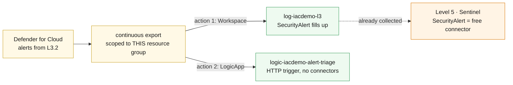

# L3.3 — Security Operations 🟡

**📍 [Level 3 · Secure](https://github.com/saulpatinojr/Demo-IaC_Demo_with_VSCode/wiki/Curriculum-Level-3-Secure)** · Chapter 3 of 4 &nbsp;·&nbsp; Previous: [L3.2 — Workload Protection](https://github.com/saulpatinojr/Demo-IaC_Demo_with_VSCode/wiki/Curriculum-L3-2-Workload-Protection) &nbsp;·&nbsp; Next: [L3.4 — Enterprise Security Architecture](https://github.com/saulpatinojr/Demo-IaC_Demo_with_VSCode/wiki/Curriculum-L3-4-Security-Architecture)

---

**Goal:** get the alerts L3.2 can now raise out of the portal and into the
places people actually work. Continuous export into the Level 2 workspace, and
a playbook that runs on every alert without a human watching.

**The IaC lesson:** automation is code too — the Logic App playbook is declared
in Bicep, so the response workflow is reviewable, diffable and redeployable
instead of a pile of boxes dragged together in the portal.

<br>

| Who this is for | Time | You need first | Cost while it runs |
|---|---|---|---|
| Chapter 3 of Level 3 · everyone | ~25 min | **L3.2**, plus L2.1 and L2.3 | 🟡 ~$0.03/hr added · ~$1.98/hr running total |

> [!IMPORTANT]
> **This is the chapter where `SecurityAlert` stops being empty.** From here on,
> security findings are queryable next to the firewall logs that might explain
> them.

<br>

## What you're building

One continuous-export automation with two destinations. Every alert Defender
raises flows both into the Level 2 workspace — where it lands next to the logs
that might explain it — and into a Logic App playbook that triages it without
anyone watching. The export is scoped to this resource group on purpose, and
the dotted line shows why the work pays off again in Level 5.



<details><summary>Text description of this diagram</summary>

One continuous-export automation with two destinations. Defender for Cloud
alerts — the ones L3.2's protections can now raise — flow into the export, which
sends each finding both to the Level 2 Log Analytics workspace and to a Logic
App playbook.

The export is scoped to **this resource group**, not the subscription. That is a
cost control as much as a permission one: a subscription-wide export bills for
every finding in the subscription, and needs Security Admin to create.

The dotted line forward is the payoff. `SecurityAlert` is a **free** data source
in Microsoft Sentinel, so everything this chapter exports arrives in Level 5
with no additional analysis charge.

</details>

**Source:** [`curriculum/L3.3-security-operations/main.bicep`](https://github.com/saulpatinojr/Demo-IaC_Demo_with_VSCode/blob/main/curriculum/L3.3-security-operations/main.bicep) · [`main.bicepparam`](https://github.com/saulpatinojr/Demo-IaC_Demo_with_VSCode/blob/main/curriculum/L3.3-security-operations/main.bicepparam)

<br>

<details><summary><b>🔍 Going deeper — why the playbook has no Teams or email action</b></summary>

<br>

A Logic App that posts to Teams, sends mail or opens a ticket needs an **API
connection**, and an API connection needs an interactive OAuth consent that no
deployment can perform for you. Shipped that way, this chapter would deploy
green and fail on first run — the worst possible lesson. This playbook is
HTTP-triggered and self-contained: it parses the alert and returns a triage
summary, so the wiring is real and works the first time. Adding a connector
afterwards is a deliberate, consented step, and the permissions block below
says who can grant it.

</details>

<details><summary><b>🔍 Going deeper — why exporting now pays off in Level 5</b></summary>

<br>

L3.1's workbook had to query Azure Resource Graph precisely because nothing was
exporting yet. From this chapter on, security findings are queryable next to
the firewall logs that might explain them — and **Level 5 inherits a workspace
that already has them**, at no extra ingestion cost, because `SecurityAlert` is
a free Sentinel data source.

</details>

<details><summary><b>🔍 Going deeper — the permissions this needs</b></summary>

<table>
<tr>
<td width="72" align="center" valign="top"></td>
<td valign="top">
<b>Azure RBAC — the minimum this chapter needs</b><br><br>
<b>Contributor</b> on the lab resource group, covering both <code>Microsoft.Security/automations</code> and the Logic App.<br>
<sub>Why: the export automation and the playbook are both ordinary resources, and reading the playbook's trigger URL uses <code>listCallbackUrl</code>, an action Contributor holds. Exporting at <b>subscription</b> scope instead would need <b>Security Admin</b> — and would bill for every finding in the subscription, so the scope limit is a cost control as much as a permission one.</sub>
</td>
</tr>
<tr>
<td width="72" align="center" valign="top"></td>
<td valign="top">
<b>Microsoft Entra ID roles</b><br><br>
<b>None — because the playbook has no connectors.</b><br>
<sub>This is the first place the directory would get involved in a real build. A playbook that posts to Teams, sends mail or opens a ticket needs an API connection, and an API connection needs an interactive <b>OAuth consent</b> that no deployment can perform for you. Who may grant it is a directory decision: users can consent for themselves only if the tenant allows it, otherwise a <b>Cloud Application Administrator</b> or <b>Global Administrator</b> has to.</sub>
</td>
</tr>
</table>

<sub><a href="https://learn.microsoft.com/azure/defender-for-cloud/permissions">For more info</a> — Defender for Cloud permissions, and who may consent to a connector</sub>

</details>

<br>

---

## 🚀 Deploy it — pick any one of three ways

<table>
<tr>
<td align="center" width="240"><br><br><b>1 · Bicep CLI</b><br><sub>Copy-paste in the terminal</sub></td>
<td align="center" width="240"><br><br><b>2 · GitHub Actions</b><br><sub>One button in the browser</sub></td>
<td align="center" width="240"><br><br><b>3 · GitHub Copilot</b><br><sub>Ask AI in plain English</sub></td>
</tr>
</table>

<br>

---

## &nbsp; Option 1 · Bicep from the terminal

```powershell
az deployment group what-if --resource-group $env:AZURE_RESOURCE_GROUP --parameters curriculum/L3.3-security-operations/main.bicepparam
az deployment group create  --resource-group $env:AZURE_RESOURCE_GROUP --parameters curriculum/L3.3-security-operations/main.bicepparam
```

**You should see:** `tablesThatWillFill` naming `SecurityAlert`, and a
`sentinelNote` explaining why exporting it now costs nothing extra later.

**Want the compliance history too?** Recommendations are much higher volume:

```powershell
$env:CURRICULUM_EXPORT_RECOMMENDATIONS = "true"
```

Then check tomorrow's `Usage` query from L2.4 and decide whether it earned it.

<br>

---

## &nbsp; Option 2 · GitHub Actions (push-button)

**Actions → "Curriculum L3 - Security & Defender for Cloud" → Run workflow →
L3.3 - Security Operations**.

<br>

---

## &nbsp; Option 3 · GitHub Copilot (plain English)

Load your values first: `./scripts/Load-LabSettings.ps1`. Then in
**Copilot Chat → Agent mode**:

> Deploy `curriculum/L3.3-security-operations/main.bicep` to my lab resource group (`$env:AZURE_RESOURCE_GROUP`) with `az deployment group create`.

**Then ask for the thing that will bite you:**

> Add a Teams "post a message" action to the playbook in `curriculum/L3.3-security-operations/main.bicep`.

Copilot will write a `Microsoft.Web/connections` resource and a Teams action,
and it will compile. Deploy it and the connection lands in an **unauthorised**
state — someone has to open it in the portal and consent interactively. That is
not a Copilot failure; it is what a connector is. Knowing which resources carry
an invisible manual step is the difference between a template that works and one
that deploys.

<br>

---

## ✅ Verify it

1. **The export exists and is scoped tightly:**

   ```powershell
   az security automation list -g $env:AZURE_RESOURCE_GROUP `
     --query "[].{name:name, enabled:isEnabled, scopes:scopes[].scopePath}" -o json
   ```

   **You should see:** one automation, enabled, scoped to your resource group —
   not the subscription.

2. **The playbook is wired to it:**

   ```powershell
   az rest --method get --url "https://management.azure.com$(az security automation list -g $env:AZURE_RESOURCE_GROUP --query '[0].id' -o tsv)?api-version=2019-01-01-preview" `
     --query "properties.actions[].actionType" -o tsv
   ```

   **You should see:** `Workspace` and `LogicApp`. Two destinations, one
   automation.

3. **Fire it end to end** — repeat the failed-login test from L3.2 until
   Defender raises an alert, then:

   ```powershell
   az monitor log-analytics query --workspace $WS `
     --analytics-query "SecurityAlert | project TimeGenerated, AlertName, AlertSeverity, CompromisedEntity | order by TimeGenerated desc | take 10" -o table
   ```

   **You should see:** rows in `SecurityAlert` — a table that was empty an hour
   ago. Then check the playbook's run history in the portal: one run per
   exported alert, each returning a triage summary.

4. **Watch what it costs.** Continuous export is free as a feature; what it
   exports is not. Tomorrow, re-run L2.4's `Usage` query and look for
   `SecurityAlert` in the list. At ~0.25 GB/day and $2.76/GB this is about
   $0.69/day — and every gigabyte of it becomes free again in Level 5, because
   Sentinel does not charge analysis on `SecurityAlert`.

<br>

>  **GitHub feature spotlight · Playbooks belong in the repository**
>
> **You just used it:** the Logic App definition is Bicep, so the response
> workflow is reviewable, diffable and redeployable. A playbook built by dragging
> boxes in the portal has no history and no reviewer.
> **Find it:** the `definition` block in this chapter's template — the trigger
> schema and the triage summary are both readable text.
> **Beyond the lab:** when an incident review asks "why did the automation do
> that", the answer should be a commit, not a screenshot.
> [Docs →](https://docs.github.com/pull-requests/collaborating-with-pull-requests/reviewing-changes-in-pull-requests)

<br>

---

## ➡️ What carries forward

L3.4 stops responding and starts designing: a web application firewall policy
with real rules, priced and reviewable, and deliberately not attached to
anything.

<br>

## 🧭 Where next?

| Your situation | Go to |
|---|---|
| Ready to keep going — design the target state and price it | **[L3.4 — Enterprise Security Architecture](https://github.com/saulpatinojr/Demo-IaC_Demo_with_VSCode/wiki/Curriculum-L3-4-Security-Architecture)** |
| Want the big picture of this level first | [Level 3 · Secure overview](https://github.com/saulpatinojr/Demo-IaC_Demo_with_VSCode/wiki/Curriculum-Level-3-Secure) |
| Done for the day — the estate bills while idle | [Cleanup & Reset](https://github.com/saulpatinojr/Demo-IaC_Demo_with_VSCode/wiki/Cleanup-and-Reset) |
| Something didn't work | [Troubleshooting](https://github.com/saulpatinojr/Demo-IaC_Demo_with_VSCode/wiki/Troubleshooting) |
