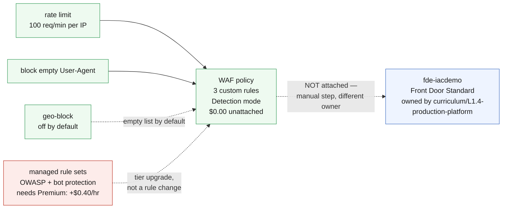

# L3.4 — Enterprise Security Architecture 🟡

**📍 [Level 3 · Secure](https://github.com/saulpatinojr/Demo-IaC_Demo_with_VSCode/wiki/Curriculum-Level-3-Secure)** · Chapter 4 of 4 &nbsp;·&nbsp; Previous: [L3.3 — Security Operations](https://github.com/saulpatinojr/Demo-IaC_Demo_with_VSCode/wiki/Curriculum-L3-3-Security-Operations) &nbsp;·&nbsp; Next: [Level 4 · Protect](https://github.com/saulpatinojr/Demo-IaC_Demo_with_VSCode/wiki/Curriculum-Level-4-Protect)

---

**Goal:** design the target state and put a price on it. A web application
firewall policy with real custom rules — deployed, reviewable, costed, and
**deliberately not attached to anything**.

**The IaC lesson:** IaC lets you review an architecture before you buy it — the
WAF's rules, mode, tier and price are all text in a pull request, arguable
before a single request is inspected or a single dollar spent.

<br>

| Who this is for | Time | You need first | Cost while it runs |
|---|---|---|---|
| Chapter 4 of Level 3 · everyone | ~25 min | **L3.1–L3.3**; L1.4 if you intend to attach it | 🟢 **$0.00/hr as shipped** · ~$1.98/hr running total |

> [!IMPORTANT]
> **An unattached WAF policy inspects no traffic and bills no request meter.**
> Attaching it is a manual step with the bill written next to it — managed
> rules need **Front Door Premium at $330/month against Standard's $35**.

<br>

## What you're building

One WAF policy carrying three custom rules, running in Detection mode, attached
to nothing. The two dotted lines are the actual lesson: attaching the policy to
L1.4's Front Door is a deliberate manual step because that profile belongs to a
different template, and the managed rule sets are a tier upgrade — a pricing
decision, not a rule change.



<details><summary>Text description of this diagram</summary>

One WAF policy carrying three custom rules: a rate limit of 100 requests per
minute per client IP, a block on requests arriving with no `User-Agent` header
at all — cheap and high-signal, since real clients send one and a lot of
opportunistic scanning does not — and an optional geo-block that ships with an
empty country list, because blocking the wrong country is how you discover your
users.

Two dotted lines mark the two things this chapter refuses to do for you. The
policy is **not attached** to L1.4's Front Door, because that profile belongs to
`curriculum/L1.4-production-platform` and attaching from here would make two templates owners of one
resource — the same rule that kept L2.3 out of L1.3's action group. And managed
rule sets, the OWASP core ruleset and bot protection, are a **tier** decision
rather than a rule change: they require Front Door Premium.

</details>

**Source:** [`curriculum/L3.4-security-architecture/main.bicep`](https://github.com/saulpatinojr/Demo-IaC_Demo_with_VSCode/blob/main/curriculum/L3.4-security-architecture/main.bicep) · [`main.bicepparam`](https://github.com/saulpatinojr/Demo-IaC_Demo_with_VSCode/blob/main/curriculum/L3.4-security-architecture/main.bicepparam)

<br>

<details><summary><b>🔍 Going deeper — what attaching this would really cost</b></summary>

<br>

An unattached WAF policy inspects no traffic and bills no request meter. That
is the design: you can read, review and cost this architecture without paying
for it. Attaching it is a manual step with the bill written next to it, and
turning on managed rules means **Front Door Premium at $330/month against
Standard's $35** — about **+$0.40/hr**, roughly a quarter of the entire
curriculum's running cost, for one feature.

</details>

<details><summary><b>🔍 Going deeper — Detection, not Prevention, by default</b></summary>

<br>

A WAF rule that looks obviously correct will block something you did not
expect — a health probe, a webhook, a mobile client with an unusual header.
Run in Detection, read what *would* have been blocked, then switch. The cost
of getting this backwards on a revenue-bearing endpoint is not measured in
dollars per hour.

</details>

<details><summary><b>🔍 Going deeper — the permissions this needs</b></summary>

<table>
<tr>
<td width="72" align="center" valign="top"></td>
<td valign="top">
<b>Azure RBAC — the minimum this chapter needs</b><br><br>
<b>Contributor</b> on the lab resource group to create the WAF policy. <b>CDN Profile Contributor</b> on L1.4's Front Door profile to <i>attach</i> it.<br>
<sub>Why: creating a WAF policy is a resource write like any other, and it inspects nothing until it is attached. Attaching is a write against a profile a different template owns — so the second role, and the ownership boundary, arrive together. Upgrading that profile to Premium is also a Contributor action, and about +$0.40/hr, which is why nobody should be able to do it by accident.</sub>
</td>
</tr>
<tr>
<td width="72" align="center" valign="top"></td>
<td valign="top">
<b>Microsoft Entra ID roles</b><br><br>
<b>None.</b><br>
<sub>Network-plane security only. The identity-plane half of a Zero Trust design for this workload — Conditional Access in front of the app, PIM for the admins — lives entirely in Microsoft Entra ID and needs directory roles this lab never grants. Naming that gap is part of the architecture review.</sub>
</td>
</tr>
</table>

<sub><a href="https://learn.microsoft.com/azure/web-application-firewall/afds/afds-overview">For more info</a> — Azure WAF on Front Door, and the tiers that gate managed rules</sub>

</details>

<br>

---

## 🚀 Deploy it — pick any one of three ways

<table>
<tr>
<td align="center" width="240"><br><br><b>1 · Bicep CLI</b><br><sub>Copy-paste in the terminal</sub></td>
<td align="center" width="240"><br><br><b>2 · GitHub Actions</b><br><sub>One button in the browser</sub></td>
<td align="center" width="240"><br><br><b>3 · GitHub Copilot</b><br><sub>Ask AI in plain English</sub></td>
</tr>
</table>

<br>

---

## &nbsp; Option 1 · Bicep from the terminal

```powershell
az deployment group what-if --resource-group $env:AZURE_RESOURCE_GROUP --parameters curriculum/L3.4-security-architecture/main.bicepparam
az deployment group create  --resource-group $env:AZURE_RESOURCE_GROUP --parameters curriculum/L3.4-security-architecture/main.bicepparam
```

**You should see:** `customRuleCount` of 2, `managedRulesEnabled` false,
`attachmentStatus` saying plainly that nothing is attached, and `costIfAttached`
spelling out both tiers.

**Price the Premium version without committing to it** — change the tier and run
*only* the what-if:

```powershell
$env:CURRICULUM_WAF_SKU = "Premium_AzureFrontDoor"
az deployment group what-if --resource-group $env:AZURE_RESOURCE_GROUP --parameters curriculum/L3.4-security-architecture/main.bicepparam
```

<br>

---

## &nbsp; Option 2 · GitHub Actions (push-button)

**Actions → "Curriculum L3 - Security & Defender for Cloud" → Run workflow →
L3.4 - Enterprise Security Architecture**.

Tick **Stop after what-if** to produce a costed design review with no
deployment at all — which is the honest output of an architecture chapter.

<br>

---

## &nbsp; Option 3 · GitHub Copilot (plain English)

Load your values first: `./scripts/Load-LabSettings.ps1`. Then in
**Copilot Chat → Agent mode**:

> Deploy `curriculum/L3.4-security-architecture/main.bicep` to my lab resource group (`$env:AZURE_RESOURCE_GROUP`) with `az deployment group create`.

**Then have the argument the chapter is for:**

> Attach this WAF policy to the Front Door endpoint created by `curriculum/L1.4-production-platform/main.bicep`, from within `curriculum/L3.4-security-architecture/main.bicep`.

Copilot can do it. **Don't.** Work out what happens the next time somebody runs
the L1.4 workflow — the security policy association is not in that template, so
it disappears, silently, and the WAF stops inspecting anything while continuing
to exist. Deciding *where* a resource is declared is an architecture decision,
and it is the one this chapter is really teaching.

<br>

---

## ✅ Verify it

1. **The policy exists, with rules, attached to nothing:**

   ```powershell
   az network front-door waf-policy list -g $env:AZURE_RESOURCE_GROUP `
     --query "[].{name:name, sku:sku.name, mode:policySettings.mode, rules:length(customRules.rules)}" -o table
   ```

   **You should see:** a Standard-tier policy in `Detection` mode with 2 custom
   rules. No Front Door references it, and it is costing nothing.

2. **Confirm managed rules really are a tier feature** — try to add them on
   Standard:

   ```powershell
   $env:CURRICULUM_WAF_SKU = "Standard_AzureFrontDoor"
   ```

   then edit the template to force `isPremium` true and run a what-if. **You
   should see:** a validation error. The tier is not a suggestion, and the
   template shapes the resource around it rather than letting you find out at
   deployment time.

3. **Attach it deliberately, if you are going to** — a manual step, on purpose:

   ```powershell
   az afd security-policy create -g $env:AZURE_RESOURCE_GROUP `
     --profile-name "afd-$env:AZURE_PREFIX-<suffix>" `
     --security-policy-name "sp-$env:AZURE_PREFIX-waf" `
     --domains "/subscriptions/.../afdEndpoints/fde-$env:AZURE_PREFIX" `
     --waf-policy "$(az network front-door waf-policy list -g $env:AZURE_RESOURCE_GROUP --query '[0].id' -o tsv)"
   ```

   **You should see:** WAF logs appear in the workspace within minutes. **And
   now you are paying per inspected request.** Detach it before you stop paying
   attention.

4. **Finish the level with a costed backlog.** You now have: a secure score and
   its findings (L3.1), protections you enabled and priced (L3.2), an alert
   pipeline (L3.3), and a WAF design (L3.4). Write the remediation list in
   priority order with a dollar figure on each line. The most valuable entries
   will be the free ones — and being able to prove that is what separates a
   security review from a shopping list.

<br>

>  **GitHub feature spotlight · A design you can review before you buy**
>
> **You just used it:** this chapter's entire output is a pull request. The rules,
> the mode, the tier and the price are all text a reviewer can argue with before
> a single request is inspected or a single dollar spent.
> **Find it:** the `costIfAttached` output — the template states its own price in
> both tiers, so the review does not have to go looking.
> **Beyond the lab:** "what will this cost and what will it break" are review
> questions, and the only reliable time to ask them is before merge.
> [Docs →](https://docs.github.com/pull-requests/collaborating-with-pull-requests/proposing-changes-to-your-work-with-pull-requests/about-pull-requests)

<br>

---

## ➡️ What carries forward

Level 3 is complete — the estate is assessed, protected, exporting alerts, and
carries a costed design for the layer it does not yet have. Level 4 protects it
against loss rather than attack. Level 5 puts Microsoft Sentinel on the
workspace L3.3 just started filling.

<br>

## 🧭 Where next?

| Your situation | Go to |
|---|---|
| Level 3 done — protect the estate against loss | **[Level 4 · Protect](https://github.com/saulpatinojr/Demo-IaC_Demo_with_VSCode/wiki/Curriculum-Level-4-Protect)** |
| Want the big picture of this level | [Level 3 · Secure overview](https://github.com/saulpatinojr/Demo-IaC_Demo_with_VSCode/wiki/Curriculum-Level-3-Secure) |
| Done for the day — the estate bills while idle | [Cleanup & Reset](https://github.com/saulpatinojr/Demo-IaC_Demo_with_VSCode/wiki/Cleanup-and-Reset) |
| Something didn't work | [Troubleshooting](https://github.com/saulpatinojr/Demo-IaC_Demo_with_VSCode/wiki/Troubleshooting) |
