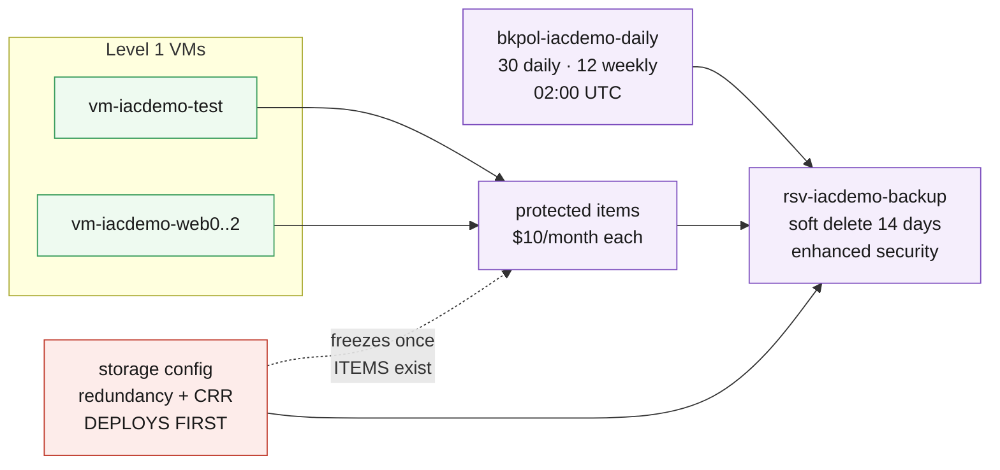

# L4.1 — Backup Fundamentals 🟣

**📍 [Level 4 · Protect](https://github.com/saulpatinojr/Demo-IaC_Demo_with_VSCode/wiki/Curriculum-Level-4-Protect)** · Chapter 1 of 4 &nbsp;·&nbsp; Previous: [L3.1 — Security Foundation](https://github.com/saulpatinojr/Demo-IaC_Demo_with_VSCode/wiki/Curriculum-L3-1-Security-Foundation) &nbsp;·&nbsp; Next: [🗺️ Curriculum Map](https://github.com/saulpatinojr/Demo-IaC_Demo_with_VSCode/wiki/Curriculum-Map) — main path complete, pick your next column · Go deeper: [L4.2 — PaaS Protection](https://github.com/saulpatinojr/Demo-IaC_Demo_with_VSCode/wiki/Curriculum-L4-2-PaaS-Protection)

---

**Goal:** protect the Level 1 virtual machines, and understand what a recovery
point actually is. This chapter also contains the one decision the curriculum
will not let you take back.

**The IaC lesson:** irreversible settings belong in the template as reviewed
parameters — and `dependsOn` is how a template forces them to deploy before
the resources that freeze them.

<br>

| Who this is for | Time | You need first | Cost while it runs |
|---|---|---|---|
| Chapter 1 of Level 4 · everyone | ~20 min | **L1.1 only** — the workflow's `include_web_tier` toggle defaults off; tick it while L1.2 stands to protect the web VMs too | 🟣 ~$0.06/hr added · ~$2.07/hr running total |

> [!WARNING]
> **Vault redundancy freezes the moment the first item is protected.** LRS, ZRS
> or GRS is chosen once, for the life of the vault — decide before you run this.
> L4.4 needs cross-region restore and cannot turn it on retrospectively.

<br>

## What you're building

One vault, one policy, four protected VMs. The template's whole shape is an
ordering constraint: vault redundancy lives on a storage config that is only
writable while the vault has **never** protected anything, so that config
deploys first and every protected item depends on it.



<details><summary>Text description of this diagram</summary>

A Recovery Services vault, a policy, and the protected items that bind the two
to the Level 1 VMs.

The red box is the ordering constraint that shapes the whole template. Vault
redundancy and the cross-region restore flag live on the storage config, and
they are only writable while the vault has **never** protected anything. The
template therefore deploys the storage config first and makes the protected
items depend on it — get that order wrong and the setting is frozen at whatever
the default happened to be.

Soft delete is on with enhanced security, holding deleted recovery points for
14 days and requiring multi-factor authorisation to disable. It is what defeats
"the attacker deleted the backups too" — and it is also why deleting this lab
does not immediately stop the storage meter.

</details>

**Source:** [`curriculum/L4.1-backup-fundamentals/main.bicep`](https://github.com/saulpatinojr/Demo-IaC_Demo_with_VSCode/blob/main/curriculum/L4.1-backup-fundamentals/main.bicep) · [`main.bicepparam`](https://github.com/saulpatinojr/Demo-IaC_Demo_with_VSCode/blob/main/curriculum/L4.1-backup-fundamentals/main.bicepparam)

<br>

<details><summary><b>🔍 Going deeper — the semicolon-separated item names</b></summary>

<br>

Those semicolon-separated names are not a typo. Azure Backup addresses an
IaaS VM through a container/item pair whose names encode the resource group
and the VM name — `iaasvmcontainer;iaasvmcontainerv2;<rg>;<vm>`. Getting them
wrong produces an unhelpful error, and it is the single most common reason
this resource fails. Read the `protectedItems` loop in the template once,
slowly.

</details>

<details><summary><b>🔍 Going deeper — the permissions this needs</b></summary>

<table>
<tr>
<td width="72" align="center" valign="top"></td>
<td valign="top">
<b>Azure RBAC — the minimum this chapter needs</b><br><br>
<b>Contributor</b> on the lab resource group. <b>Backup Contributor</b> is the least-privilege equivalent.<br>
<sub>Why: the vault, its policies and the protected items are all ordinary resources, and registering a VM needs write access to the VM as well as to the vault. Note what Contributor does <b>not</b> distinguish: <b>Backup Operator</b> can trigger backups and restores but cannot delete recovery points, and that split is the whole point of L4.3.</sub>
</td>
</tr>
<tr>
<td width="72" align="center" valign="top"></td>
<td valign="top">
<b>Microsoft Entra ID roles</b><br><br>
<b>None.</b><br>
<sub>Azure Backup reaches the disks through the vault system-assigned identity, granted automatically at registration. No app registration, no consent, no directory role.</sub>
</td>
</tr>
</table>

<sub><a href="https://learn.microsoft.com/azure/backup/backup-rbac-rs-vault">For more info</a> — Azure RBAC roles for Azure Backup</sub>

</details>

<br>

---

> [!NOTE]
> **🏫 Classroom: use the GitHub Actions option.** Your Azure account holds
> Reader, so local `az deployment` commands will be refused — deploys go
> through your fork's workflow, which uses the shared workshop identity
> automatically. Compiling locally (`az bicep build`) works for everyone.

## 🚀 Deploy it — pick any one of three ways

<table>
<tr>
<td align="center" width="240"><br><br><b>1 · Bicep CLI</b><br><sub>Copy-paste in the terminal</sub></td>
<td align="center" width="240"><br><br><b>2 · GitHub Actions</b><br><sub>One button in the browser</sub></td>
<td align="center" width="240"><br><br><b>3 · GitHub Copilot</b><br><sub>Ask AI in plain English</sub></td>
</tr>
</table>

<br>

---

## &nbsp; Option 1 · Bicep from the terminal

```powershell
az deployment group what-if --resource-group $env:AZURE_RESOURCE_GROUP --parameters curriculum/L4.1-backup-fundamentals/main.bicepparam
az deployment group create  --resource-group $env:AZURE_RESOURCE_GROUP --parameters curriculum/L4.1-backup-fundamentals/main.bicepparam
```

**You should see:** `redundancy` echoing your choice, `crossRegionRestoreEnabled`,
and a `redundancyIsFrozen` output stating plainly that L4.4 cannot change it.

**Decide redundancy before the first run, not after:**

```powershell
$env:CURRICULUM_VAULT_REDUNDANCY = "LocallyRedundant"   # half the storage price, no cross-region restore, ever
$env:CURRICULUM_CROSS_REGION_RESTORE = "true"           # needs GeoRedundant; L4.4 wants this
```

<br>

---

## &nbsp; Option 2 · GitHub Actions (push-button)

**Actions → "Curriculum L4 - Backup & Recovery Readiness" → Run workflow →
L4.1 - Backup Fundamentals**.

Two of the run inputs are the frozen decisions — **Vault redundancy** and **Enable cross-region restore**. They are surfaced as run inputs rather than buried in a parameter file precisely because nobody can fix them later.

<br>

---

## &nbsp; Option 3 · GitHub Copilot (plain English)

Load your values first: `./scripts/Load-LabSettings.ps1`. Then in
**Copilot Chat → Agent mode**:

> Deploy `curriculum/L4.1-backup-fundamentals/main.bicep` to my lab resource group (`$env:AZURE_RESOURCE_GROUP`) with `az deployment group create`.

**Then ask it to do the impossible:**

> Change the redundancy on the existing vault in `curriculum/L4.1-backup-fundamentals/main.bicep` from GeoRedundant to LocallyRedundant and redeploy.

It will edit the parameter happily. The deployment then fails, because Azure
refuses the change once an item is protected. This is a good failure to see
once: the constraint lives in the platform, not in the template.

<br>

---

## ✅ Verify it

1. **The vault exists with the redundancy you chose:**

   ```powershell
   az backup vault backup-properties show -n "rsv-$env:AZURE_PREFIX-backup" -g $env:AZURE_RESOURCE_GROUP -o table
   ```

   **You should see:** your storage model and cross-region restore flag. Check
   it now — this is the last moment either can be changed.

2. **The VMs are protected:**

   ```powershell
   az backup item list --vault-name "rsv-$env:AZURE_PREFIX-backup" -g $env:AZURE_RESOURCE_GROUP `
     --query "[].{item:properties.friendlyName, health:properties.healthStatus, policy:properties.policyName}" -o table
   ```

   **You should see:** one row per VM. `lastBackupStatus` stays empty until the
   first scheduled run at 02:00 UTC, so trigger one now rather than waiting.

3. **Restore a single file, not the whole VM.** File-level recovery mounts the
   recovery point as a drive, and it is the restore people actually need at 3am:

   ```powershell
   az backup restore files mount-rp --vault-name "rsv-$env:AZURE_PREFIX-backup" -g $env:AZURE_RESOURCE_GROUP `
     --container-name "vm-$env:AZURE_PREFIX-test" --item-name "vm-$env:AZURE_PREFIX-test" --rp-name <recoveryPointName>
   ```

   **You should see:** a script that mounts the disk on a machine you choose.
   Time it against a full VM restore — one is minutes, the other is most of an
   hour, and knowing the difference is what makes an RTO real rather than
   aspirational.

4. **Count what you just committed to.** Four protected instances at $10/month
   is **$40/month**, plus storage. Then check the thing everyone misses: this is
   the only cost in the curriculum that **survives teardown**. Deleting the VMs
   does not delete their recovery points, and soft delete holds them 14 days
   longer.

<br>

>  **GitHub feature spotlight · The template that owns a frozen decision**
>
> **You just used it:** redundancy and cross-region restore are parameters on
> this template, with the freeze written on them — so the decision is in the
> pull request, with a reviewer, rather than in a portal dropdown someone
> clicked past.
> **Find it:** the `vaultRedundancy` and `enableCrossRegionRestore` parameter
> descriptions, and the `dependsOn` that forces the storage config to land
> before any protected item.
> **Beyond the lab:** irreversible settings deserve review more than reversible
> ones, and code review is the only place that reliably happens.
> [Docs →](https://docs.github.com/pull-requests/collaborating-with-pull-requests/reviewing-changes-in-pull-requests)

<br>

---

## ➡️ What carries forward

This chapter completes the main path — deploy, monitor, secure, protect. Going
deeper, L4.2 protects the data that is not on a disk — where "backup" usually
turns out to mean something already switched on that nobody has verified.

<br>

## 🧭 Where next?

| Your situation | Go to |
|---|---|
| **Main path complete!** Pick your next move — go deeper anywhere, or take the extra-credit tracks | **[🗺️ Curriculum Map](https://github.com/saulpatinojr/Demo-IaC_Demo_with_VSCode/wiki/Curriculum-Map)** |
| Go deeper here — protect the data that isn't on a disk | [L4.2 — PaaS Protection](https://github.com/saulpatinojr/Demo-IaC_Demo_with_VSCode/wiki/Curriculum-L4-2-PaaS-Protection) |
| Extra credit — put Microsoft Sentinel on the workspace | [L5.1 — Sentinel Foundation](https://github.com/saulpatinojr/Demo-IaC_Demo_with_VSCode/wiki/Curriculum-L5-1-Sentinel-Foundation) |
| Extra credit — high availability and disaster recovery | [L6.1 — High Availability & Redundancy](https://github.com/saulpatinojr/Demo-IaC_Demo_with_VSCode/wiki/Curriculum-L6-1-High-Availability) |
| Want the big picture of this level first | [Level 4 · Protect overview](https://github.com/saulpatinojr/Demo-IaC_Demo_with_VSCode/wiki/Curriculum-Level-4-Protect) |
| Done for the day — the estate bills while idle | [Cleanup & Reset](https://github.com/saulpatinojr/Demo-IaC_Demo_with_VSCode/wiki/Cleanup-and-Reset) |
| Something didn't work | [Troubleshooting](https://github.com/saulpatinojr/Demo-IaC_Demo_with_VSCode/wiki/Troubleshooting) |
