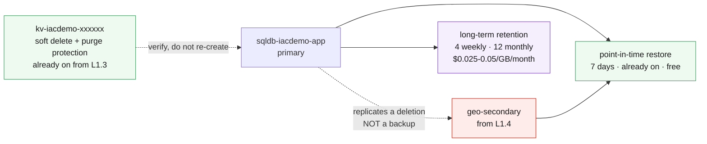

# L4.2 — PaaS Protection 🟣

**Goal:** protect the data that is not on a disk. Azure SQL has been backing itself up since L1.3 deployed, so this chapter is as much about verifying what already exists as configuring what does not.

| Who this is for | Time | You need first | Cost while it runs |
|---|---|---|---|
| Chapter 2 of Level 4 · everyone | ~20 min | **L4.1**, plus L1.3 and L1.4 | 🟢 ~$0.01/hr added · ~$2.08/hr running total |

> [!IMPORTANT]
> **A geo-replicated database is not a backup.** The failover group from L1.4
> replicates a `DROP TABLE` faithfully and immediately, to both regions. Only
> point-in-time restore undoes it. If this chapter teaches one sentence, that is
> the one.

## What you're building



<details><summary>Text description of this diagram</summary>

Two retention mechanisms on the same database, answering different questions.

**Point-in-time restore** answers "undo the last few days". It has been running
since L1.3 deployed, at no extra charge, and the only decision is how far back
the window reaches — the Basic tier this lab uses caps it at seven days.

**Long-term retention** answers "produce the month-end from eighteen months
ago". That is a compliance question rather than an operational one, and its
storage bill scales with how confidently you answer it.

The red box is the trap. The geo-secondary from L1.4 looks like protection and
is not: it replicates a deletion faithfully and immediately. Key Vault appears
because its soft delete and purge protection are already on from L1.3 — this
chapter verifies them rather than re-creating them.

</details>

**Source:** [`curriculum/L4.2-paas-protection/main.bicep`](https://github.com/saulpatinojr/Demo-IaC_Demo_with_VSCode/blob/main/curriculum/L4.2-paas-protection/main.bicep) · [`main.bicepparam`](https://github.com/saulpatinojr/Demo-IaC_Demo_with_VSCode/blob/main/curriculum/L4.2-paas-protection/main.bicepparam)

> [!NOTE]
> **What this estate cannot protect, and why that is fine.** Container Apps
> configuration and private DNS records have no backup service — they are
> redeployed from `curriculum/L1.3-multi-service-application` instead, which is a legitimate recovery
> strategy precisely because the templates are version-pinned and in git. The
> lab deploys no storage account, so there is nothing for a Backup vault to
> protect. Saying what is *not* covered is part of a protection review.

<br>

## &nbsp; Azure Up to date

<table>
<tr>
<td width="72" align="center" valign="top"></td>
<td valign="top">
<b>Azure RBAC — the minimum this chapter needs</b><br><br>
<b>Contributor</b> on the lab resource group. <b>SQL DB Contributor</b> covers the retention policies alone.<br>
<sub>Why: both retention policies are child resources of the database, so ordinary resource rights are enough. Restoring is a different action — <code>Microsoft.Sql/servers/databases/write</code> on the target — and worth noticing that whoever can restore a database can also place a copy of production data somewhere less protected.</sub>
</td>
</tr>
<tr>
<td width="72" align="center" valign="top"></td>
<td valign="top">
<b>Microsoft Entra ID roles</b><br><br>
<b>None — but this is where it should change.</b><br>
<sub>The SQL server still has the SQL-authentication admin L1.3 created. Moving it to Microsoft Entra-only authentication needs a <b>Directory Readers</b> role to resolve the admin principal, and would remove a password from the estate entirely. That is a genuine hardening step this lab does not take, and naming it beats pretending it is done.</sub>
</td>
</tr>
</table>

<sub><a href="https://learn.microsoft.com/azure/azure-sql/database/long-term-backup-retention-configure">For more info</a> — Azure SQL long-term retention, and what PITR already covers</sub>

<br>

## 🚀 Deploy it — pick any one of three ways

<table>
<tr>
<td align="center" width="240"><br><br><b>1 · Bicep CLI</b><br><sub>Copy-paste in the terminal</sub></td>
<td align="center" width="240"><br><br><b>2 · GitHub Actions</b><br><sub>One button in the browser</sub></td>
<td align="center" width="240"><br><br><b>3 · GitHub Copilot</b><br><sub>Ask AI in plain English</sub></td>
</tr>
</table>

<br>

---

## &nbsp; Option 1 · Bicep from the terminal

```powershell
az deployment group what-if --resource-group $env:AZURE_RESOURCE_GROUP --parameters curriculum/L4.2-paas-protection/main.bicepparam
az deployment group create  --resource-group $env:AZURE_RESOURCE_GROUP --parameters curriculum/L4.2-paas-protection/main.bicepparam
```

**You should see:** `replicationIsNotBackup` stating the trap in one line, and
`whatIsNotProtected` listing the four things in this estate that no backup
service covers.

**Watch a platform limit reject you:**

```powershell
$env:CURRICULUM_PITR_DAYS = "35"   # rejected on the Basic tier — read the error, it is the lesson
```

<br>

---

## &nbsp; Option 2 · GitHub Actions (push-button)

**Actions → "Curriculum L4 - Backup & Recovery Readiness" → Run workflow →
L4.2 - PaaS Protection**.

Untick **L1.4 is deployed** if you stopped at L1.3; pointing a retention policy at a database that does not exist fails the deployment.

<br>

---

## &nbsp; Option 3 · GitHub Copilot (plain English)

Load your values first: `./scripts/Load-LabSettings.ps1`. Then in
**Copilot Chat → Agent mode**:

> Deploy `curriculum/L4.2-paas-protection/main.bicep` to my lab resource group (`$env:AZURE_RESOURCE_GROUP`) with `az deployment group create`.

**Then ask the question that decides a real budget:**

> Read `curriculum/L4.2-paas-protection/main.bicep` and tell me what a 7-year yearly retention policy would cost per month for a 50 GB database on RA-GRS storage, showing the arithmetic.

Check the answer against the rate table on the
[Curriculum Cost Model](https://github.com/saulpatinojr/Demo-IaC_Demo_with_VSCode/wiki/Curriculum-Cost-Model).
Yearly recovery points accumulate rather than replace, so the honest figure
grows every year — which is exactly why the template ships `PT0S` and makes you
ask for it explicitly.

<br>

---

## ✅ Verify it

1. **PITR was already running before you configured anything:**

   ```powershell
   az sql db show -g $env:AZURE_RESOURCE_GROUP -s $SQL -n "sqldb-$env:AZURE_PREFIX-app" `
     --query "{earliestRestore:earliestRestoreDate}" -o table
   ```

   **You should see:** a restore point from days ago — before this chapter ran.
   That is the point: it has been protecting you since L1.3, free and unverified.

2. **Both policies are attached:**

   ```powershell
   az sql db str-policy show -g $env:AZURE_RESOURCE_GROUP -s $SQL -n "sqldb-$env:AZURE_PREFIX-app" -o table
   az sql db ltr-policy show -g $env:AZURE_RESOURCE_GROUP -s $SQL -n "sqldb-$env:AZURE_PREFIX-app" -o table
   ```

3. **Prove replication is not backup** — the exercise that justifies the chapter.
   Create a table on the primary, confirm it appears on the geo-secondary, drop
   it, and confirm the drop replicated too. Then restore with PITR:

   ```powershell
   az sql db restore -g $env:AZURE_RESOURCE_GROUP -s $SQL -n "sqldb-$env:AZURE_PREFIX-app" `
     --dest-name "sqldb-$env:AZURE_PREFIX-app-restored" --time "<a minute before the drop>"
   ```

   **You should see:** a *new* database containing the table. PITR never restores
   in place — you get a second database and then decide what to do with it, and
   that extra step is the one people forget when writing an RTO.

   **Delete the restored copy afterwards.** It bills like any other database.

4. **Verify Key Vault rather than reconfiguring it:**

   ```powershell
   az keyvault show -g $env:AZURE_RESOURCE_GROUP -n "kv-$env:AZURE_PREFIX-<suffix>" `
     --query "{softDelete:properties.enableSoftDelete, purgeProtection:properties.enablePurgeProtection}" -o table
   ```

   **You should see:** both true, from L1.3. Purge protection cannot be turned
   off again once on — a deliberate one-way door, and the same shape of decision
   as L4.1 redundancy.

>  **GitHub feature spotlight · Recovery that lives in the repository**
>
> **Why it belongs here:** the things this chapter lists as unprotected —
> Container Apps configuration, DNS records, the templates themselves — are all
> recoverable from git. "Redeploy from `main`" is a real recovery strategy, and
> it is free.
> **Find it:** the version pins on every AVM module in `curriculum/`. A pinned module
> recreates the environment; a floating tag creates a new one.
> **Beyond the lab:** backup protects state, source control protects shape. A
> recovery plan needs both, and only one of them has a monthly bill.
> [Docs →](https://docs.github.com/repositories/working-with-files/managing-files)

<br>

---

## ➡️ What carries forward

L4.3 makes all of this operational: the vault reports into the Level 2
workspace, failed *and missing* jobs page someone, and you rehearse a restore
against a written expectation.

**Leave it deployed** → **[back to Level 4 · Protect](https://github.com/saulpatinojr/Demo-IaC_Demo_with_VSCode/wiki/Curriculum-Level-4-Protect)**.
