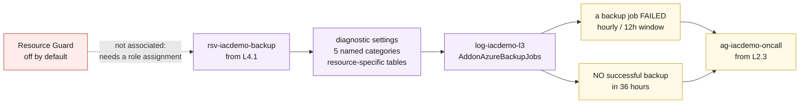

# L4.3 — Operational Backup Management 🟣

**📍 [Level 4 · Protect](https://github.com/saulpatinojr/Demo-IaC_Demo_with_VSCode/wiki/Curriculum-Level-4-Protect)** · Chapter 3 of 4 &nbsp;·&nbsp; Previous: [L4.2 — PaaS Protection](https://github.com/saulpatinojr/Demo-IaC_Demo_with_VSCode/wiki/Curriculum-L4-2-PaaS-Protection) &nbsp;·&nbsp; Next: [L4.4 — Enterprise Data Protection Strategy](https://github.com/saulpatinojr/Demo-IaC_Demo_with_VSCode/wiki/Curriculum-L4-4-Data-Protection-Strategy)

---

**Goal:** make backup an operational service rather than a configuration —
monitored, alerted on, rehearsed, and protected against its own operators.

**The IaC lesson:** an alert rule in a template is a reviewable sentence — the
"no successful backup in 36 hours" query lives in code, where someone can ask
whether 36 is the right number before it ships.

<br>

| Who this is for | Time | You need first | Cost while it runs |
|---|---|---|---|
| Chapter 3 of Level 4 · everyone | ~20 min | **L4.1** and **L4.2**, plus L2.1 and L2.3 | 🟢 ~$0.01/hr added · ~$2.09/hr running total |

> [!IMPORTANT]
> **Two alerts, not one — and the second is the important one.** A failed job
> raises an alert. A job that was never scheduled raises nothing at all, and
> that silence is the failure mode that actually loses data.

<br>

## What you're building

The vault starts reporting into the Log Analytics workspace Level 2 built, and
two alert rules watch what arrives — one for jobs that fail, and one for the
far more dangerous case of jobs that silently stop existing. A Resource Guard
is available but off by default, and the reason why is half the lesson.



<details><summary>Text description of this diagram</summary>

The vault reports into the workspace Level 2 built, and two rules watch what
arrives.

Diagnostic settings forward five named categories into **resource-specific
tables** rather than the legacy `AzureDiagnostics` blob, so `AddonAzureBackupJobs`
has typed columns and the queries stay readable.

The two alert rules are deliberately different shapes. The first counts jobs in
a `Failed` state — an ordinary threshold alert. The second counts *successful*
jobs and fires when that count is **zero** over 36 hours, which is long enough
for the daily schedule to have had a chance and missed it. Only the second one
catches a schedule that silently stopped existing.

The Resource Guard is off by default and shown detached on purpose. Associating
it with the vault needs a role assignment, which Contributor cannot create — and
a guard sitting in the same subscription under the same administrators stops
accidents rather than attackers.

</details>

**Source:** [`curriculum/L4.3-backup-operations/main.bicep`](https://github.com/saulpatinojr/Demo-IaC_Demo_with_VSCode/blob/main/curriculum/L4.3-backup-operations/main.bicep) · [`main.bicepparam`](https://github.com/saulpatinojr/Demo-IaC_Demo_with_VSCode/blob/main/curriculum/L4.3-backup-operations/main.bicepparam)

<br>

<details><summary><b>🔍 Going deeper — multi-user authorization, and why the guard belongs elsewhere</b></summary>

<br>

Multi-user authorization is deployed far enough to be understood, and no
further. Real MUA puts the Resource Guard in a *different subscription* under
*different administrators*, so the person who can delete the backups cannot
also disable the thing stopping them. A guard next to the vault, owned by the
same people, is theatre. The template will create one if you ask, and its
output says exactly why that is not the same as having MUA.

</details>

<details><summary><b>🔍 Going deeper — the permissions this needs</b></summary>

<table>
<tr>
<td width="72" align="center" valign="top"></td>
<td valign="top">
<b>Azure RBAC — the minimum this chapter needs</b><br><br>
<b>Contributor</b> on the lab resource group. <b>Backup Operator</b> is the interesting contrast.<br>
<sub>Why: diagnostic settings and alert rules are ordinary resources. The contrast matters more than the requirement — <b>Backup Operator</b> can trigger backups and restores but <b>cannot delete recovery points</b>, while Contributor can. Splitting those two is how you stop a single compromised account from destroying both the data and its copies. Associating a Resource Guard additionally needs <b>Owner</b> or <b>User Access Administrator</b>, because it creates a role assignment.</sub>
</td>
</tr>
<tr>
<td width="72" align="center" valign="top"></td>
<td valign="top">
<b>Microsoft Entra ID roles</b><br><br>
<b>None for the deployment — but the design depends on directory separation.</b><br>
<sub>MUA only works when the Resource Guard is administered by different people. In practice that means a different subscription, often a different Microsoft Entra ID group, and a deliberate decision about who is in it. The Azure permission is the mechanism; the directory is where the separation actually lives.</sub>
</td>
</tr>
</table>

<sub><a href="https://learn.microsoft.com/azure/backup/multi-user-authorization">For more info</a> — Multi-user authorization, and why the guard belongs elsewhere</sub>

</details>

<br>

---

> [!NOTE]
> **🏫 Classroom: use the GitHub Actions option.** Your Azure account holds
> Reader, so local `az deployment` commands will be refused — deploys go
> through your fork's workflow, which uses the shared workshop identity
> automatically. Compiling locally (`az bicep build`) works for everyone.

## 🚀 Deploy it — pick any one of three ways

<table>
<tr>
<td align="center" width="240"><br><br><b>1 · Bicep CLI</b><br><sub>Copy-paste in the terminal</sub></td>
<td align="center" width="240"><br><br><b>2 · GitHub Actions</b><br><sub>One button in the browser</sub></td>
<td align="center" width="240"><br><br><b>3 · GitHub Copilot</b><br><sub>Ask AI in plain English</sub></td>
</tr>
</table>

<br>

---

## &nbsp; Option 1 · Bicep from the terminal

```powershell
az deployment group what-if --resource-group $env:AZURE_RESOURCE_GROUP --parameters curriculum/L4.3-backup-operations/main.bicepparam
az deployment group create  --resource-group $env:AZURE_RESOURCE_GROUP --parameters curriculum/L4.3-backup-operations/main.bicepparam
```

**You should see:** `whyTwoAlerts` explaining the silence rule in one line, and
`muaIsIncomplete` being honest about what a same-subscription Resource Guard
does and does not buy you.

**Create the guard to inspect it:**

```powershell
$env:CURRICULUM_RESOURCE_GUARD = "true"
```

<br>

---

## &nbsp; Option 2 · GitHub Actions (push-button)

**Actions → "Curriculum L4 - Backup & Recovery Readiness" → Run workflow →
L4.3 - Operational Backup Management**.

Nothing here is frozen or expensive, so this is a safe first run without the dry-run toggle.

<br>

---

## &nbsp; Option 3 · GitHub Copilot (plain English)

Load your values first: `./scripts/Load-LabSettings.ps1`. Then in
**Copilot Chat → Agent mode**:

> Deploy `curriculum/L4.3-backup-operations/main.bicep` to my lab resource group (`$env:AZURE_RESOURCE_GROUP`) with `az deployment group create`.

**Then make it prove the silence rule works:**

> In `curriculum/L4.3-backup-operations/main.bicep`, change the "no successful backup" rule window from 36 hours to 2 hours so I can watch it fire, run `az bicep build`, then deploy.

It will fire almost immediately, because a daily schedule has not run in the
last two hours. That is a false positive you created on purpose — and deciding
what window is long enough to be meaningful but short enough to be useful is
exactly the judgement this rule needs. Put it back to 36 afterwards.

<br>

---

## ✅ Verify it

1. **The vault is reporting into the workspace:**

   ```powershell
   az monitor log-analytics query --workspace $WS `
     --analytics-query "AddonAzureBackupJobs | summarize Jobs=count() by JobStatus, JobOperation" -o table
   ```

   **You should see:** rows within about 20 minutes of the first backup. No rows
   at all usually means the diagnostic setting landed but no job has run yet —
   trigger one from L4.1 rather than assuming it is broken.

2. **Both rules exist and are enabled:**

   ```powershell
   az monitor scheduled-query list -g $env:AZURE_RESOURCE_GROUP `
     --query "[?contains(name,'backup')].{name:name, enabled:properties.enabled, window:properties.windowSize}" -o table
   ```

3. **Run a restore drill against a written expectation.** Write down the
   expected RTO *before* you start, then restore the test VM and time it:

   ```powershell
   az backup restore restore-disks --vault-name "rsv-$env:AZURE_PREFIX-backup" -g $env:AZURE_RESOURCE_GROUP `
     --container-name "vm-$env:AZURE_PREFIX-test" --item-name "vm-$env:AZURE_PREFIX-test" `
     --storage-account <staging-account> --rp-name <recoveryPointName>
   ```

   **You should see:** restored disks in the staging account, and a real number
   for how long it took. Compare it to your written guess — the gap between the
   two is the actual finding, and it is why drills exist.

   **Delete the restored disks immediately.** A drill left running is an
   unpatched, unmonitored duplicate of production: a security cost as well as a
   financial one.

4. **Check the RBAC split is real.** Look up what `Backup Operator` can do
   compared with `Backup Contributor`, and answer one question: if an attacker
   compromised the account you are using right now, could they delete both the
   VMs and their recovery points? For plain Contributor the answer is yes, and
   that is what MUA exists to change.

<br>

>  **GitHub feature spotlight · Alerting on absence, in code**
>
> **You just used it:** the "no successful backup in 36 hours" rule is a query
> and a window — text in a template, reviewable by someone who can ask whether
> 36 is the right number. A rule created by clicking through the portal carries
> no such conversation.
> **Find it:** the `noSuccessAlert` resource, and the comment above it saying
> what it is for.
> **Beyond the lab:** monitoring for absence is harder to think of than
> monitoring for failure, and much easier to review than to remember.
> [Docs →](https://docs.github.com/pull-requests/collaborating-with-pull-requests/reviewing-changes-in-pull-requests/about-pull-request-reviews)

<br>

---

## ➡️ What carries forward

L4.4 turns per-resource backup into a strategy with a price: a long-retention
policy that tiers its own tail into archive, and the arithmetic that justifies
it.

<br>

## 🧭 Where next?

| Your situation | Go to |
|---|---|
| Ready to keep going — turn backup into a costed strategy | **[L4.4 — Enterprise Data Protection Strategy](https://github.com/saulpatinojr/Demo-IaC_Demo_with_VSCode/wiki/Curriculum-L4-4-Data-Protection-Strategy)** |
| ⬅ Back to the main path | [🗺️ Curriculum Map](https://github.com/saulpatinojr/Demo-IaC_Demo_with_VSCode/wiki/Curriculum-Map) |
| Want the big picture of this level first | [Level 4 · Protect overview](https://github.com/saulpatinojr/Demo-IaC_Demo_with_VSCode/wiki/Curriculum-Level-4-Protect) |
| Done for the day — the estate bills while idle | [Cleanup & Reset](https://github.com/saulpatinojr/Demo-IaC_Demo_with_VSCode/wiki/Cleanup-and-Reset) |
| Something didn't work | [Troubleshooting](https://github.com/saulpatinojr/Demo-IaC_Demo_with_VSCode/wiki/Troubleshooting) |
