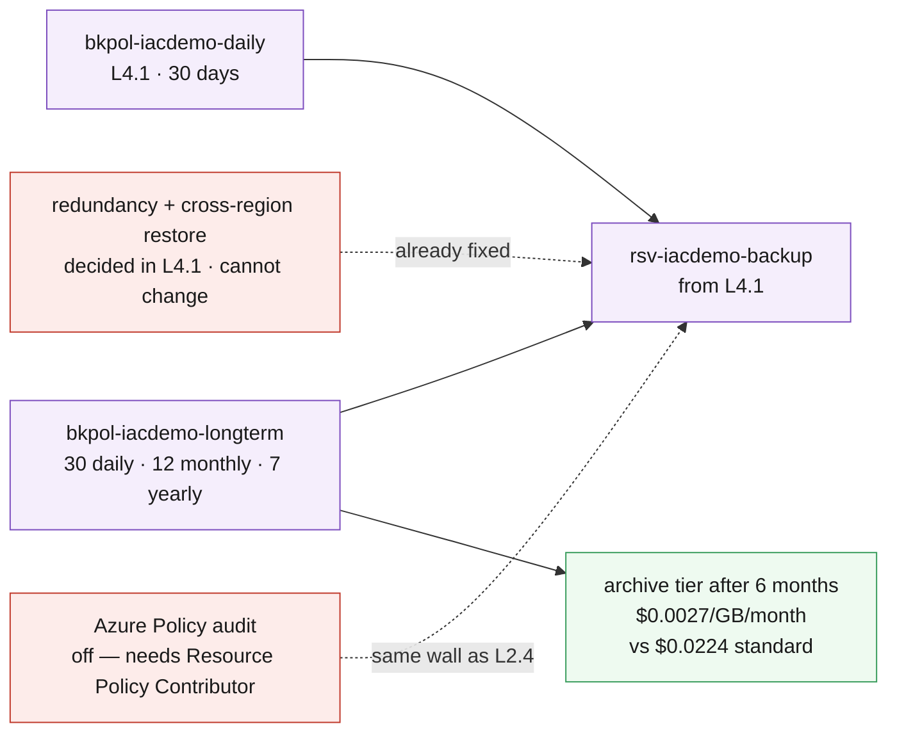

# L4.4 — Enterprise Data Protection Strategy 🟣

**Goal:** turn per-resource backup into a policy with a defensible price — a long-retention policy that tiers its own tail into archive, and the arithmetic that justifies every year of it.

| Who this is for | Time | You need first | Cost while it runs |
|---|---|---|---|
| Chapter 4 of Level 4 · everyone | ~20 min | **L4.1** and **L4.3** | 🟣 ~$0.01/hr added · ~$2.10/hr running total, and growing |

> [!WARNING]
> **Level 4 is the only level whose cost keeps rising with nothing changed.**
> Retained recovery points accumulate. A 7-year yearly policy signed off today
> is a bill that grows every January for seven years, and it is the most
> commonly mis-forecast line in a real Azure invoice. Price it here, on a lab
> database, before you agree to it on a real one.

## What you're building



<details><summary>Text description of this diagram</summary>

A second backup policy alongside the daily one L4.1 created — added as a child
of the vault, the same additive pattern L2.1 used for diagnostic settings, never
by editing the vault another template owns.

The new policy carries the compliance shape: 30 daily, 12 monthly, and 7 yearly
recovery points. The green box is the lever that makes that affordable — a
tiering rule moves everything older than six months into the archive tier at
$0.0027/GB/month against $0.0224 standard, roughly an 88% cut on the long tail
**without shortening the retention promise**. That is why archiving beats
trimming retention as a first move.

The two red boxes are things this chapter deliberately cannot do. Redundancy and
cross-region restore were frozen when L4.1 protected its first item. And the
governance policy assignment hits the same wall as L2.4: Contributor cannot
create one.

</details>

**Source:** [`curriculum/L4.4-data-protection-strategy/main.bicep`](https://github.com/saulpatinojr/Demo-IaC_Demo_with_VSCode/blob/main/curriculum/L4.4-data-protection-strategy/main.bicep) · [`main.bicepparam`](https://github.com/saulpatinojr/Demo-IaC_Demo_with_VSCode/blob/main/curriculum/L4.4-data-protection-strategy/main.bicepparam)

> [!IMPORTANT]
> **Immutability is not set here, and that is deliberate.** Vault immutability
> belongs to L4.1, and its `Locked` state cannot be undone **by anyone,
> including Microsoft support**. That is the entire point of it — an attacker
> with full admin rights still cannot shorten your retention. It is also exactly
> why no template should set it as a convenience. Decide it consciously, in
> L4.1, with someone else reading the pull request.

<br>

## &nbsp; Azure Up to date

<table>
<tr>
<td width="72" align="center" valign="top"></td>
<td valign="top">
<b>Azure RBAC — the minimum this chapter needs</b><br><br>
<b>Contributor</b> on the lab resource group for the policy. <b>Resource Policy Contributor</b> or <b>Owner</b> only if you enable the governance audit.<br>
<sub>Why: a backup policy is a child of the vault, so ordinary rights are enough. The audit policy assignment is off by default for the same reason as L2.4 — <code>Microsoft.Authorization/*/Write</code> is in Contributor notActions, so a policy assignment fails for the audience this lab is written for. Locking immutability, if you ever do, needs <b>Owner</b> and should need a conversation.</sub>
</td>
</tr>
<tr>
<td width="72" align="center" valign="top"></td>
<td valign="top">
<b>Microsoft Entra ID roles</b><br><br>
<b>None.</b><br>
<sub>Data protection strategy is Azure-plane. The directory equivalent — deciding who may approve a retention reduction, and proving it later — lives in Microsoft Entra ID governance: PIM for the backup admin role, and access reviews on whoever holds it. Neither is in scope here, and both belong in the same document as this policy.</sub>
</td>
</tr>
</table>

<sub><a href="https://learn.microsoft.com/azure/backup/backup-azure-immutable-vault-concept">For more info</a> — Immutable vaults, and what Locked really means</sub>

<br>

## 🚀 Deploy it — pick any one of three ways

<table>
<tr>
<td align="center" width="240"><br><br><b>1 · Bicep CLI</b><br><sub>Copy-paste in the terminal</sub></td>
<td align="center" width="240"><br><br><b>2 · GitHub Actions</b><br><sub>One button in the browser</sub></td>
<td align="center" width="240"><br><br><b>3 · GitHub Copilot</b><br><sub>Ask AI in plain English</sub></td>
</tr>
</table>

<br>

---

## &nbsp; Option 1 · Bicep from the terminal

```powershell
az deployment group what-if --resource-group $env:AZURE_RESOURCE_GROUP --parameters curriculum/L4.4-data-protection-strategy/main.bicepparam
az deployment group create  --resource-group $env:AZURE_RESOURCE_GROUP --parameters curriculum/L4.4-data-protection-strategy/main.bicepparam
```

**You should see:** `retentionShape` describing the policy in plain terms,
`archiveSaving` quantifying the tiering lever, and `whatL41Froze` reminding you
which decisions are already closed.

**Model the expensive line before you accept it:**

```powershell
$env:CURRICULUM_YEARLY_RETENTION = "0"    # then compare the storage forecast against 7
```

<br>

---

## &nbsp; Option 2 · GitHub Actions (push-button)

**Actions → "Curriculum L4 - Backup & Recovery Readiness" → Run workflow →
L4.4 - Enterprise Data Protection Strategy**.

Worth one **Stop after what-if** run: adding a second policy is harmless, but seeing the diff before it lands is the habit this whole level is trying to build.

<br>

---

## &nbsp; Option 3 · GitHub Copilot (plain English)

Load your values first: `./scripts/Load-LabSettings.ps1`. Then in
**Copilot Chat → Agent mode**:

> Deploy `curriculum/L4.4-data-protection-strategy/main.bicep` to my lab resource group (`$env:AZURE_RESOURCE_GROUP`) with `az deployment group create`.

**Then get it to do the arithmetic you would otherwise skip:**

> Using the rates in the comments of `curriculum/L4.4-data-protection-strategy/main.bicep`, calculate the monthly backup storage cost for four 30 GB VMs under this policy after one year and after seven, with and without archive tiering. Show the working.

The gap between those four numbers is the business case for tiering, and it is
the slide that ends this level. Sanity-check the rates against the
[Curriculum Cost Model](https://github.com/saulpatinojr/Demo-IaC_Demo_with_VSCode/wiki/Curriculum-Cost-Model)
before you quote them to anyone.

<br>

---

## ✅ Verify it

1. **Both policies exist side by side:**

   ```powershell
   az backup policy list --vault-name "rsv-$env:AZURE_PREFIX-backup" -g $env:AZURE_RESOURCE_GROUP `
     --query "[].{name:name, type:properties.backupManagementType}" -o table
   ```

   **You should see:** the daily policy from L4.1 and the long-term one from
   here. Nothing was replaced — move a single item onto the new policy and leave
   the rest, so you can compare.

2. **The tiering rule is really there:**

   ```powershell
   az backup policy show --vault-name "rsv-$env:AZURE_PREFIX-backup" -g $env:AZURE_RESOURCE_GROUP `
     -n "bkpol-$env:AZURE_PREFIX-longterm" --query "properties.tieringPolicy" -o json
   ```

   **You should see:** `TierAfter` at 6 months. Archive tiering has a minimum
   retention requirement, so a policy that keeps recovery points for less than
   that cannot use it — another case where the platform constrains the design.

3. **Confirm what L4.1 closed off:**

   ```powershell
   az backup vault backup-properties show -n "rsv-$env:AZURE_PREFIX-backup" -g $env:AZURE_RESOURCE_GROUP `
     --query "{redundancy:storageModelType, crossRegionRestore:crossRegionRestoreFlag}" -o table
   ```

   **You should see:** whatever L4.1 chose. If cross-region restore is `false`
   and your strategy needs it, the honest answer is that this vault cannot
   deliver it — and rebuilding a vault means re-protecting everything and losing
   the recovery point history. That consequence is the reason L4.1 asked first.

4. **Write the strategy down.** You now have retention shapes, redundancy, a
   tiering rule, alerting from L4.3 and a restore drill result. Produce a
   one-page data protection standard with a dollar figure per line and an RPO
   and RTO per tier. That document, not the deployment, is the output of
   Level 4 — and the numbers in it are defensible because you measured them.

>  **GitHub feature spotlight · The cost model and the code in one review**
>
> **You just used it:** retention, redundancy and tiering are all parameters in
> one file, and the rates that price them are comments beside them. A reviewer
> can check the arithmetic and the implementation in the same diff.
> **Find it:** the `archiveSaving` and `theWholeFormula` outputs — the template
> states its own cost model rather than leaving it in a spreadsheet nobody
> versions.
> **Beyond the lab:** a retention policy is a financial commitment with a code
> review attached. Treat it like one.
> [Docs →](https://docs.github.com/pull-requests/collaborating-with-pull-requests/reviewing-changes-in-pull-requests/about-comparing-branches-in-pull-requests)

<br>

---

## ➡️ What carries forward

Level 4 is complete: the estate is protected, monitored, rehearsed and costed.

**Level 5** puts Microsoft Sentinel on the workspace L3.3 started filling — and
needs a Microsoft Entra ID role for the first time. **Level 6** protects against
losing a region rather than losing data.

**Leave it deployed** → **[back to Level 4 · Protect](https://github.com/saulpatinojr/Demo-IaC_Demo_with_VSCode/wiki/Curriculum-Level-4-Protect)**.
