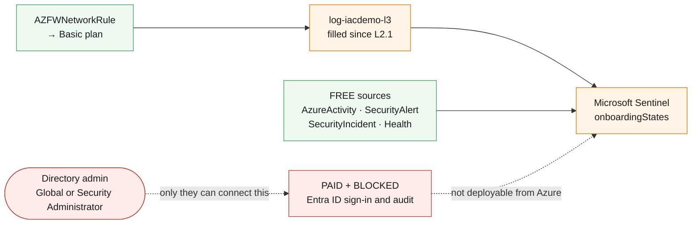

# L5.1 — Sentinel Foundation 🟠

**Goal:** enable Microsoft Sentinel on the workspace this curriculum has been filling since L2.1, and connect only what is free before anything paid.

| Who this is for | Time | You need first | Cost while it runs |
|---|---|---|---|
| Chapter 1 of Level 5 · everyone | ~20 min | **Levels 1–4**, and Sentinel Contributor | 🟠 **$0.00/hr in the trial** · +$0.31/hr after it |

> [!WARNING]
> **Sentinel bills analysis on everything in the workspace it is enabled on.**
> The operations data Level 2 has been collecting is already there, so switching
> Sentinel on applies a $4.76/GB analysis charge to it as well as the $2.76/GB
> ingestion you were already paying. That is why L2.4's table-plan discipline
> mattered, and why this template demotes the noisiest table on the way in.
>
> The 31-day free trial waives both charges for the first 10 GB/day. This estate
> fits inside it. **Run Level 5 inside the window.**

## What you're building



<details><summary>Text description of this diagram</summary>

Sentinel is enabled **on the existing workspace** rather than a new one, which
is the decision the entire redesign has been building toward: every data source
Level 2 and Level 3 connected is already there, and nothing has to be
reconnected.

The green boxes are free. Azure Activity has been flowing since L2.1;
`SecurityAlert` and `SecurityIncident` arrive from the L3.3 export and carry no
Sentinel analysis charge at all. The template also demotes `AZFWNetworkRule` to
the **Basic** plan ($0.50/GB against Analytics' $2.76, and no Sentinel analysis
charge on Basic-tier data), because a table nothing detects on stops being
merely verbose once Sentinel is charging $4.76/GB analysis on top. Auxiliary is
cheaper still at $0.05/GB but is not offered for a standard Azure resource-log
table like this one.

The red boxes are the wall. Microsoft Entra ID sign-in and audit logs are paid
data **and** need a Global Administrator or Security Administrator to connect
them in the directory. No Azure permission substitutes for that, and a
resource-group Contributor cannot get there from here.

</details>

**Source:** [`curriculum/L5.1-sentinel-foundation/main.bicep`](https://github.com/saulpatinojr/Demo-IaC_Demo_with_VSCode/blob/main/curriculum/L5.1-sentinel-foundation/main.bicep) · [`main.bicepparam`](https://github.com/saulpatinojr/Demo-IaC_Demo_with_VSCode/blob/main/curriculum/L5.1-sentinel-foundation/main.bicepparam)

> [!NOTE]
> **Where Sentinel lives from here.** The Azure portal experience retires after
> **31 March 2027**, and the Microsoft Defender portal is the destination. The
> resources this template deploys are unaffected — onboarding, connectors and
> rules are the same ARM resources either way — but the screenshots in any
> course written today will age out before the retirement does.

<br>

## &nbsp; Azure Up to date

<table>
<tr>
<td width="72" align="center" valign="top"></td>
<td valign="top">
<b>Azure RBAC — the minimum this chapter needs</b><br><br>
<b>Microsoft Sentinel Contributor</b> on the workspace. Plain Contributor is <b>not</b> enough.<br>
<sub>Why: onboarding Sentinel and creating data connectors are <code>Microsoft.SecurityInsights</code> operations that Contributor on a resource group does not cover. This is the first chapter where the lab identity genuinely needs a role upgrade rather than a workaround — ask before the class, because a failed onboarding at minute five stops the level.</sub>
</td>
</tr>
<tr>
<td width="72" align="center" valign="top"></td>
<td valign="top">
<b>Microsoft Entra ID roles</b><br><br>
<b>Global Administrator</b> or <b>Security Administrator</b> — for the connector this template cannot deploy.<br>
<sub>The Microsoft Entra ID data connector is granted in the <b>directory</b>, not the subscription, and in most organisations that is a different team entirely. It is also paid data at about $7.52/GB combined. Both facts belong in the same conversation: you are asking someone else to approve a change that costs you money.</sub>
</td>
</tr>
</table>

<sub><a href="https://learn.microsoft.com/azure/sentinel/roles">For more info</a> — Microsoft Sentinel roles and permissions</sub>

<br>

## 🚀 Deploy it — pick any one of three ways

<table>
<tr>
<td align="center" width="240"><br><br><b>1 · Bicep CLI</b><br><sub>Copy-paste in the terminal</sub></td>
<td align="center" width="240"><br><br><b>2 · GitHub Actions</b><br><sub>One button in the browser</sub></td>
<td align="center" width="240"><br><br><b>3 · GitHub Copilot</b><br><sub>Ask AI in plain English</sub></td>
</tr>
</table>

<br>

---

## &nbsp; Option 1 · Bicep from the terminal

```powershell
az deployment group what-if --resource-group $env:AZURE_RESOURCE_GROUP --parameters curriculum/L5.1-sentinel-foundation/main.bicepparam
az deployment group create  --resource-group $env:AZURE_RESOURCE_GROUP --parameters curriculum/L5.1-sentinel-foundation/main.bicepparam
```

**You should see:** `freeDataSources` listing what arrives at no charge,
`paidAndBlocked` naming the connector you cannot deploy, and `whatToWatch`
telling you which query to re-run tomorrow.

**Keep the demotion off if you want to see the difference:**

```powershell
$env:CURRICULUM_DEMOTE_VERBOSE = "false"   # then compare tomorrow's Usage bill
```

<br>

---

## &nbsp; Option 2 · GitHub Actions (push-button)

**Actions → "Curriculum L5 - Microsoft Sentinel" → Run workflow →
L5.1 - Sentinel Foundation**.

If onboarding fails with an authorisation error, the identity has Contributor and not **Microsoft Sentinel Contributor**. That is the expected failure, not a broken template.

<br>

---

## &nbsp; Option 3 · GitHub Copilot (plain English)

Load your values first: `./scripts/Load-LabSettings.ps1`. Then in
**Copilot Chat → Agent mode**:

> Deploy `curriculum/L5.1-sentinel-foundation/main.bicep` to my lab resource group (`$env:AZURE_RESOURCE_GROUP`) with `az deployment group create`.

**Then ask it for the thing that is not yours to give:**

> Add a Microsoft Entra ID data connector to `curriculum/L5.1-sentinel-foundation/main.bicep` so we get sign-in logs.

Copilot will write a plausible `dataConnectors` resource of kind
`AzureActiveDirectory`. It will fail, and the error will be about permissions
rather than syntax. The connector requires a directory role no Azure RBAC
assignment can grant — which is the single most important thing to understand
before planning a Sentinel deployment for a real organisation.

<br>

---

## ✅ Verify it

1. **Sentinel is on the workspace you expected:**

   ```powershell
   az sentinel onboarding-state show --workspace-name "log-$env:AZURE_PREFIX-l3" -g $env:AZURE_RESOURCE_GROUP -o table
   ```

2. **The free connector is live:**

   ```powershell
   az sentinel data-connector list --workspace-name "log-$env:AZURE_PREFIX-l3" -g $env:AZURE_RESOURCE_GROUP -o table
   ```

   **You should see:** the Defender for Cloud connector. Everything L3.3 exported
   is now Sentinel data at no additional analysis charge.

3. **Confirm the trial is running, and when it ends.** In the portal:
   **Microsoft Sentinel → News & guides → Free trial**. Write the end date in
   the class calendar. After it, this estate costs roughly $0.31/hr more.

4. **Do the arithmetic that decides the rest of the level:**

   ```powershell
   az monitor log-analytics query --workspace $WS `
     --analytics-query "Usage | where TimeGenerated > ago(24h) and IsBillable | summarize GB=sum(Quantity)/1000 by DataType | order by GB desc" -o table
   ```

   **You should see:** the same table you have been watching since L2.1 — but
   every row on the Analytics plan now costs about **$7.52/GB** rather than
   $2.76. Multiply it out. That number is the argument for every table-plan
   decision in the rest of Level 5.

>  **GitHub feature spotlight · The connector you cannot merge your way past**
>
> **Why it belongs here:** everything else in this curriculum has been solvable
> with a pull request. This is the first thing that is not — the Entra ID
> connector needs a person with a directory role to agree, and no template,
> review or approval in this repository substitutes for it.
> **Find it:** the `paidAndBlocked` output, which names the blocker rather than
> failing silently.
> **Beyond the lab:** knowing which dependencies are technical and which are
> organisational is most of what makes a project plan realistic.
> [Docs →](https://docs.github.com/actions/deployment/security-hardening-your-deployments/about-security-hardening-with-openid-connect)

<br>

---

## ➡️ What carries forward

L5.2 writes detections against exactly this data — and one of them joins
security data to operations data, which is only possible because every level
wrote into the same workspace.

**Leave it deployed** → **[back to Level 5 · Detect](https://github.com/saulpatinojr/Demo-IaC_Demo_with_VSCode/wiki/Curriculum-Level-5-Detect)**.
