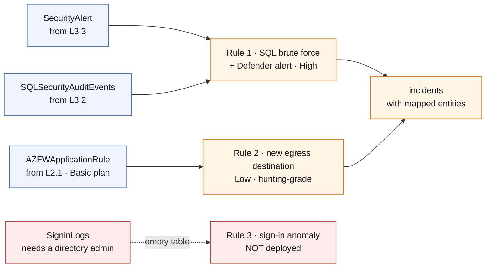

# L5.2 — Detection & Investigation 🟠

**📍 [Level 5 · Detect](https://github.com/saulpatinojr/Demo-IaC_Demo_with_VSCode/wiki/Curriculum-Level-5-Detect)** · Chapter 2 of 3 &nbsp;·&nbsp; Previous: [L5.1 — Sentinel Foundation](https://github.com/saulpatinojr/Demo-IaC_Demo_with_VSCode/wiki/Curriculum-L5-1-Sentinel-Foundation) &nbsp;·&nbsp; Next: [L5.3 — SOC Operations & Automation](https://github.com/saulpatinojr/Demo-IaC_Demo_with_VSCode/wiki/Curriculum-L5-3-SOC-Operations)

---

**Goal:** write detections that fire on this environment’s real behaviour, then
investigate what they produce. Detection logic is free — you pay for the data,
not the queries.

**The IaC lesson:** a detection is a reviewable text artifact — each analytics
rule’s query, threshold, severity and entity mapping is Bicep a colleague can
argue with in a pull request before it ever pages anyone.

<br>

| Who this is for | Time | You need first | Cost while it runs |
|---|---|---|---|
| Chapter 2 of Level 5 · everyone | ~20 min | **L5.1** | 🟢 **$0.00/hr in the trial** · +$0.03/hr after it |

> [!IMPORTANT]
> **One of these rules is only possible because of a decision made in L2.1** —
> it joins security data to operations data, and that join exists because every
> level wrote into the *same* workspace instead of standing up its own.

<br>

## What you're building

Three analytics rules, written as Bicep — two deploy, one is deliberately
withheld. Rule 1 joins Defender alerts to failed SQL logins; Rule 2 watches
the firewall's Basic-plan table for outbound destinations it has never seen;
Rule 3 needs sign-in logs nobody here has permission to connect. Both deployed
rules map entities, so their incidents can be investigated rather than just
counted.



<details><summary>Text description of this diagram</summary>

Three rules, two of which deploy.

**Rule 1** is the payoff for one workspace. It correlates repeated failed SQL
authentications — which exist because L3.2 turned on auditing — with Defender
for Cloud alerts on the same resource, which exist because L3.3 exported them.
Severity High, because the combination is far more specific than either half.

**Rule 2** queries `AZFWApplicationRule`, the table L5.1 moved to the Basic
plan, and looks for outbound destinations not seen in the previous seven days.
Severity Low on purpose: it is a hunting-grade signal promoted to a rule so the
class has something that actually fires to practise triage on.

**Rule 3** is deliberately **not deployed**. It needs `SigninLogs`, which needs
the directory connector nobody here can enable. A rule over an empty table never
fires and looks like coverage — worse than not existing.

Both deployed rules carry **entity mappings**. Without them an incident is a row
in a table; with them Sentinel can pivot to everything else that resource or
address touched.

</details>

**Source:** [`curriculum/L5.2-detection-investigation/main.bicep`](https://github.com/saulpatinojr/Demo-IaC_Demo_with_VSCode/blob/main/curriculum/L5.2-detection-investigation/main.bicep) · [`main.bicepparam`](https://github.com/saulpatinojr/Demo-IaC_Demo_with_VSCode/blob/main/curriculum/L5.2-detection-investigation/main.bicepparam)

<br>

<details><summary><b>🔍 Going deeper — the join that one workspace buys you</b></summary>

<br>

Rule 1 joins `SecurityAlert` to `SQLSecurityAuditEvents` — security data to
operations data. Neither table alone is an incident; the join is the
detection. That join exists because every level wrote into the *same*
workspace instead of standing up its own, which is the decision L2.1 made and
the entire redesign has been protecting since.

</details>

<details><summary><b>🔍 Going deeper — analytics rules over Basic tables</b></summary>

<br>

Rule 2 proves something about Basic tables. L2.4 taught that alert rules
cannot read them — that is true of Log Analytics *scheduled query* alerts.
Sentinel analytics rules over a Basic table work when the query is a simple
filter and aggregation, which this one is. The distinction is fiddly, real,
and exactly the kind of thing that gets a detection quietly disabled six
months later. Test the rule, do not assume the plan.

</details>

<details><summary><b>🔍 Going deeper — the permissions this needs</b></summary>

<table>
<tr>
<td width="72" align="center" valign="top"></td>
<td valign="top">
<b>Azure RBAC — the minimum this chapter needs</b><br><br>
<b>Microsoft Sentinel Contributor</b> on the workspace — a requirement on the <b>shared workshop deploy identity</b> that ships the rules, not on you. Your own <b>Reader</b> is enough to open the incidents they produce.<br>
<sub>Why: analytics rules are <code>Microsoft.SecurityInsights</code> resources, same as the onboarding in L5.1. Worth knowing the narrower roles too — <b>Microsoft Sentinel Responder</b> can investigate and manage incidents but not change rules, and <b>Microsoft Sentinel Reader</b> can only look. A SOC that gives every analyst Contributor has no change control over its own detections — which is exactly why this workshop routes every rule change through the deploy identity and a pull request rather than granting write access to each participant.</sub>
</td>
</tr>
<tr>
<td width="72" align="center" valign="top"></td>
<td valign="top">
<b>Microsoft Entra ID roles</b><br><br>
<b>Global Administrator</b> or <b>Security Administrator</b> — only if you want Rule 3 to do anything.<br>
<sub>Rule 3 is included in the template and disabled by default precisely so the gap is visible. If a directory admin connects Microsoft Entra ID logs, set <code>CURRICULUM_ENTRA_RULES=true</code> and it starts working. Until then it is documentation of a dependency, not a detection.</sub>
</td>
</tr>
</table>

<sub><a href="https://learn.microsoft.com/azure/sentinel/roles">For more info</a> — Sentinel Contributor, Responder and Reader</sub>

</details>

<br>

---

> [!NOTE]
> **🏫 Classroom: use the GitHub Actions option.** Your Azure account holds Reader, so local `az deployment` commands will be refused — deploys go through your fork's workflow, which uses the shared workshop identity automatically. Compiling locally (`az bicep build`) works for everyone.

## 🚀 Deploy it — pick any one of three ways

<table>
<tr>
<td align="center" width="240"><br><br><b>1 · Bicep CLI</b><br><sub>Copy-paste in the terminal</sub></td>
<td align="center" width="240"><br><br><b>2 · GitHub Actions</b><br><sub>One button in the browser</sub></td>
<td align="center" width="240"><br><br><b>3 · GitHub Copilot</b><br><sub>Ask AI in plain English</sub></td>
</tr>
</table>

<br>

---

## &nbsp; Option 1 · Bicep from the terminal

```powershell
az deployment group what-if --resource-group $env:AZURE_RESOURCE_GROUP --parameters curriculum/L5.2-detection-investigation/main.bicepparam
az deployment group create  --resource-group $env:AZURE_RESOURCE_GROUP --parameters curriculum/L5.2-detection-investigation/main.bicepparam
```

**You should see:** `ruleCount` of 2, and `blockedRule` explaining why the third
is absent rather than silently missing.

**If a directory admin has connected the logs:**

```powershell
$env:CURRICULUM_ENTRA_RULES = "true"
```

<br>

---

## &nbsp; Option 2 · GitHub Actions (push-button)

**Actions → "Curriculum L5 - Microsoft Sentinel" → Run workflow →
L5.2 - Detection & Investigation**.

The **directory admin has connected Entra ID logs** toggle is the only input that matters here. Leave it off unless someone has actually done it.

<br>

---

## &nbsp; Option 3 · GitHub Copilot (plain English)

Load your values first: `./scripts/Load-LabSettings.ps1`. Then in
**Copilot Chat → Agent mode**:

> Deploy `curriculum/L5.2-detection-investigation/main.bicep` to my lab resource group (`$env:AZURE_RESOURCE_GROUP`) with `az deployment group create`.

**Then make it write a detection for something you know happened:**

> In `curriculum/L5.2-detection-investigation/main.bicep`, add a scheduled analytics rule that fires when a backup job fails twice in 24 hours, using the AddonAzureBackupJobs table from L4.3. Map the resource as an entity. Run `az bicep build`, then show me a what-if.

Ask yourself whether that belongs in Sentinel at all. L4.3 already alerts on it
through Azure Monitor, for $0.50/month, without Sentinel analysis charges. Every
signal has a right home, and "we have a SIEM" is not a reason to route
everything through it.

<br>

---

## ✅ Verify it

1. **Both rules exist and are enabled:**

   ```powershell
   az sentinel alert-rule list --workspace-name "log-$env:AZURE_PREFIX-l3" -g $env:AZURE_RESOURCE_GROUP `
     --query "[].{name:displayName, severity:severity, enabled:enabled}" -o table
   ```

2. **Make Rule 1 fire** — repeat the failed-login test from L3.2 six or more
   times against the SQL server, then wait for the hourly evaluation:

   ```powershell
   1..8 | ForEach-Object { sqlcmd -S "$SQL.database.windows.net" -U notauser -P "wrong-$_" -Q "SELECT 1" }
   ```

   **You should see:** an incident within the hour, with the SQL server already
   attached as an entity. Open it and use the investigation graph — that pivot
   is what the entity mapping bought you.

3. **Check the MITRE coverage honestly:** in the portal, **Microsoft Sentinel →
   MITRE ATT&CK**.

   **You should see:** two techniques covered and a great many not. Say the
   number out loud. Two rules is not a detection strategy, and a coverage map
   that looks sparse is more useful than one that looks full because someone
   enabled every template rule without checking the data behind them.

4. **Hunt without an alert.** In **Hunting**, run:

   ```kql
   AzureActivity
   | where OperationNameValue has "delete" and ActivityStatusValue == "Success"
   | summarize Deletions = count() by Caller, ResourceGroup
   | order by Deletions desc
   ```

   **You should see:** your own teardown activity from earlier levels. Hunting
   starts from a hypothesis rather than a rule, and recognising your own
   footprints is the first step to recognising someone else's.

<br>

>  **GitHub feature spotlight · Detections reviewed before they page anyone**
>
> **You just used it:** these rules are Bicep — the query, the threshold, the
> severity and the entity mapping are all text a colleague can argue with before
> the rule wakes anybody at 3am.
> **Find it:** the `entityMappings` block on each rule, and the comment
> explaining why Rule 3 is not deployed.
> **Beyond the lab:** a SOC that edits detections in the portal cannot answer
> "who changed this, and why" — which is the first question asked after a missed
> incident.
> [Docs →](https://docs.github.com/pull-requests/collaborating-with-pull-requests/reviewing-changes-in-pull-requests/about-pull-request-reviews)

<br>

---

## ➡️ What carries forward

L5.3 automates the triage these incidents need, and closes the level with a
cost review that turns off a connector you have proved you do not need.

<br>

## 🧭 Where next?

| Your situation | Go to |
|---|---|
| Ready to keep going — automate the triage | **[L5.3 — SOC Operations & Automation](https://github.com/saulpatinojr/Demo-IaC_Demo_with_VSCode/wiki/Curriculum-L5-3-SOC-Operations)** |
| Want the big picture of this level first | [Level 5 · Detect overview](https://github.com/saulpatinojr/Demo-IaC_Demo_with_VSCode/wiki/Curriculum-Level-5-Detect) |
| Done for the day — the estate bills while idle | [Cleanup & Reset](https://github.com/saulpatinojr/Demo-IaC_Demo_with_VSCode/wiki/Cleanup-and-Reset) |
| Something didn't work | [Troubleshooting](https://github.com/saulpatinojr/Demo-IaC_Demo_with_VSCode/wiki/Troubleshooting) |
| ⬅ Back to the main path grid | [🗺️ Curriculum Map](https://github.com/saulpatinojr/Demo-IaC_Demo_with_VSCode/wiki/Curriculum-Map) |
