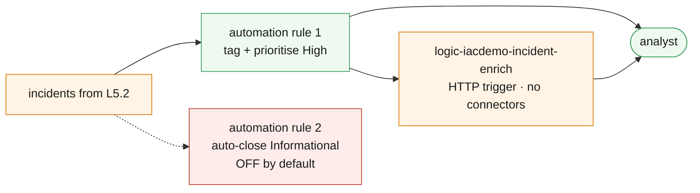

# L5.3 — SOC Operations & Automation 🟠

**📍 [Level 5 · Detect](https://github.com/saulpatinojr/Demo-IaC_Demo_with_VSCode/wiki/Curriculum-Level-5-Detect)** · Chapter 3 of 3 &nbsp;·&nbsp; Previous: [L5.2 — Detection & Investigation](https://github.com/saulpatinojr/Demo-IaC_Demo_with_VSCode/wiki/Curriculum-L5-2-Detection-Investigation) &nbsp;·&nbsp; Next: [Level 6 · Recover](https://github.com/saulpatinojr/Demo-IaC_Demo_with_VSCode/wiki/Curriculum-Level-6-Recover)

---

**Goal:** operate the SIEM — automate the repetitive parts of response, and
close the level by measuring what the whole thing costs.

**The IaC lesson:** response automation is code too — the automation rules and
the playbook's triage questions live in this repository, so the SOC's routine
improves through pull requests instead of drifting between analysts.

<br>

| Who this is for | Time | You need first | Cost while it runs |
|---|---|---|---|
| Chapter 3 of Level 5 · everyone | ~20 min | **L5.2** | 🟠 ~$0.01/hr added · ~$2.11/hr in the trial, ~$2.45/hr after |

> [!IMPORTANT]
> **Automation rules run before a human sees the incident.** The auto-close
> rule in this template is **off by default** — an auto-closed incident is one
> nobody looked at, so argue about it in class before enabling it.

<br>

## What you're building

Two automation rules and one playbook stand between a new incident and the
analyst. The safe rule tags and prioritises; the risky one auto-closes and
ships disabled. The playbook enriches incidents over a plain HTTP trigger with
no API connections, so it deploys and runs without anyone's consent screen.



<details><summary>Text description of this diagram</summary>

Incidents from L5.2 pass through automation rules before an analyst sees them.

The first rule tags and prioritises High-severity incidents — additive,
reversible, and safe to run unattended. The second closes Informational
incidents automatically and is **off by default**: it is the automation rule
most likely to be regretted, because it removes things from a queue nobody is
then watching.

The playbook is HTTP-triggered with **no API connections**, for the same reason
as L3.3: a connector needs an interactive OAuth consent that no deployment can
perform, so a Teams-posting version would deploy green and fail on first run.
This one composes the first thirty seconds of triage — what, how bad, which
resource, and three questions to ask — so the routine is written down once
rather than remembered differently by each analyst.

</details>

**Source:** [`curriculum/L5.3-soc-operations/main.bicep`](https://github.com/saulpatinojr/Demo-IaC_Demo_with_VSCode/blob/main/curriculum/L5.3-soc-operations/main.bicep) · [`main.bicepparam`](https://github.com/saulpatinojr/Demo-IaC_Demo_with_VSCode/blob/main/curriculum/L5.3-soc-operations/main.bicepparam)

<br>

<details><summary><b>🔍 Going deeper — the cost Azure Cost Management cannot see</b></summary>

<br>

The largest cost in a SOC does not appear on the Azure bill. Analyst time is.
Automation rules, playbook triggers, workbooks and incident management are all
free in Sentinel; what you are optimising with them is the expensive resource
that Azure Cost Management cannot see. Say that explicitly when presenting
this level, or the automation looks like a rounding error.

</details>

<details><summary><b>🔍 Going deeper — the permissions this needs</b></summary>

<table>
<tr>
<td width="72" align="center" valign="top"></td>
<td valign="top">
<b>Azure RBAC — the minimum this chapter needs</b><br><br>
<b>Microsoft Sentinel Contributor</b> for the automation rules, plus <b>Contributor</b> for the Logic App.<br>
<sub>Why: automation rules are Sentinel resources; the playbook is an ordinary Logic App. There is a subtlety worth knowing — for Sentinel to <i>run</i> a playbook it needs the <b>Microsoft Sentinel Automation Contributor</b> role on the playbook resource group, which the portal grants for you the first time and a template does not. If a playbook never fires from an automation rule, that missing grant is why.</sub>
</td>
</tr>
<tr>
<td width="72" align="center" valign="top"></td>
<td valign="top">
<b>Microsoft Entra ID roles</b><br><br>
<b>Cloud Application Administrator</b> or <b>Global Administrator</b> — the moment you add a connector.<br>
<sub>Same wall as L3.3, and it arrives here for real. Posting to Teams, sending mail or opening a ticket needs an API connection and an interactive consent. Whether an analyst can consent for themselves is a tenant setting; in most organisations it is not, and the SOC has to ask.</sub>
</td>
</tr>
</table>

<sub><a href="https://learn.microsoft.com/azure/sentinel/automate-responses-with-playbooks">For more info</a> — Sentinel playbooks, and the permissions that let one actually run</sub>

</details>

<br>

---

## 🚀 Deploy it — pick any one of three ways

<table>
<tr>
<td align="center" width="240"><br><br><b>1 · Bicep CLI</b><br><sub>Copy-paste in the terminal</sub></td>
<td align="center" width="240"><br><br><b>2 · GitHub Actions</b><br><sub>One button in the browser</sub></td>
<td align="center" width="240"><br><br><b>3 · GitHub Copilot</b><br><sub>Ask AI in plain English</sub></td>
</tr>
</table>

<br>

---

## &nbsp; Option 1 · Bicep from the terminal

```powershell
az deployment group what-if --resource-group $env:AZURE_RESOURCE_GROUP --parameters curriculum/L5.3-soc-operations/main.bicepparam
az deployment group create  --resource-group $env:AZURE_RESOURCE_GROUP --parameters curriculum/L5.3-soc-operations/main.bicepparam
```

**You should see:** `autoCloseWarning` making the case against the rule you did
not enable, and `closingExercise` naming the thing to do before you finish the
level.

**Enable auto-close only after the argument:**

```powershell
$env:CURRICULUM_AUTO_CLOSE = "true"
```

<br>

---

## &nbsp; Option 2 · GitHub Actions (push-button)

**Actions → "Curriculum L5 - Microsoft Sentinel" → Run workflow →
L5.3 - SOC Operations & Automation**.

Nothing here is expensive or irreversible, so a straight run is fine.

<br>

---

## &nbsp; Option 3 · GitHub Copilot (plain English)

Load your values first: `./scripts/Load-LabSettings.ps1`. Then in
**Copilot Chat → Agent mode**:

> Deploy `curriculum/L5.3-soc-operations/main.bicep` to my lab resource group (`$env:AZURE_RESOURCE_GROUP`) with `az deployment group create`.

**Then hit the wall on purpose:**

> Add a Microsoft Teams "post message in a chat" action to the playbook in `curriculum/L5.3-soc-operations/main.bicep` so incidents are announced in our SOC channel.

It compiles. It deploys. The connection lands **unauthorised**, and the first
run fails. Someone with the right directory role has to open it and consent.
That is the third time this curriculum has hit the same boundary — L3.3, L5.1
and now here — and by now the pattern should be predictable rather than
surprising.

<br>

---

## ✅ Verify it

1. **The automation rule is in place and ordered:**

   ```powershell
   az sentinel automation-rule list --workspace-name "log-$env:AZURE_PREFIX-l3" -g $env:AZURE_RESOURCE_GROUP `
     --query "[].{name:displayName, order:order, enabled:triggeringLogic.isEnabled}" -o table
   ```

2. **Trigger the playbook by hand** to prove the wiring before trusting it:

   ```powershell
   $url = az rest --method post --uri "$(az logic workflow show -g $env:AZURE_RESOURCE_GROUP -n "logic-$env:AZURE_PREFIX-incident-enrich" --query id -o tsv)/triggers/When_an_incident_is_created/listCallbackUrl?api-version=2019-05-01" --query value -o tsv
   Invoke-RestMethod -Method Post -Uri $url -ContentType "application/json" -Body '{"Title":"test","Severity":"High","IncidentNumber":"0"}'
   ```

   **You should see:** the triage summary returned, with the three first
   questions in it.

3. **Measure the SOC, not just the alerts.** In the portal, open the built-in
   **Security Operations Efficiency** workbook.

   **You should see:** mean time to triage, mean time to close, and the
   false-positive rate. With two rules and a week of data these numbers are
   meaningless — and knowing they are meaningless at this sample size is itself
   the lesson.

4. **Close the level with the cost review.** Re-run the Usage query one last
   time, and this time act on it:

   ```powershell
   az monitor log-analytics query --workspace $WS `
     --analytics-query "Usage | where TimeGenerated > ago(24h) and IsBillable | summarize GB=sum(Quantity)/1000 by DataType | extend SentinelDailyUSD = round(GB * 7.52, 2) | order by GB desc" -o table
   ```

   **You should finish this level having turned off at least one connector or
   demoted at least one table**, and be able to say what it saved. A SIEM that
   only ever grows is a budget problem waiting to be somebody else's emergency.

<br>

>  **GitHub feature spotlight · The response routine, written down once**
>
> **You just used it:** the three triage questions in the playbook are in the
> repository, so they get better through pull requests instead of drifting
> between analysts.
> **Find it:** the `firstQuestions` array in the `Enrich` action.
> **Beyond the lab:** the difference between a SOC and a group of people
> answering alerts is whether the routine is written down somewhere it can be
> improved.
> [Docs →](https://docs.github.com/pull-requests/collaborating-with-pull-requests/proposing-changes-to-your-work-with-pull-requests/about-pull-requests)

<br>

---

## ➡️ What carries forward

Level 5 is a terminal track — pair it with
**[Level 6 · Recover](https://github.com/saulpatinojr/Demo-IaC_Demo_with_VSCode/wiki/Curriculum-Level-6-Recover)**
in either order. When the class ends, tear down deliberately: disabling
Sentinel does not delete the workspace, and retained data keeps billing.

<br>

## 🧭 Where next?

| Your situation | Go to |
|---|---|
| Level 5 complete — take the other terminal track | **[Level 6 · Recover](https://github.com/saulpatinojr/Demo-IaC_Demo_with_VSCode/wiki/Curriculum-Level-6-Recover)** |
| Want the big picture of this level | [Level 5 · Detect overview](https://github.com/saulpatinojr/Demo-IaC_Demo_with_VSCode/wiki/Curriculum-Level-5-Detect) |
| Done for the day — the estate bills while idle | [Cleanup & Reset](https://github.com/saulpatinojr/Demo-IaC_Demo_with_VSCode/wiki/Cleanup-and-Reset) |
| Something didn't work | [Troubleshooting](https://github.com/saulpatinojr/Demo-IaC_Demo_with_VSCode/wiki/Troubleshooting) |
