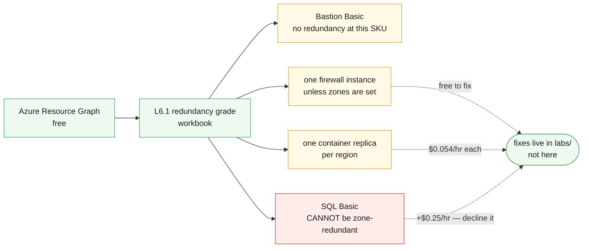

# L6.1 — High Availability & Redundancy 🔴

**Goal:** grade the architecture Level 1 built, honestly, against availability zones and component redundancy — before spending anything on fixing it.

| Who this is for | Time | You need first | Cost while it runs |
|---|---|---|---|
| Chapter 1 of Level 6 · everyone | ~20 min | **Levels 1–4**, and L2.2 for the measured half | 🟢 **$0.00/hr** — this chapter deploys a report, not redundancy |

> [!IMPORTANT]
> **This chapter changes nothing, deliberately.** Every redundancy upgrade in
> this estate belongs to the template that owns the resource — the container
> app replica count is in `labs/L3-containers`, the load balancer zones in
> `labs/L2-web-tier`. Fixing them from here would break the ownership rule the
> whole curriculum runs on. So L6.1 **measures**, and each fix arrives as a
> reviewed pull request against the right file.

## What you're building



<details><summary>Text description of this diagram</summary>

One workbook, fed by Azure Resource Graph, grading every resource in the group
by zone posture — zone-redundant, zonal, or neither — and then naming the four
single points of failure L1.4 left behind.

Three of the four are cheap to fix. Zone-redundant firewall and load balancer
cost **nothing extra** on the same SKU; a second container replica is $0.054/hr.
The fourth is not: the Basic-tier SQL database **cannot** be made zone-redundant
at any price, and leaving Basic costs about +$0.25/hr.

The dotted lines all point away from this chapter, at `labs/`. That is the
point. A redundancy grade produced by the monitoring team and a redundancy fix
made by the team that owns the workload are different activities, and conflating
them is how templates end up fighting each other.

</details>

**Source:** [`curriculum/L6.1-high-availability/main.bicep`](https://github.com/saulpatinojr/Demo-IaC_Demo_with_VSCode/blob/main/curriculum/L6.1-high-availability/main.bicep) · [`main.bicepparam`](https://github.com/saulpatinojr/Demo-IaC_Demo_with_VSCode/blob/main/curriculum/L6.1-high-availability/main.bicepparam)

> [!NOTE]
> **An SLA is not an SLO is not a measurement.** Azure publishes an SLA for each
> service; you choose an SLO; L2.2's availability test tells you what actually
> happened. Put all three side by side for this environment and the gaps are
> instructive — a 99.99% SLA on a component sitting behind a single Basic
> Bastion does not make the *system* 99.99%.

<br>

## &nbsp; Azure Up to date

<table>
<tr>
<td width="72" align="center" valign="top"></td>
<td valign="top">
<b>Azure RBAC — the minimum this chapter needs</b><br><br>
<b>Reader</b> on the resource group is enough to run every query. <b>Contributor</b> to deploy the workbook.<br>
<sub>Why: Azure Resource Graph reads what your identity can already see, so the grade is only as complete as your access — a Reader scoped to one resource group cannot tell you about the subscription around it. Worth noticing before quoting the result as an estate-wide finding.</sub>
</td>
</tr>
<tr>
<td width="72" align="center" valign="top"></td>
<td valign="top">
<b>Microsoft Entra ID roles</b><br><br>
<b>None.</b><br>
<sub>Redundancy is an infrastructure property. The identity-plane equivalent — whether your directory itself has a resilience story, and what happens to sign-ins during a regional Microsoft Entra ID incident — is a real question and firmly outside what this lab can demonstrate.</sub>
</td>
</tr>
</table>

<sub><a href="https://learn.microsoft.com/azure/reliability/availability-zones-overview">For more info</a> — Availability zones, zonal vs zone-redundant</sub>

<br>

## 🚀 Deploy it — pick any one of three ways

<table>
<tr>
<td align="center" width="240"><br><br><b>1 · Bicep CLI</b><br><sub>Copy-paste in the terminal</sub></td>
<td align="center" width="240"><br><br><b>2 · GitHub Actions</b><br><sub>One button in the browser</sub></td>
<td align="center" width="240"><br><br><b>3 · GitHub Copilot</b><br><sub>Ask AI in plain English</sub></td>
</tr>
</table>

<br>

---

## &nbsp; Option 1 · Bicep from the terminal

```powershell
az deployment group what-if --resource-group $env:AZURE_RESOURCE_GROUP --parameters curriculum/L6.1-high-availability/main.bicepparam
az deployment group create  --resource-group $env:AZURE_RESOURCE_GROUP --parameters curriculum/L6.1-high-availability/main.bicepparam
```

**You should see:** `freeFixes` and `paidFixes` split out, and `ownershipRule`
stating why this template changes nothing.

<br>

---

## &nbsp; Option 2 · GitHub Actions (push-button)

**Actions → "Curriculum L6 - Disaster Recovery & Redundancy" → Run workflow →
L6.1 - High Availability & Redundancy**.

Nothing is deployed beyond a workbook, so this is safe to run at any point.

<br>

---

## &nbsp; Option 3 · GitHub Copilot (plain English)

Load your values first: `./scripts/Load-LabSettings.ps1`. Then in
**Copilot Chat → Agent mode**:

> Deploy `curriculum/L6.1-high-availability/main.bicep` to my lab resource group (`$env:AZURE_RESOURCE_GROUP`) with `az deployment group create`.

**Then ask it to break the rule and refuse:**

> Make the load balancer in this environment zone-redundant by editing `curriculum/L6.1-high-availability/main.bicep`.

There is no load balancer in this template to edit. The right change is in
`labs/L2-web-tier/main.bicep`, which owns it — ask Copilot to make it there
instead, and notice that the fix is a one-line `zones` property and costs
nothing. The hard part was never the Bicep; it was knowing which file.

<br>

---

## ✅ Verify it

1. **Open the workbook** — **Azure Monitor → Workbooks →
   `L6.1 — <prefix> redundancy grade`**.

   **You should see:** most resources graded "Not zonal". That is the honest
   starting position for an environment built for teaching, and pretending
   otherwise would waste the chapter.

2. **Check the four known gaps:**

   ```powershell
   az graph query -q "resources | where resourceGroup =~ '$env:AZURE_RESOURCE_GROUP' | where type in~ ('microsoft.network/bastionhosts','microsoft.network/azurefirewalls','microsoft.sql/servers/databases','microsoft.app/containerapps') | project name, type, zones" -o table
   ```

3. **Compare the SLA, the SLO and the measurement.** Look up the published SLA
   for Azure Firewall, then run:

   ```powershell
   az monitor log-analytics query --workspace $WS `
     --analytics-query "AppAvailabilityResults | where TimeGenerated > ago(7d) | summarize Total=count(), Ok=countif(Success==true) | extend Measured = round(100.0*Ok/Total, 3)" -o table
   ```

   **You should see:** a measured number that is not the SLA. Which is fine —
   the useful question is whether it clears the SLO *you* chose, and L6.3 turns
   that into an alert.

4. **Spend a fixed budget.** Give the class $0.10/hr and ask where it buys the
   most availability for this workload. The defensible answer is a second
   container replica plus the free zone settings — and *declining* the database
   upgrade with numbers is worth more than agreeing to it.

>  **GitHub feature spotlight · A finding that names the file that fixes it**
>
> **You just used it:** the workbook does not only say "this is not
> zone-redundant" — the page and the outputs say which template owns the fix
> and what it costs. A finding you cannot trace to a file is a finding nobody
> will action.
> **Find it:** the cost table in the workbook, and the `ownershipRule` output.
> **Beyond the lab:** the gap between an audit and an improvement is almost
> always "who owns this line of code".
> [Docs →](https://docs.github.com/repositories/working-with-files/managing-files)

<br>

---

## ➡️ What carries forward

L6.2 builds the regional recovery capability for the tier that cannot simply be
redeployed — the stateful one.

**Leave it deployed** → **[back to Level 6 · Recover](https://github.com/saulpatinojr/Demo-IaC_Demo_with_VSCode/wiki/Curriculum-Level-6-Recover)**.
