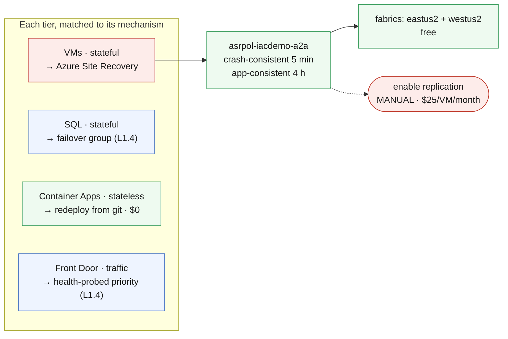

# L6.2 — Disaster Recovery Implementation 🔴

**📍 [Level 6 · Recover](https://github.com/saulpatinojr/Demo-IaC_Demo_with_VSCode/wiki/Curriculum-Level-6-Recover)** · Chapter 2 of 3 &nbsp;·&nbsp; Previous: [L6.1 — High Availability & Redundancy](https://github.com/saulpatinojr/Demo-IaC_Demo_with_VSCode/wiki/Curriculum-L6-1-High-Availability) &nbsp;·&nbsp; Next: [L6.3 — Business Continuity & Validation](https://github.com/saulpatinojr/Demo-IaC_Demo_with_VSCode/wiki/Curriculum-L6-3-Continuity-Validation)

---

**Goal:** build a real regional recovery capability for the tier you cannot
simply redeploy — the stateful one. Every other tier gets matched to the
mechanism that actually fits it.

**The IaC lesson:** knowing what does *not* belong in a template — replication
policy and fabrics are declarative metadata that live in Bicep, while enabling
replication is a long-running, billed operation that deserves to be a command
somebody types.

<br>

| Who this is for | Time | You need first | Cost while it runs |
|---|---|---|---|
| Chapter 2 of Level 6 · everyone | ~20 min | **L4.1** (the vault) and **L6.1** | 🟢 **$0.00/hr as deployed** · $25/VM/month once you enable replication |

> [!IMPORTANT]
> **This template lays the groundwork but does not enable replication.**
> Replication seeds an initial copy over hours and starts a **$25/VM/month**
> meter the moment it succeeds — that step stays a deliberate manual command.

<br>

## What you're building

Four tiers, four different recovery mechanisms — and only the stateful VMs
need a new product. The template deploys a Site Recovery replication policy
and a fabric in each region; SQL and the traffic layer reuse what L1.4 already
built, and the stateless container app's plan is redeploy-from-git. The one
paid step — enabling replication — is left deliberately manual.



<details><summary>Text description of this diagram</summary>

Four tiers, four different answers, and only one of them needs Site Recovery.

The **VMs** are stateful and cannot be recreated from a template with their data
intact, so they get ASR: a replication policy that takes crash-consistent points
every five minutes and app-consistent ones every four hours, plus a fabric at
each end. Policy and fabrics are free — they are metadata.

The **database** already has its answer from L1.4: a failover group. The
**traffic layer** likewise, through Front Door health probes and origin
priority. Neither needs anything new here, which is worth pausing on: two of the
four DR mechanisms in this architecture were built in Level 1 without being
called DR.

The **container app** is stateless, so its recovery mechanism is *redeploy from
this repository* — costing **$0/month** in standby, against paying for warm
infrastructure that does nothing on a normal day.

The red box is the manual step, and the meter.

</details>

**Source:** [`curriculum/L6.2-disaster-recovery/main.bicep`](https://github.com/saulpatinojr/Demo-IaC_Demo_with_VSCode/blob/main/curriculum/L6.2-disaster-recovery/main.bicep) · [`main.bicepparam`](https://github.com/saulpatinojr/Demo-IaC_Demo_with_VSCode/blob/main/curriculum/L6.2-disaster-recovery/main.bicepparam)

<br>

<details><summary><b>🔍 Going deeper — why replication is not in the template</b></summary>

<br>

Leaving replication out is not a shortcut. Enabling replication is a
long-running, stateful operation that seeds an initial copy over hours and does
not converge inside a deployment — and it starts a **$25/VM/month** meter the
moment it succeeds. That deserves to be a command somebody types, not a side
effect of a redeploy.

</details>

<details><summary><b>🔍 Going deeper — recovery plan order is not a detail</b></summary>

<br>

Data before app, app before traffic. Failing traffic over to a region whose
database has not finished failing over produces a working site serving wrong
answers — which is worse than an outage, because nobody notices. Write the
sequence down before the drill in L6.3.

</details>

<details><summary><b>🔍 Going deeper — the permissions this needs</b></summary>

<table>
<tr>
<td width="72" align="center" valign="top"></td>
<td valign="top">
<b>Azure RBAC — the minimum this chapter needs</b><br><br>
<b>Contributor</b> on the lab resource group — the <b>shared workshop deploy identity's</b> role, not yours; <b>Site Recovery Contributor</b> is its least-privilege equivalent. Your <b>Reader</b> covers every verification step below.<br>
<sub>Why: the policy and fabrics are children of the L4.1 vault, so the deploy identity's ordinary resource rights are enough. Enabling replication — the manual step — needs write access in <b>both</b> regions: the source VM and the target resource group, which may not be the same group or the same owner. That cross-region permission is the one people discover mid-incident; in this classroom it means the enable-replication step is the instructor's to run, not yours.</sub>
</td>
</tr>
<tr>
<td width="72" align="center" valign="top"></td>
<td valign="top">
<b>Microsoft Entra ID roles</b><br><br>
<b>None.</b><br>
<sub>Site Recovery uses the vault system-assigned identity to reach disks in both regions. Worth noting what a real DR plan does need from the directory though: if Microsoft Entra ID is degraded, the people executing your runbook may not be able to sign in to run it. Break-glass accounts are a directory concern, not an Azure one.</sub>
</td>
</tr>
</table>

<sub><a href="https://learn.microsoft.com/azure/site-recovery/azure-to-azure-tutorial-enable-replication">For more info</a> — Enabling Azure-to-Azure replication, and what it costs</sub>

</details>

<br>

---

> [!NOTE]
> **🏫 Classroom: use the GitHub Actions option.** Your Azure account holds Reader, so local `az deployment` commands will be refused — deploys go through your fork's workflow, which uses the shared workshop identity automatically. Compiling locally (`az bicep build`) works for everyone.

## 🚀 Deploy it — pick any one of three ways

<table>
<tr>
<td align="center" width="240"><br><br><b>1 · Bicep CLI</b><br><sub>Copy-paste in the terminal</sub></td>
<td align="center" width="240"><br><br><b>2 · GitHub Actions</b><br><sub>One button in the browser</sub></td>
<td align="center" width="240"><br><br><b>3 · GitHub Copilot</b><br><sub>Ask AI in plain English</sub></td>
</tr>
</table>

<br>

---

## &nbsp; Option 1 · Bicep from the terminal

```powershell
az deployment group what-if --resource-group $env:AZURE_RESOURCE_GROUP --parameters curriculum/L6.2-disaster-recovery/main.bicepparam
az deployment group create  --resource-group $env:AZURE_RESOURCE_GROUP --parameters curriculum/L6.2-disaster-recovery/main.bicepparam
```

**You should see:** `rpoShape` stating the RPO in plain terms,
`whatIsStillManual` explaining the missing step, and `cheaperAlternative` making
the case for redeploying the stateless tiers instead.

**Then enable replication for ONE VM, by hand:**

```powershell
az site-recovery protection-container mapping create --help   # read this first — the flags are unforgiving
```

One VM teaches the mechanism. Four teaches the same thing at four times the
price.

<br>

---

## &nbsp; Option 2 · GitHub Actions (push-button)

**Actions → "Curriculum L6 - Disaster Recovery & Redundancy" → Run workflow →
L6.2 - Disaster Recovery Implementation**.

The **Recovery region** input defaults to `westus2`, matching the L1.4 secondary so the DR story stays consistent across the curriculum.

<br>

---

## &nbsp; Option 3 · GitHub Copilot (plain English)

Load your values first: `./scripts/Load-LabSettings.ps1`. Then in
**Copilot Chat → Agent mode**:

> Deploy `curriculum/L6.2-disaster-recovery/main.bicep` to my lab resource group (`$env:AZURE_RESOURCE_GROUP`) with `az deployment group create`.

**Then ask for the thing that will not work:**

> Add a resource to `curriculum/L6.2-disaster-recovery/main.bicep` that enables replication for vm-iacdemo-test.

Copilot will produce a `replicationProtectedItems` resource that looks
reasonable. Deploy it and the operation either times out or leaves the item in
a permanent "enabling" state, because initial replication seeds over hours and
the deployment gives up long before. Not every Azure operation belongs in a
template, and knowing which is a senior skill.

<br>

---

## ✅ Verify it

1. **The policy and both fabrics exist:**

   ```powershell
   az site-recovery policy list --vault-name "rsv-$env:AZURE_PREFIX-backup" -g $env:AZURE_RESOURCE_GROUP -o table
   az site-recovery fabric list --vault-name "rsv-$env:AZURE_PREFIX-backup" -g $env:AZURE_RESOURCE_GROUP -o table
   ```

   **You should see:** one policy, two fabrics, and **no protected items** —
   which is correct at this stage, not a failure.

2. **Enable replication for one VM** through the portal (**Recovery Services
   vault → Site Recovery → Enable replication**) and watch the initial seed. It
   takes a while, and watching it is part of understanding what an RPO costs.

3. **Test the mechanisms you already had.** The SQL failover group from L1.4 is
   a DR capability nobody called DR:

   The group name ends in a `uniqueString` suffix you cannot type, so look it up
   rather than guessing:

   ```powershell
   $FOG = az sql failover-group list -g $env:AZURE_RESOURCE_GROUP -s $SQL --query "[0].name" -o tsv
   az sql failover-group show -g $env:AZURE_RESOURCE_GROUP -s $SQL -n $FOG `
     --query "{name:name, role:replicationRole, grace:readWriteEndpoint.failoverWithDataLossGracePeriodMinutes}" -o table
   ```

   **You should see:** the primary role and the grace period. That grace period
   *is* your RPO for the data tier, and most people have never looked at it.

4. **Price the whole plan.** One replicated VM is $25/month plus replica disks,
   cache storage and egress. Four is $100/month plus the rest. The stateless
   tiers are $0. Write the number down — L6.3 asks whether the RTO it buys is
   the one the business asked for.

<br>

>  **GitHub feature spotlight · Redeploy from source as a recovery path**
>
> **You already have it:** every template in `curriculum/` pins its AVM module
> versions and takes its parameters from the environment. That combination is
> what makes "redeploy the region from `main`" a plan rather than a wish, and it
> is why two of the four tiers here need no DR product at all.
> **Find it:** the `br/public:avm/res/...` version pins.
> **Beyond the lab:** the day you need this, a pinned module recreates the
> environment and a floating tag creates a new one.
> [Docs →](https://docs.github.com/actions/using-workflows/manually-running-a-workflow)

<br>

---

## ➡️ What carries forward

L6.3 proves all of it. RTO and RPO derived from a requirement, drills that
produce numbers, and an SLO alert that fires when the promise is not being
kept.

<br>

## 🧭 Where next?

| Your situation | Go to |
|---|---|
| Ready to keep going — prove the recovery works | **[L6.3 — Business Continuity & Validation](https://github.com/saulpatinojr/Demo-IaC_Demo_with_VSCode/wiki/Curriculum-L6-3-Continuity-Validation)** |
| Want the big picture of this level first | [Level 6 · Recover overview](https://github.com/saulpatinojr/Demo-IaC_Demo_with_VSCode/wiki/Curriculum-Level-6-Recover) |
| Done for the day — the estate bills while idle | [Cleanup & Reset](https://github.com/saulpatinojr/Demo-IaC_Demo_with_VSCode/wiki/Cleanup-and-Reset) |
| Something didn't work | [Troubleshooting](https://github.com/saulpatinojr/Demo-IaC_Demo_with_VSCode/wiki/Troubleshooting) |
| ⬅ Back to the main path grid | [🗺️ Curriculum Map](https://github.com/saulpatinojr/Demo-IaC_Demo_with_VSCode/wiki/Curriculum-Map) |
