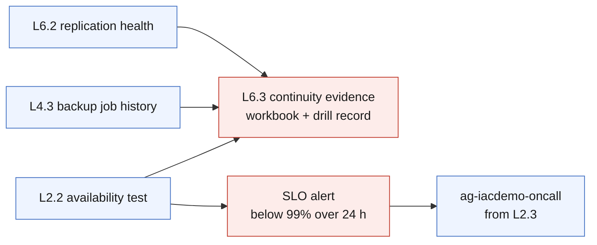

# L6.3 — Business Continuity & Validation 🔴

**Goal:** prove the recovery capability instead of asserting it — an availability SLO alert, and a drill workbook that turns each exercise into evidence with numbers in it.

| Who this is for | Time | You need first | Cost while it runs |
|---|---|---|---|
| Chapter 3 of Level 6 · everyone | ~20 min | **L6.1** and **L6.2**; L2.2 and L4.3 for the data | 🟢 **$0.00/hr steady state** · $2–5 per drill |

> [!IMPORTANT]
> **Every query on this chapter's workbook reads data an earlier level already
> collects** — availability from L2.2, backup and restore history from L4.3,
> replication health from L6.2. Nothing new is instrumented. That is the
> finding: a well-instrumented estate can already answer continuity questions
> without a special project.

## What you're building



<details><summary>Text description of this diagram</summary>

Two things deploy, and both are made entirely of data that already exists.

The **SLO alert** measures availability over 24 hours from the L2.2 web test and
fires when it falls below the target. It is not an outage alert — L2.3 already
answers "is it up right now". This one answers "did we keep the promise", which
can fire on a morning when nothing is currently broken. That difference is the
whole of service-level thinking.

The **continuity workbook** puts measured availability, backup and restore
durations, and a blank drill record on one page. The drill table is meant to be
filled in *during* the exercise, not afterwards from memory, and the column that
matters is the gap between the target and the measured number.

</details>

**Source:** [`curriculum/L6.3-continuity-validation/main.bicep`](https://github.com/saulpatinojr/Demo-IaC_Demo_with_VSCode/blob/main/curriculum/L6.3-continuity-validation/main.bicep) · [`main.bicepparam`](https://github.com/saulpatinojr/Demo-IaC_Demo_with_VSCode/blob/main/curriculum/L6.3-continuity-validation/main.bicepparam)

> [!NOTE]
> **The cheapest possible DR posture is an untested one.** That is exactly why
> it is a false saving. A drill costs $2–5 in temporary resources and an hour of
> someone's time; discovering the plan does not work during a real outage costs
> considerably more. Schedule the drill, keep the receipts, and delete the
> temporary resources the same day.

<br>

## &nbsp; Azure Up to date

<table>
<tr>
<td width="72" align="center" valign="top"></td>
<td valign="top">
<b>Azure RBAC — the minimum this chapter needs</b><br><br>
<b>Contributor</b> for the workbook and the alert rule. Drills need more, and in more places.<br>
<sub>Why: the deployed resources are ordinary. The drill is where permissions bite — a test failover needs write access in the <b>recovery</b> region, a database restore creates a new database, and Azure Chaos Studio needs a managed identity with a role assignment on every target, which plain Contributor <b>cannot create</b>. That is why Chaos Studio is described here and not deployed.</sub>
</td>
</tr>
<tr>
<td width="72" align="center" valign="top"></td>
<td valign="top">
<b>Microsoft Entra ID roles</b><br><br>
<b>None to deploy — but a real continuity plan depends on the directory.</b><br>
<sub>If Microsoft Entra ID is degraded, the people executing your runbook may not be able to sign in to run it. <b>Break-glass accounts</b> — excluded from Conditional Access, monitored, credentials in a safe — are a directory control, not an Azure one, and no amount of Site Recovery substitutes for them. Name it in the plan even though this lab cannot demonstrate it.</sub>
</td>
</tr>
</table>

<sub><a href="https://learn.microsoft.com/entra/identity/role-based-access-control/security-emergency-access">For more info</a> — Break-glass accounts, and why DR plans need them</sub>

<br>

## 🚀 Deploy it — pick any one of three ways

<table>
<tr>
<td align="center" width="240"><br><br><b>1 · Bicep CLI</b><br><sub>Copy-paste in the terminal</sub></td>
<td align="center" width="240"><br><br><b>2 · GitHub Actions</b><br><sub>One button in the browser</sub></td>
<td align="center" width="240"><br><br><b>3 · GitHub Copilot</b><br><sub>Ask AI in plain English</sub></td>
</tr>
</table>

<br>

---

## &nbsp; Option 1 · Bicep from the terminal

```powershell
az deployment group what-if --resource-group $env:AZURE_RESOURCE_GROUP --parameters curriculum/L6.3-continuity-validation/main.bicepparam
az deployment group create  --resource-group $env:AZURE_RESOURCE_GROUP --parameters curriculum/L6.3-continuity-validation/main.bicepparam
```

**You should see:** `availabilityTarget` stating the promise,
`everyQueryIsInherited` listing which level each number comes from, and
`theClosingArgument` — the sentence the whole curriculum has been building to.

<br>

---

## &nbsp; Option 2 · GitHub Actions (push-button)

**Actions → "Curriculum L6 - Disaster Recovery & Redundancy" → Run workflow →
L6.3 - Business Continuity & Validation**.

Safe to run. The SLO alert may fire on its first evaluation if the availability test has had a bad day, which is a useful first incident.

<br>

---

## &nbsp; Option 3 · GitHub Copilot (plain English)

Load your values first: `./scripts/Load-LabSettings.ps1`. Then in
**Copilot Chat → Agent mode**:

> Deploy `curriculum/L6.3-continuity-validation/main.bicep` to my lab resource group (`$env:AZURE_RESOURCE_GROUP`) with `az deployment group create`.

**Then have it write the runbook you will actually use:**

> Read `curriculum/L6.2-disaster-recovery/main.bicep` and `labs/L4-global/main.bicep`, then write a regional failover runbook for this environment in the correct order — data, then app, then traffic — with the exact az commands and a rollback step for each.

Then have somebody who did not write it execute it. Every ambiguity they hit at
their desk is one they would have hit at 03:00 with an incident bridge
listening. A runbook only its author can follow is not a runbook.

<br>

---

## ✅ Verify it

1. **The SLO alert exists and knows its target:**

   ```powershell
   az monitor scheduled-query show -g $env:AZURE_RESOURCE_GROUP -n "alert-$env:AZURE_PREFIX-availability-slo" `
     --query "{enabled:enabled, window:windowSize, frequency:evaluationFrequency}" -o table
   ```

2. **Run a test failover that touches nothing real:**

   ```powershell
   az site-recovery protected-item failover test --help
   ```

   **You should see:** a VM come up in the recovery region, isolated from
   production. Time it. Compare it to the RTO you wrote down before starting —
   the gap is the finding, and the finding is the deliverable.

   **Clean up the test failover afterwards.** It bills while it exists.

3. **Fail the database over deliberately** — the L1.4 failover group, used in
   anger for the first time:

   ```powershell
   az sql failover-group set-primary -g $env:AZURE_RESOURCE_GROUP -s "$SQL-dr" -n "fog-$env:AZURE_PREFIX"
   ```

   **You should see:** the listener endpoint follow the new primary, and the app
   keep working without a connection-string change — which is the entire point
   of a failover group, and only obvious once you have watched it.
   Fail it back afterwards.

4. **Check the monitoring noticed.** During the drill, did anything from Level 2
   or Level 3 fire? If a regional failover produced no alerts at all, the
   monitoring has a gap — and finding that in a drill rather than an incident is
   the best possible outcome.

5. **Write the one-page continuity standard.** RTO and RPO per tier, the measured
   numbers next to them, the drill date, and the cost. That document is the
   output of Level 6 — and of the curriculum. The numbers in it are defensible
   because you measured them rather than quoting an SLA.

>  **GitHub feature spotlight · Evidence with a commit behind it**
>
> **You just used it:** the SLO target, the queries and the drill record are all
> in the repository, so "we meet 99%" has a definition, a measurement and a
> history rather than being a claim in a slide deck.
> **Find it:** the `availabilityTargetPercent` parameter and the drill table in
> the workbook definition.
> **Beyond the lab:** an audit asks for evidence, not assurances. The cheapest
> time to produce it is while you are already doing the work.
> [Docs →](https://docs.github.com/pull-requests/committing-changes-to-your-project/viewing-and-comparing-commits/differences-between-commit-views)

<br>

---

## ➡️ What carries forward

**The curriculum is complete.** Deploy → Monitor → Secure → Protect → Detect →
Recover, on one environment, for about $2.55/hr — of which the Azure Firewall
from L1.2 alone is $1.25/hr, more than Levels 2 through 6 combined.

Tear down in reverse order, and check the three things that outlive a resource
group cleanup: Site Recovery replication, Recovery Services vault contents, and
retained Log Analytics data.

**Leave it deployed** → **[back to Level 6 · Recover](https://github.com/saulpatinojr/Demo-IaC_Demo_with_VSCode/wiki/Curriculum-Level-6-Recover)**.
