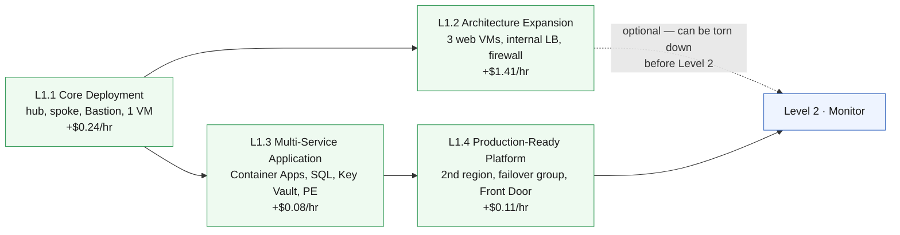

# Level 1 — Azure Foundation & Deployment 🟢

**Theme: Deploy.** Build the environment that every later level operates on.

Level 1 is the four labs that already exist, re-framed as four chapters of one
phase instead of four separate demos. The Bicep, the parameter files and the
workflows are unchanged — what changes is the promise made to the learner at the
end: *this environment stays up, and you are going to run it.*

| | |
|---|---|
| **Builds on** | Nothing — this is the entry point |
| **Chapters** | L1.1 · L1.2 · L1.3 · L1.4 |
| **Existing assets reused** | `curriculum/L1.1-core-deployment` · `curriculum/L1.2-architecture-expansion` · `curriculum/L1.3-multi-service-application` · `curriculum/L1.4-production-platform` · `curriculum-l1-*.yml` |
| **Running cost at end of level** | **~$1.84/hr** (~$0.43/hr if L1.2's firewall is torn down) |

> [!NOTE]
> This is a curriculum outline. Chapter pages define objectives, dependencies,
> services and cost only — the hands-on steps for each chapter are the existing
> lab pages today, and will be rewritten against this structure in a later phase.

## Where this level sits

Text description of this diagram

Four chapters and the hand-off to Level 2. L1.1 is a prerequisite for
everything. L1.2 and L1.3 are siblings that both attach to L1.1's hub — L1.3
does not need L1.2 — and L1.4 extends L1.3. The dotted line records the cost
escape hatch that already exists in the labs: L1.2's Azure Firewall and web tier
can be removed before moving on to Level 2 without breaking the rest of the
environment, cutting the running total from about $1.84/hr to about $0.43/hr.

## L1.1 — Core Deployment

**Objective.** Deploy a working hub-and-spoke network with a private
administrative path, from a template the learner authored and reviewed.

**Learning objectives**

- Explain what infrastructure as code buys you, and read a Bicep template
  end to end without guessing.
- Deploy an Azure Verified Module at resource-group scope against a
  pre-existing resource group.
- Describe hub-and-spoke topology: what belongs in a hub, what belongs in a
  spoke, and why peering is not transitive.
- Reach a VM that has no public IP address, and explain why that is the
  default posture rather than an inconvenience.
- Run the same deployment three ways — CLI, GitHub Actions with OIDC, and
  Copilot agent mode — and explain what differs between them.

**Builds on.** Nothing. This chapter creates the resource group's contents.

**Azure services.** Virtual Network · subnets · VNet peering · Network Security
Groups · Azure Bastion (Basic) · Linux VM (Standard_B2s) · managed disk ·
public IP.

**Estimated cost.** **+$0.24/hr · running total $0.24/hr.** Bastion ($0.19/hr)
is 80% of it; networking objects themselves are free.

**Cost optimization.** Bastion bills whether or not anyone connects — it is the
first "idle resources still cost money" lesson in the curriculum, and the right
place to introduce the teardown workflow. Deallocating the VM saves $0.04/hr but
not the disk.

## L1.2 — Architecture Expansion

**Objective.** Grow the single-VM foundation into a redundant, traffic-governed
tier, and see what centralised inspection costs.

**Learning objectives**

- Place several identical workloads behind an internal load balancer and prove
  the traffic is actually distributed.
- Route spoke egress through a firewall in the hub with user-defined routes,
  and explain what breaks if the firewall disappears.
- Distinguish an NSG (stateful, per-subnet/NIC allow-deny) from a firewall
  (centralised, application-aware, logged).
- Read a deployment as a *cost decision*: this chapter multiplies the running
  bill by seven, and the learner should be able to say exactly why.

**Builds on.** L1.1 — the firewall goes into the hub's reserved subnet, and the
web subnet is added to L1.1's spoke.

**Azure services.** Azure Firewall (Standard) · firewall policy · route tables ·
internal Standard Load Balancer · 3 × Linux VM · public IP.

**Estimated cost.** **+$1.41/hr · running total $1.65/hr.** Azure Firewall
Standard is $1.25/hr of that on its own, plus $0.07/hr per capacity unit and
$0.016/GB processed.

**Cost optimization.** Azure Firewall **Basic** is $0.395/hr — a 68% saving —
but needs a second `/26` for `AzureFirewallManagementSubnet`, so the address
plan has to anticipate it. The chapter should present that as a live design
trade-off. Do **not** delete the firewall alone: both spoke subnets route
`0.0.0.0/0` at its private IP, so removing it black-holes the VMs while they
keep billing.

## L1.3 — Multi-Service Application Architecture

**Objective.** Replace VM-hosted compute with a managed application platform and
put the data tier behind private networking.

**Learning objectives**

- Deploy a container platform into a delegated subnet and explain what
  delegation hands over to Azure.
- Make a PaaS data service unreachable from the public internet, and prove it
  from both inside and outside the VNet.
- Explain how a private endpoint plus a private DNS zone changes the answer to
  the *same* DNS query depending on where it is asked.
- Use a managed identity instead of a stored secret, and articulate what was
  removed from the threat model.
- Recognise which parts of the workload are still public on purpose.

**Builds on.** L1.1 only. A second spoke peers to L1.1's hub; L1.2's firewall
and route tables are not involved.

**Azure services.** Azure Container Apps + environment · Azure SQL Database
(Basic) · Key Vault · user-assigned managed identity · private endpoints ·
private DNS zones · Log Analytics workspace · Application Insights.

**Estimated cost.** **+$0.08/hr · running total $1.73/hr.** The container
replica ($0.054/hr) dominates; SQL Basic is $0.0067/hr and the private
networking objects total about $0.02/hr.

**Cost optimization.** Scaling the app to zero minimum replicas removes the
largest line in the chapter. The Log Analytics workspace created here is
**free until data flows through it** — Level 2 is where it starts billing, which
makes this the right chapter to introduce ingestion-based pricing before the
learner is exposed to it.

## L1.4 — Production-Ready Platform Deployment

**Objective.** Take the single-region application to a two-region,
globally-fronted platform, and ask honestly whether it would survive an outage.

**Learning objectives**

- Deploy the same workload into a second region from the same template.
- Join two databases into a failover group and describe what a failover does to
  connection strings, and what it costs in data loss.
- Put a global entry point in front of both regions with health-probed routing.
- Assess the result against the Well-Architected reliability pillar and name at
  least three things that are still single points of failure.
- Explain the difference between *deployed in two regions* and *survives losing
  one* — the question Level 6 exists to answer properly.

**Builds on.** L1.3 — the primary region's app and database are the failover
group's primary and Front Door's first origin.

**Azure services.** Second-region Container Apps environment · second Azure SQL
server + geo-secondary database · SQL failover group · Azure Front Door
(Standard).

**Estimated cost.** **+$0.11/hr · running total $1.84/hr.** The geo-secondary
database bills at the primary's rate; Front Door Standard's base fee is $35/mo
(~$0.048/hr) before request and egress meters.

**Cost optimization.** This is the chapter where "cost of resilience" becomes
concrete: the standby region roughly doubles the application tier's cost and
delivers nothing on a normal day. Front Door requests ($1 per million) and
egress ($0.13–0.25/GB depending on zone) are usage meters not included in the
running total.

## Cost summary for Level 1

| Chapter | Adds | Running total | Dominant meter |
|---|---|---|---|
| L1.1 Core Deployment | +$0.24/hr | $0.24/hr | Bastion $0.19/hr |
| L1.2 Architecture Expansion | +$1.41/hr | $1.65/hr | Firewall Standard $1.25/hr |
| L1.3 Multi-Service Application | +$0.08/hr | $1.73/hr | Container replica $0.054/hr |
| L1.4 Production-Ready Platform | +$0.11/hr | $1.84/hr | Front Door base + geo-secondary DB |

**Level 1 total: ~$1.84/hr**, or **~$0.43/hr** with L1.2 removed. Every later
level is measured as an increment on top of this.

>  **GitHub feature spotlight · Reusing what is already reviewed**
>
> **What this level does:** it adds no new templates. `curriculum/L1.1-core-deployment`
> through `curriculum/L1.4-production-platform` are already version-pinned to Azure Verified Modules,
> already linted by `bicepconfig.json`, and already deployed by four workflows
> that authenticate with OIDC and no stored secret.
> **Find it:** the `curriculum/` folder and `.github/workflows/curriculum-l1-*.yml`.
> **Beyond the lab:** a curriculum change that requires rewriting the code is a
> curriculum change nobody finishes. Re-framing beats re-authoring.
> [Docs →](https://docs.github.com/actions/using-workflows/about-workflows)

## What carries forward

Level 2 does not deploy application infrastructure. It instruments **exactly
these resources** — the VMs, the firewall, the load balancer, the container app,
the database and the key vault — using the Log Analytics workspace L1.3 created.

**Leave Level 1 deployed** → **[continue to Level 2 · Monitor](https://github.com/saulpatinojr/Demo-IaC_Demo_with_VSCode/wiki/Curriculum-Level-2-Monitor)**.
