# Level 2 — Operations, Monitoring & Observability 🔵

**Theme: Monitor.** Turn the environment Level 1 deployed into one you can
actually operate — and learn that in Azure Monitor, *what you collect* is what
you pay for.

| | |
|---|---|
| **Builds on** | All of Level 1 (L1.1 – L1.4) |
| **Chapters** | L2.1 · L2.2 · L2.3 · L2.4 |
| **Existing assets reused** | The Log Analytics workspace and Application Insights from L1.3; the alert rule pattern already in `labs/L3-containers/main.bicep` |
| **New Azure resources** | Almost none — this level is mostly configuration on existing resources |
| **Running cost at end of level** | **~$1.93/hr** (~$1.91/hr after L2.4's tiering work) |

> [!NOTE]
> Curriculum outline only. No hands-on steps or exercises are defined yet.

## Where this level sits

```mermaid
flowchart LR
  L1["Level 1 environment<br/>4 VMs · firewall · LB · container app<br/>SQL · Key Vault · Front Door"]
  C21["L2.1 Monitoring Fundamentals<br/>collect: DCRs, diagnostic settings"]
  C22["L2.2 Operational Visibility<br/>see: KQL, workbooks, App Insights"]
  C23["L2.3 Proactive Operations<br/>react: alerts, actions, autoscale"]
  C24["L2.4 Enterprise Monitoring Strategy<br/>govern: tiers, retention, policy"]

  L1 -->|"every resource emits<br/>logs and metrics"| C21
  C21 --> C22 --> C23 --> C24
  C24 -.->|"one workspace,<br/>ready for security data"| NEXT["Level 3 · Secure"]

  classDef env fill:#eefaf0,stroke:#3a9d5d,color:#1a1a1a
  classDef ch fill:#eef4ff,stroke:#4472c4,color:#1a1a1a
  classDef nxt fill:#fff9e6,stroke:#c9a227,color:#1a1a1a
  class L1 env
  class C21,C22,C23,C24 ch
  class NEXT nxt
```

Text description of this diagram

The Level 1 environment feeds into L2.1, which is the collection chapter: data
collection rules and diagnostic settings point every existing resource at the
Log Analytics workspace that L1.3 already created. The remaining three chapters
run in order and each answers a different question — L2.2 *what is happening*,
L2.3 *what should wake someone up*, L2.4 *what should we be collecting at all,
and what does it cost*.

The dotted line to Level 3 records the design decision that matters most here:
Level 2 produces **one workspace**, and Level 3 puts its security data in that
same workspace rather than creating a second one. That is what makes Sentinel
possible in Level 5 without a redesign.

## L2.1 — Monitoring Fundamentals

**Objective.** Get every resource from Level 1 sending the right telemetry to
one workspace, and be able to say what each stream costs.

**Learning objectives**

- Distinguish platform **metrics** (free, 93-day retention, numeric) from
  **logs** (billed per GB, queryable, arbitrary shape), and pick the right one
  for a given question.
- Configure diagnostic settings on the firewall, load balancer, Key Vault, SQL
  database and container app, and explain what each category actually contains.
- Deploy the Azure Monitor Agent to the Level 1 VMs through a data collection
  rule, and explain why DCRs replaced per-agent configuration.
- Enable VM insights and container insights, and identify which tables they
  write to.
- Read the workspace's own usage table to see what each source is costing.

**Builds on.** L1.1–L1.4 for the resources; L1.3 for the workspace.

**Azure services.** Log Analytics workspace (reused) · Azure Monitor Agent ·
data collection rules · data collection endpoints · diagnostic settings ·
VM insights · container insights · Azure Activity log.

**Estimated cost.** **+$0.06/hr · running total ~$1.90/hr.** Assumes ~0.5 GB/day
of Analytics-tier ingestion at **$2.76/GB** ≈ $1.38/day. Agents, DCRs and the
Activity log are free; the Activity log is free *only* into Log Analytics.

**Cost optimization.** Turn categories on one at a time and watch the usage
table move. Azure Firewall and NSG flow logs are the two sources that can
quietly dominate this level — collecting them is a deliberate choice, not a
default. Metrics answer many "is it up?" questions for free.

## L2.2 — Operational Visibility

**Objective.** Turn collected data into answers, for both the operator and the
person who asks "is the app slow?"

**Learning objectives**

- Write KQL that spans several resource types to answer one operational
  question.
- Build a workbook that shows the health of the whole Level 1 estate on one
  page, parameterised by resource group.
- Use Application Insights on the container app to trace a request through the
  stack and find where latency is.
- Configure availability tests against the Front Door endpoint from L1.4 and
  interpret failures by region.
- Explain the difference between a dashboard someone looks at and a signal
  someone gets paged by — the bridge into L2.3.

**Builds on.** L2.1 (there is nothing to query until collection works).

**Azure services.** Log Analytics (KQL) · Azure Workbooks · Azure Monitor
dashboards · Application Insights (reused from L1.3) · standard availability
tests · Azure Resource Graph.

**Estimated cost.** **+$0.02/hr · running total ~$1.92/hr.** Workbooks,
dashboards and queries are free; the cost is the extra ~0.2 GB/day of
Application Insights telemetry. Availability tests add well under $1/month at
lab frequency.

**Cost optimization.** Application Insights sampling is the lever here — at
default settings a chatty app can out-ingest every other source combined.
Queries themselves are free in the Analytics tier, so exploration is safe; that
stops being true for the Basic and Auxiliary tiers introduced in L2.4.

## L2.3 — Proactive Operations

**Objective.** Move from watching to being told — with a signal-to-noise budget.

**Learning objectives**

- Create metric, log and activity-log alert rules and choose correctly between
  them for a given failure mode.
- Route alerts through action groups, and design a notification path that
  survives one person being on holiday.
- Apply dynamic thresholds where a static one would be wrong, and explain when
  they misbehave.
- Use autoscale on the container app so that a load spike is handled rather
  than merely reported.
- Suppress noise deliberately with alert processing rules during maintenance,
  and defend the decision.

**Builds on.** L2.2 (the queries become the log alerts) and L1.3's existing
`HighReplicaCount` alert, which is the worked example already in the repo.

**Azure services.** Azure Monitor alert rules (metric, log, activity log) ·
action groups · alert processing rules · dynamic thresholds · autoscale ·
Azure Service Health alerts.

**Estimated cost.** **+$0.01/hr · running total ~$1.93/hr.** Metric alerts are
$0.10 per monitored metric/month; log alerts are $1.50/month at 5-minute
frequency, $0.50 at 15-minute; the first 1,000 emails are free and Service
Health alerts cost nothing. A realistic lab set (10 metric + 4 log rules) is
about $7/month.

**Cost optimization.** Alert *frequency* is the price dial: the same log alert
costs three times as much at 1-minute evaluation as at 5-minute. Most lab
signals do not need a 1-minute rule. Metric alerts on platform metrics avoid
ingestion charges entirely.

## L2.4 — Enterprise Monitoring Strategy

**Objective.** Decide what a hundred of these environments would collect, and
prove the decision with numbers.

**Learning objectives**

- Choose a workspace topology (single vs. per-team vs. per-region) and justify
  it against access control, data sovereignty and cost.
- Place each table in the right plan — **Analytics**, **Basic** or **Auxiliary**
  — and quantify the saving and the capability lost.
- Separate interactive retention from long-term retention and archive, and
  compute the cost of a 12-month compliance requirement.
- Enforce diagnostic settings estate-wide with Azure Policy `DeployIfNotExists`
  instead of configuring resources by hand.
- Build a monitoring cost report and set a budget with an action group on it.

**Builds on.** L2.1–L2.3 — this chapter governs everything the previous three
turned on.

**Azure services.** Log Analytics table plans · retention and archive settings ·
Azure Policy (`DeployIfNotExists`) · Azure Monitor commitment tiers ·
Microsoft Cost Management budgets · Azure Monitor Baseline Alerts patterns.

**Estimated cost.** **+$0.01/hr gross, −$0.03/hr net · running total ~$1.91/hr.**
Retaining 30 GB past the included 31 days costs $0.12/GB/month (~$3.60/month);
archive is $0.02/GB/month. Against that, moving ~0.3 GB/day of verbose logs from
Analytics ($2.76/GB) to Basic ($0.50/GB) saves about $0.68/day.

**Cost optimization.** This chapter is *the* optimization chapter: it should end
with a lower bill than it started. Commitment tiers start at 100 GB/day and are
far above lab volume — worth explaining, not enabling. The transferable lesson
is that in Azure Monitor, architecture decisions and cost decisions are the same
decision.

## Cost summary for Level 2

| Chapter | Adds | Running total | Dominant meter |
|---|---|---|---|
| L2.1 Monitoring Fundamentals | +$0.06/hr | ~$1.90/hr | Analytics ingestion $2.76/GB |
| L2.2 Operational Visibility | +$0.02/hr | ~$1.92/hr | App Insights telemetry |
| L2.3 Proactive Operations | +$0.01/hr | ~$1.93/hr | Log alert rules ($1.50/rule/mo at 5 min) |
| L2.4 Enterprise Monitoring Strategy | −$0.02/hr net | ~$1.91/hr | Retention vs. Basic-tier saving |

**Level 2 adds roughly $0.07/hr — about 4% of the running bill.** Said plainly:
instrumenting this environment properly costs less than 6% of what its firewall
costs. That comparison belongs in the level's closing slide.

> [!TIP]
> Level 2's cost is entirely a function of GB/day. Before the level starts, note
> the current usage; after L2.4, note it again. The delta *is* the lesson.

>  **GitHub feature spotlight · Repository variables for lab settings**
>
> **Why it matters here:** every alert in this level needs a destination, and
> every workspace query needs a resource group. Those are already repository
> variables and secrets (`AZURE_PREFIX`, `AZURE_RESOURCE_GROUP`) set once by
> `Setup-Oidc.ps1`, so monitoring configuration never hardcodes an environment.
> **Find it:** **Settings → Secrets and variables → Actions**.
> **Beyond the lab:** the same split — non-secret configuration as variables,
> credentials as OIDC — is what lets one monitoring template serve dev, test and
> production.
> [Docs →](https://docs.github.com/actions/learn-github-actions/variables)

## What carries forward

Level 3 puts Microsoft Defender for Cloud on top of this estate and sends its
findings to **this workspace**. The alert routing built in L2.3 becomes the
delivery path for security alerts, and the table-plan discipline from L2.4 is
what keeps Level 5's Sentinel bill sane.

**Leave Levels 1–2 in place** → **[continue to Level 3 · Secure](https://github.com/saulpatinojr/Demo-IaC_Demo_with_VSCode/wiki/Curriculum-Level-3-Secure)**.
