# Level 3 — Security & Microsoft Defender for Cloud 🟡

**Theme: Secure.** Assess, harden and defend the environment that Levels 1 and 2
built and instrumented — without deploying a single new workload to attack.

| | |
|---|---|
| **Builds on** | Level 1 (the resources) and Level 2 (the workspace and alert routing) |
| **Chapters** | L3.1 · L3.2 · L3.3 · L3.4 |
| **Existing assets reused** | Key Vault, managed identity and private endpoints from L1.3; the Log Analytics workspace from L2.1; action groups from L2.3 |
| **New Azure resources** | Plans and policies, not infrastructure |
| **Running cost at end of level** | **~$2.01/hr** with the recommended plan set |

> [!NOTE]
> **Build status:** Level 3 is fully built — four templates, one workflow, four
> walkthroughs, and the instructor script for the subscription-scoped half.

## Where this level sits

```mermaid
flowchart LR
  BASE["Levels 1–2<br/>deployed estate + one workspace"]
  C31["L3.1 Security Foundation<br/>assess — free posture"]
  C32["L3.2 Workload Protection<br/>defend — paid plans"]
  C33["L3.3 Security Operations<br/>respond — triage & automate"]
  C34["L3.4 Enterprise Security Architecture<br/>design — the target state"]

  BASE -->|"resources to assess"| C31
  BASE -->|"workspace to write findings into"| C31
  C31 --> C32 --> C33 --> C34
  C34 -.->|"Defender alerts become<br/>a free Sentinel connector"| L5["Level 5 · Detect"]

  classDef base fill:#eef4ff,stroke:#4472c4,color:#1a1a1a
  classDef ch fill:#fff9e6,stroke:#c9a227,color:#1a1a1a
  classDef nxt fill:#fff4e5,stroke:#d97706,color:#1a1a1a
  class BASE base
  class C31,C32,C33,C34 ch
  class L5 nxt
```

Text description of this diagram

Levels 1 and 2 feed L3.1 twice over: they supply the resources to be assessed
and the Log Analytics workspace that security findings are written into. The
four chapters run in order and follow the security lifecycle — assess with free
posture management, then defend with paid workload plans, then respond, then
design the target state.

The dotted line forward matters for cost: Microsoft Defender for Cloud alerts
are a **free** Sentinel data source, so the work done in this level arrives in
Level 5 at no ingestion charge. Enabling Defender plans here is therefore also a
Sentinel decision.

## L3.1 — Security Foundation

**Built:** [`curriculum/L3.1-security-foundation`](https://github.com/saulpatinojr/Demo-IaC_Demo_with_VSCode/blob/main/curriculum/L3.1-security-foundation/main.bicep) ·
**walkthrough:** [L3.1 — Security Foundation](https://github.com/saulpatinojr/Demo-IaC_Demo_with_VSCode/wiki/Curriculum-L3-1-Security-Foundation)

**Objective.** Establish where the environment actually stands, using only the
free capability, before spending anything.

**Learning objectives**

- Read the secure score and explain what it measures and what it ignores.
- Map Defender for Cloud recommendations back to the Microsoft Cloud Security
  Benchmark control they came from.
- Identify which Level 1 design choices already scored well (private endpoints,
  managed identity, no public IP on the VM) and which did not.
- Distinguish `Audit`, `Deny` and `DeployIfNotExists` policy effects by blast
  radius — and explain why a Contributor can assign none of them, since
  `Microsoft.Authorization/*/Write` sits in the role's `notActions`.
- Locate the permission boundary in this lab: Defender **plans** are
  subscription-scoped and belong to the instructor, while per-resource security
  settings are yours. Name which side each Level 3 task falls on.
- Review RBAC on the resource group and the OIDC identity, and apply least
  privilege to both.

**Builds on.** Levels 1–2. Nothing new is deployed.

**Azure services.** Microsoft Defender for Cloud — foundational CSPM (free) ·
secure score · Microsoft Cloud Security Benchmark · Azure Policy ·
Microsoft Entra ID RBAC · Azure Resource Graph.

**Estimated cost.** **+$0.00/hr · running total ~$1.91/hr.** Foundational CSPM,
secure score, recommendations and Azure Policy are free on every subscription.

**Cost optimization.** The entire chapter is free, and that is the point: most
of the secure-score improvement available to this environment costs nothing.
Defender **CSPM (paid)** adds attack path analysis and the security explorer at
$0.007/resource/hr (~$5/resource/month) — roughly $0.14/hr for an estate this
size — so it belongs in an instructor-led window, not as a default on.

## L3.2 — Workload Protection

**Built:** [`curriculum/L3.2-workload-protection`](https://github.com/saulpatinojr/Demo-IaC_Demo_with_VSCode/blob/main/curriculum/L3.2-workload-protection/main.bicep) ·
**walkthrough:** [L3.2 — Workload Protection](https://github.com/saulpatinojr/Demo-IaC_Demo_with_VSCode/wiki/Curriculum-L3-2-Workload-Protection)

**Objective.** Turn on threat detection where it applies, one plan at a time,
with the per-node meter visible.

**Learning objectives**

- Enable Defender for SQL at **resource** scope yourself, and explain why that
  bills per server instance the moment it is enabled, independently of the
  subscription plan.
- Configure SQL auditing into the Level 2 workspace, and know that it takes
  **two** resources — the auditing setting and a `master`-database diagnostic
  setting — with either alone sending nothing.
- Describe what Defender for Servers, Key Vault and Resource Manager each detect
  that the others cannot, and identify which of them you can turn on and which
  need the instructor.
- Choose between Servers **Plan 1** and **Plan 2**, and justify the 3× price
  difference in terms of the capabilities gained.
- Use just-in-time VM access and explain what it replaces.
- Interpret vulnerability assessment findings on the Level 1 VMs and prioritise
  them by exploitability rather than CVSS alone.
- Explain the coverage gap in this estate: **Defender for Containers protects
  AKS, Arc-enabled Kubernetes and registry images — it does not provide runtime
  protection for Azure Container Apps.** L1.3's app is covered by CSPM posture,
  not by a workload plan.

**Builds on.** L3.1 (the recommendations tell you which plans matter) and L1.1,
L1.2 (VMs), L1.3, L1.4 (SQL servers and Key Vault).

**Azure services.** Defender for Servers · Defender for SQL · Defender for Key
Vault · Defender for Resource Manager · Microsoft Defender Vulnerability
Management · just-in-time VM access · (optional) Defender for Storage.

**Estimated cost.** **+$0.07/hr · running total ~$1.98/hr.** With Servers Plan 1
on 4 VMs ($0.00672/node/hr = $0.027/hr), Defender for SQL on 2 servers
($0.0202/instance/hr = $0.040/hr), Key Vault ($0.0003/hr) and Resource Manager
($0.0069/hr). Servers **Plan 2** would raise the VM share to $0.08/hr
($0.02/node/hr, ~$14.60/node/month).

**Cost optimization.** Every meter here is per node or per instance, so cost
scales with the estate, not with activity — the opposite of Level 2. Two levers:
enable plans at **resource level** rather than subscription level so only the
lab resources bill, and prefer Plan 1 unless the chapter specifically teaches a
Plan 2 capability. Every Defender plan has a 30-day free trial; scheduling the
level inside it makes L3.2 free once.

## L3.3 — Security Operations

**Built:** [`curriculum/L3.3-security-operations`](https://github.com/saulpatinojr/Demo-IaC_Demo_with_VSCode/blob/main/curriculum/L3.3-security-operations/main.bicep) ·
**walkthrough:** [L3.3 — Security Operations](https://github.com/saulpatinojr/Demo-IaC_Demo_with_VSCode/wiki/Curriculum-L3-3-Security-Operations)

**Objective.** Work an alert from detection to closure, and automate the parts
that should never be manual.

**Learning objectives**

- Trigger a benign detection deliberately and follow the alert through the
  Defender for Cloud experience end to end.
- Triage by attack path and asset criticality rather than by alert timestamp.
- Send Defender alerts to the Level 2 action groups so security uses the same
  notification path as operations.
- Build workflow automation with a Logic App — isolate, notify, or open a
  ticket — and identify the tasks where automation is inappropriate.
- Use governance rules to assign recommendations with owners and due dates,
  and explain why an unassigned recommendation is not a plan.
- Read the regulatory compliance dashboard against a standard the class cares
  about.

**Builds on.** L3.2 (there are no alerts without a plan) and L2.3 (the routing).

**Azure services.** Defender for Cloud security alerts · continuous export to
Log Analytics and Event Hubs · workflow automation (Azure Logic Apps) ·
governance rules · regulatory compliance dashboard · attack path analysis.

**Estimated cost.** **+$0.03/hr · running total ~$2.01/hr.** Alerts, governance
rules and the compliance dashboard are included in the plans from L3.2. The cost
is continuous export and security-event ingestion — assume ~0.25 GB/day at
$2.76/GB (~$0.69/day). Logic App consumption actions are fractions of a cent
each; a lab playbook running a few thousand actions a month is under $1.

**Cost optimization.** Export only the alert and recommendation streams, not raw
security events, unless Level 5 needs them — and if it does, let Level 5 pay for
that deliberately. `SecurityAlert` data is free when Sentinel is enabled, which
is a strong argument for sequencing the export decision *after* L5.1.

## L3.4 — Enterprise Security Architecture

**Built:** [`curriculum/L3.4-security-architecture`](https://github.com/saulpatinojr/Demo-IaC_Demo_with_VSCode/blob/main/curriculum/L3.4-security-architecture/main.bicep) ·
**walkthrough:** [L3.4 — Enterprise Security Architecture](https://github.com/saulpatinojr/Demo-IaC_Demo_with_VSCode/wiki/Curriculum-L3-4-Security-Architecture)

**Objective.** Draw the target-state security architecture for this workload and
put a price on each control.

**Learning objectives**

- Design a web application firewall layer for the L1.4 front end and state its
  cost precisely — WAF managed rule sets require **Front Door Premium**, whose
  base fee is $330/month against Standard's $35/month.
- Compare that with an Application Gateway WAF in front of the container app,
  and choose on cost, latency and operational fit.
- Evaluate upgrading L1.2's firewall to **Premium** for IDPS and TLS inspection
  at $1.75/hr versus Standard's $1.25/hr, and decide whether this workload earns
  it.
- Harden the identity and secret layer: Key Vault RBAC, purge protection, and
  the elimination of any remaining long-lived credential.
- Assess the estate against the Well-Architected security pillar and Zero Trust
  principles, and produce a prioritised remediation backlog with costs attached.

**Builds on.** L3.1–L3.3, plus L1.2's firewall and L1.4's Front Door as the
subjects of the design work.

**Azure services.** Azure Web Application Firewall (Front Door Premium or
Application Gateway) · Azure Firewall Premium (IDPS, TLS inspection) ·
Key Vault RBAC and purge protection · Microsoft Entra Privileged Identity
Management (conceptual) · Azure Landing Zone security guidance.

**Estimated cost.** **+$0.00/hr as designed · running total ~$2.01/hr.** If the
class deploys the WAF: Front Door Premium is **+$0.40/hr** over Standard
(~$295/month more). If it upgrades the firewall: **+$0.50/hr** plus $0.11/hr per
capacity unit. Either one deployed for a whole class doubles the curriculum's
running cost.

**Cost optimization.** This is the chapter where the right answer is usually
**design it, cost it, and do not deploy it**. If a live demo is required,
deploy in a bounded instructor window and tear down in the same session — a
Front Door Premium left running over a weekend costs more than the entire rest
of the curriculum for that period.

## Cost summary for Level 3

| Chapter | Adds | Running total | Dominant meter |
|---|---|---|---|
| L3.1 Security Foundation | +$0.00/hr | ~$1.91/hr | Free (paid CSPM optional, ~$0.14/hr) |
| L3.2 Workload Protection | +$0.07/hr | ~$1.98/hr | Defender for SQL $0.0202/instance/hr |
| L3.3 Security Operations | +$0.03/hr | ~$2.01/hr | Security log ingestion $2.76/GB |
| L3.4 Enterprise Security Architecture | +$0.00/hr designed | ~$2.01/hr | WAF/Premium tiers if deployed (+$0.40–0.50/hr) |

**Level 3 adds roughly $0.10/hr** — about 5% of the running bill — as long as
the premium tiers stay on the whiteboard.

>  **GitHub feature spotlight · Secret scanning and push protection**
>
> **Why it belongs in this level:** L3.4 asks the learner to eliminate long-lived
> credentials. GitHub does the same job on the repository side — secret scanning
> looks for credentials that were committed, and push protection blocks them
> before they land.
> **Find it:** **Settings → Code security and analysis**. This repo has nothing
> to find, by design: Azure authentication is OIDC and there is no client secret
> anywhere in it.
> **Beyond the lab:** the strongest secret hygiene is architectural — have no
> secret to leak. Scanning is the safety net under that, not a substitute for it.
> [Docs →](https://docs.github.com/code-security/secret-scanning/about-secret-scanning)

## What carries forward

Level 4 protects the same resources against loss rather than attack, and reuses
Level 3's governance model to enforce backup as policy. Level 5 inherits every
Defender alert produced here as a **free** Sentinel connector.

**Leave Levels 1–3 in place** → **[continue to Level 4 · Protect](https://github.com/saulpatinojr/Demo-IaC_Demo_with_VSCode/wiki/Curriculum-Level-4-Protect)**.
