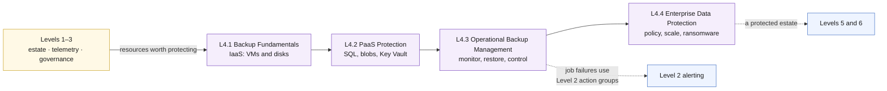

# Level 4 — Backup, Protection & Recovery Readiness 🟣

**Theme: Protect.** Make the environment recoverable. Not "backed up" —
*recoverable*, which is only true once a restore has been performed.

| | |
|---|---|
| **Builds on** | Level 1 (what gets protected), Level 2 (job alerting), Level 3 (protection as governance) |
| **Chapters** | L4.1 · L4.2 · L4.3 · L4.4 |
| **Existing assets reused** | The Level 1 VMs, SQL databases and Key Vault; L2.3's action groups; L3.1's Azure Policy model |
| **New Azure resources** | Recovery Services vault · Backup vault · backup policies |
| **Running cost at end of level** | **~$2.10/hr** |

> [!NOTE]
> Curriculum outline only. No hands-on steps or exercises are defined yet.

## Where this level sits

Text description of this diagram

Levels 1 to 3 provide the estate, its telemetry and its governance model. The
four chapters then move outward in scope: L4.1 protects infrastructure-as-a-
service (the virtual machines and their disks), L4.2 protects the platform
services (SQL, blob storage, Key Vault), L4.3 makes protection an operational
discipline rather than a configuration, and L4.4 turns it into a policy-enforced
strategy including ransomware defence.

Two dotted lines show reuse rather than sequence: backup job failures are routed
through the action groups Level 2 already built, and the protected estate is a
prerequisite for both parallel tracks that follow.

## L4.1 — Backup Fundamentals

**Objective.** Protect the Level 1 virtual machines, and understand what a
recovery point actually is.

**Learning objectives**

- Create a Recovery Services vault and explain how vault-level redundancy
  (LRS / ZRS / GRS) constrains every restore option that follows.
- Design a backup policy from a stated retention requirement — daily, weekly,
  monthly, yearly — rather than accepting the default.
- Distinguish an application-consistent from a crash-consistent recovery point,
  and know which one a Linux VM gets by default.
- Perform a file-level restore and a full VM restore, and compare recovery time
  for each.
- Enable soft delete and describe the deletion attack it defeats.

**Builds on.** L1.1 and L1.2 — the four VMs are the protected instances.

**Azure services.** Recovery Services vault · Azure Backup for Azure VMs ·
backup policies · instant restore snapshots · soft delete · vault redundancy
settings.

**Estimated cost.** **+$0.06/hr · running total ~$2.07/hr.** Azure Backup bills
**$10/month per protected VM instance** (4 VMs = $40/month ≈ $0.055/hr) plus
backup storage at **$0.0448/GB/month GRS** (~$1.79/month for ~40 GB of
compressed OS-disk data). Protected-instance pricing is tiered by instance size,
so a small lab VM may bill in a lower tier.

**Cost optimization.** Vault redundancy is the biggest dial available: LRS is
$0.0224/GB/month against GRS's $0.0448 — half price, at the cost of every
cross-region restore option in L4.4. Instant-restore snapshot retention defaults
to 2 days and bills as managed-disk snapshots; shortening it is a free saving.
Retention length multiplies storage linearly, so a 10-year policy on a lab VM is
a cost lesson, not a compliance one.

## L4.2 — PaaS Protection

**Objective.** Protect the data that is not on a disk, where "backup" often
means something already switched on that nobody has verified.

**Learning objectives**

- Distinguish Azure SQL's automatic point-in-time restore (included, 7 days on
  Basic) from long-term retention (configured, billed separately).
- Restore a database to a point in time and measure how long it takes.
- Explain why a geo-replicated database is **not** a backup — the failover group
  from L1.4 replicates a deletion faithfully.
- Configure operational and vaulted backup for blob storage and describe the
  difference in threat model.
- Verify Key Vault soft delete and purge protection, and explain why purge
  protection cannot be turned off again.
- Identify what in this estate is **not** protected by anything — Container Apps
  configuration, private DNS zone records, the templates themselves — and note
  that the last one is protected by the Git repository.

**Builds on.** L1.3 and L1.4 (SQL, Key Vault), L4.1 (the vault concepts).

**Azure services.** Azure SQL point-in-time restore · SQL long-term retention ·
Backup vault · Azure Backup for blobs (operational and vaulted) · Key Vault soft
delete and purge protection.

**Estimated cost.** **+$0.01/hr · running total ~$2.08/hr.** SQL PITR within the
included retention is free at 1× database size; long-term retention storage is
$0.025/GB/month LRS or $0.05/GB/month RA-GRS — pennies for a lab database.
Vaulted blob backup is $10/month per protected instance if a storage account is
added. Key Vault soft delete and purge protection are free.

**Cost optimization.** The cheapest protection in this chapter is free and
already on — the lesson is verification, not spending. When long-term retention
is configured, retention length and redundancy are the only two dials; the
worked example should price a real 7-year requirement so the class sees where
PaaS backup cost actually comes from.

## L4.3 — Operational Backup Management

**Objective.** Run backup as an operational service — monitored, reported,
rehearsed, and protected against its own operators.

**Learning objectives**

- Use Backup center to view protection state across vaults from one place.
- Alert on failed and missed backup jobs through the Level 2 action groups, and
  explain why "no news" from a backup system is the most dangerous signal.
- Build a backup compliance report from the Log Analytics data and identify
  unprotected resources.
- Apply least-privilege backup RBAC — Backup Operator cannot delete, Backup
  Contributor can — and explain the separation.
- Configure multi-user authorization with a Resource Guard so a single
  compromised admin cannot destroy the backups.
- Run a restore drill against a documented expectation and record the result.

**Builds on.** L4.1 and L4.2 (something to manage), L2.3 (alert routing),
L3.1 (RBAC discipline).

**Azure services.** Backup center · Azure Backup reports (Log Analytics) ·
backup job alerts · Azure RBAC backup roles · multi-user authorization with
Resource Guard · restore drills.

**Estimated cost.** **+$0.01/hr · running total ~$2.09/hr.** Backup center,
reports, MUA and Resource Guard are free; the cost is ~0.05 GB/day of backup job
telemetry (~$0.14/day) plus the temporary resources a restore drill creates —
budget $1–2 per drill for restored disks and VM runtime.

**Cost optimization.** Restore drills are the one cost in this level worth
paying every time: delete the restored resources immediately afterwards, and
the drill costs less than a coffee. A drill left running is an unmonitored,
unpatched duplicate of production, which is a security cost as well as a
financial one.

## L4.4 — Enterprise Data Protection Strategy

**Objective.** Turn per-resource backup into an estate-wide, policy-enforced,
ransomware-aware strategy with a defensible price.

**Learning objectives**

- Auto-enrol new resources into backup with Azure Policy, so protection is not
  a step someone can forget.
- Derive backup policy from RPO and RTO targets instead of from habit, and
  state where those targets come from.
- Design ransomware resilience: immutable vaults, soft delete, MUA, and an
  offline or cross-tenant copy — and explain what each one stops.
- Enable cross-region restore and quantify the redundancy upgrade it requires.
- Use Azure Business Continuity center to view backup and disaster recovery
  posture together, which is the bridge to Level 6.
- Produce a data protection cost model for the estate and defend the retention
  choices in it.

**Builds on.** L4.1–L4.3, and L3.1's Azure Policy model.

**Azure services.** Azure Policy for backup · immutable vaults · cross-region
restore · Azure Business Continuity center · vault redundancy (GRS / RA-GRS) ·
archive tier.

**Estimated cost.** **+$0.01/hr · running total ~$2.10/hr.** Policy, immutability
and Business Continuity center are free. The increment is redundancy and
retention: cross-region restore requires RA-GRS at $0.0569/GB/month against GRS's
$0.0448 (about $0.48/month more on ~40 GB), and the strategy work in this chapter
typically extends retention across the whole protected set, which grows stored
data over the following months. Archive tier is $0.0027/GB/month LRS for the long
tail.

**Cost optimization.** Retention × redundancy × protected instances is the whole
formula — the chapter should have the class change one variable at a time and
watch the total move. The most common real-world saving is tiering old recovery
points to archive rather than shortening retention, because it preserves the
compliance answer while cutting storage cost by more than 90%.

## Cost summary for Level 4

| Chapter | Adds | Running total | Dominant meter |
|---|---|---|---|
| L4.1 Backup Fundamentals | +$0.06/hr | ~$2.07/hr | Protected instance $10/VM/month |
| L4.2 PaaS Protection | +$0.01/hr | ~$2.08/hr | LTR storage $0.025–0.05/GB/month |
| L4.3 Operational Backup Management | +$0.01/hr | ~$2.09/hr | Backup telemetry + drill resources |
| L4.4 Enterprise Data Protection | +$0.01/hr | ~$2.10/hr | Redundancy and retention growth |

**Level 4 adds roughly $0.09/hr.** Unlike every earlier level, its cost *grows
over time* even with nothing changed, because retained recovery points
accumulate. That is worth naming explicitly — it is the most commonly
mis-forecast line in a real Azure bill.

> [!WARNING]
> Backup cost is the one line in this curriculum that survives teardown. Deleting
> a VM does not delete its recovery points, and a vault with soft delete enabled
> keeps billing for retained data after the source is gone. Level 4's teardown
> guidance has to cover the vault, not just the resources.

>  **GitHub feature spotlight · The repository is part of your recovery plan**
>
> **Why it belongs here:** L4.2 asks what in the estate is unprotected. The
> answer for the infrastructure itself is *the Git history* — every template,
> parameter file and workflow can be redeployed from this repository, which is
> why "redeploy from IaC" is a legitimate recovery strategy in Level 6.
> **Find it:** the commit history on `labs/`, and the version pins on every AVM
> module that make a redeploy reproducible rather than approximate.
> **Beyond the lab:** backup protects state; source control protects shape. A
> recovery plan needs both, and only one of them is free.
> [Docs →](https://docs.github.com/repositories/working-with-files/managing-files)

## What carries forward

Levels 5 and 6 both start here, and they are independent of each other:

- **[Level 5 · Detect](https://github.com/saulpatinojr/Demo-IaC_Demo_with_VSCode/wiki/Curriculum-Level-5-Detect)** — Microsoft Sentinel on the workspace this curriculum has been filling since L2.1.
- **[Level 6 · Recover](https://github.com/saulpatinojr/Demo-IaC_Demo_with_VSCode/wiki/Curriculum-Level-6-Recover)** — high availability and disaster recovery, which starts by asking whether L1.4's two regions are real resilience.
