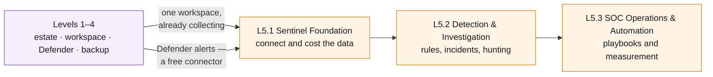

# Level 5 — Microsoft Sentinel 🟠

**Theme: Detect.** Stand up a SIEM on the workspace this curriculum has been
filling since L2.1, and run a security incident from signal to closure.

Level 5 is a **parallel track**: it assumes Levels 1–4 are complete and does not
depend on Level 6.

| | |
|---|---|
| **Builds on** | Levels 1–4 — the estate, the workspace, the Defender plans, the governance |
| **Chapters** | L5.1 · L5.2 · L5.3 |
| **Existing assets reused** | The Log Analytics workspace (L2.1), diagnostic settings (L2.1), action groups (L2.3), Defender alerts (L3.3) |
| **New Azure resources** | Sentinel onboarding, analytics rules, playbooks — no new infrastructure |
| **Running cost at end of level** | **~$2.11/hr inside the free trial · ~$2.45/hr after it** |

> [!NOTE]
> Curriculum outline only. No hands-on steps or exercises are defined yet.

> [!IMPORTANT]
> **Arrange the permissions before the class, not during it.** This is the first
> level that needs a role **outside Azure**: the Microsoft Entra ID data
> connector is granted by a **Global Administrator** or **Security
> Administrator** in the directory, which in most organisations is a different
> person on a different team. On the Azure side you need **Microsoft Sentinel
> Contributor** on the workspace. Neither is something a lab participant holding
> Contributor on one resource group can grant themselves.

> [!IMPORTANT]
> **Sequence this level against the calendar.** Microsoft Sentinel's free trial
> waives both Log Analytics ingestion and Sentinel analysis for the first
> 10 GB/day for **31 days**. Every chapter below fits inside that allowance for
> an estate this size, which makes Level 5 nearly free — or the most expensive
> level in the curriculum if the window is missed.

## Where this level sits

Text description of this diagram

Levels 1 to 4 feed L5.1 along two paths that matter for different reasons. The
first is the Log Analytics workspace itself: Sentinel is enabled *on* an existing
workspace, so all the collection work from Level 2 is already done and no data
source has to be reconnected. The second is Microsoft Defender for Cloud alerts
from Level 3, which are a **free** Sentinel data source — the security work
already done arrives at no ingestion cost.

The three chapters then run in order: connect and cost the data, build and use
detections, then automate and measure the response.

## L5.1 — Sentinel Foundation

**Objective.** Enable Sentinel on the existing workspace and make an informed,
priced decision about every data source before connecting it.

**Learning objectives**

- Explain what enabling Sentinel changes about a Log Analytics workspace, and
  what it does not.
- Distinguish free data sources (Azure Activity, Defender for Cloud alerts,
  `SecurityAlert`, `SecurityIncident`, Office 365 audit) from paid ones
  (Microsoft Entra ID sign-in and audit logs, firewall and NSG logs, VM security
  events) — and connect each one deliberately.
- Choose the right table plan per source: **Analytics** for anything a detection
  rule queries, **Basic** or **Auxiliary** for high-volume evidence data.
- Install content from the Content hub and explain what a solution actually
  delivers — connectors, rules, workbooks, playbooks.
- Estimate the workspace's daily ingestion and translate it into a monthly bill
  before turning connectors on.
- Know where Sentinel lives going forward: the Azure portal experience retires
  after **31 March 2027**, and the Microsoft Defender portal is the destination.

**Builds on.** L2.1 (the workspace and its diagnostic settings), L2.4 (the table
plan discipline), L3.3 (Defender alerts).

**Azure services.** Microsoft Sentinel · data connectors · Content hub ·
Log Analytics table plans · Microsoft Defender portal.

**Estimated cost.** **+$0.00/hr in the trial · +$0.31/hr after it · running
total ~$2.10/hr or ~$2.41/hr.** Outside the trial, Analytics-tier data costs
Log Analytics ingestion at **$2.76/GB** plus Sentinel analysis at **$4.76/GB** —
about **$7.52/GB combined**. The assumption here is ~1 GB/day of paid data
(Entra ID logs, firewall logs, VM security events) ≈ $7.52/day.

**Cost optimization.** The largest cost decision in the entire curriculum is
made in this chapter, and it is a *selection* decision, not a purchase. Levers,
in order of impact: use the free trial window; connect free sources first and
prove the detections work on them; route verbose evidence data to Basic
($1.00/GB Sentinel analysis) or Auxiliary tiers; keep non-security operational
data out of the Sentinel workspace entirely — Sentinel bills on everything in
the workspace it is enabled on.

## L5.2 — Detection & Investigation

**Objective.** Build detections that fire on this environment's real behaviour,
then investigate what they produce.

**Learning objectives**

- Write a scheduled analytics rule in KQL against the data connected in L5.1,
  with entity mapping that makes the resulting incident investigable.
- Choose between scheduled, near-real-time and Microsoft-security rule types by
  latency requirement and cost.
- Map the rule set to MITRE ATT&CK and identify the coverage gaps this estate
  has — which will be substantial, and saying so honestly is the lesson.
- Investigate an incident end to end: entities, timeline, related alerts, and a
  written conclusion.
- Hunt proactively with a hypothesis, using bookmarks and livestream, and
  explain how hunting differs from alerting.
- Use watchlists to give detections business context that logs do not carry.

**Builds on.** L5.1 (no rule can query data that was never connected).

**Azure services.** Sentinel analytics rules (scheduled, NRT, Microsoft
security) · incidents and entities · UEBA · hunting queries · bookmarks ·
livestream · watchlists · MITRE ATT&CK coverage view.

**Estimated cost.** **+$0.00/hr in the trial · +$0.03/hr after it · running
total ~$2.10/hr or ~$2.44/hr.** Analytics rules, hunting, watchlists and
incidents carry no charge — you pay for the data, not the queries. UEBA adds its
own behaviour-analytics tables at Analytics-tier rates; the estimate assumes
~0.1 GB/day.

**Cost optimization.** Detection logic is free, which means the right instinct is
to write more rules over less data rather than collect more data. Rule frequency
is worth a look for a different reason than in Level 2 — a 5-minute rule over a
14-day lookback re-scans a lot of data — but the charge lands on ingestion and
retention, not on execution.

## L5.3 — SOC Operations & Automation

**Objective.** Operate the SIEM: automate the repetitive parts of response, and
measure whether the SOC is getting better or just busier.

**Learning objectives**

- Build a SOAR playbook in Logic Apps triggered by an incident, and identify the
  response actions that must stay human.
- Use automation rules to triage, tag, assign and suppress at scale, and explain
  why suppression is a governance decision rather than a convenience.
- Design the incident lifecycle — ownership, severity, closing classification —
  and use it consistently.
- Measure SOC efficiency with the built-in workbooks: mean time to triage, mean
  time to resolve, and the false-positive rate.
- Run a cost review of the workspace and adjust connectors and table plans based
  on what the detections actually used — closing the loop with L5.1.
- Explain how Sentinel, Defender for Cloud and Defender XDR relate in the
  unified security operations experience.

**Builds on.** L5.2 (incidents to automate) and L2.3 / L3.3 (the notification and
automation patterns already built).

**Azure services.** Sentinel automation rules · playbooks (Azure Logic Apps) ·
incident management · SOC efficiency workbooks · Sentinel health and audit ·
Microsoft Defender portal unified experience.

**Estimated cost.** **+$0.01/hr · running total ~$2.11/hr or ~$2.45/hr.**
Automation rules, workbooks and Sentinel health data are free. Logic Apps
consumption is the only real charge — a few thousand playbook actions a month
costs under $1.

**Cost optimization.** Automation is where the SIEM pays for itself, and the
chapter should say so with numbers: analyst time is the largest cost in any real
SOC, and it does not appear on the Azure bill at all. On the Azure side, the
level's closing exercise is the cost review — the class should leave having
turned off at least one connector they now know they did not need.

## Cost summary for Level 5

| Chapter | Adds (in trial) | Adds (after trial) | Running total after trial | Dominant meter |
|---|---|---|---|---|
| L5.1 Sentinel Foundation | +$0.00/hr | +$0.31/hr | ~$2.41/hr | LA $2.76/GB + Sentinel $4.76/GB |
| L5.2 Detection & Investigation | +$0.00/hr | +$0.03/hr | ~$2.44/hr | UEBA table ingestion |
| L5.3 SOC Operations & Automation | +$0.01/hr | +$0.01/hr | ~$2.45/hr | Logic Apps consumption |

**Level 5 adds roughly $0.35/hr outside the trial — the largest increment of any
level after L1.2's firewall, and unlike the firewall it is entirely within the
learner's control.** Inside the 31-day free trial it is effectively free.
Commitment tiers start at 100 GB/day ($296/day) and exist to be explained, not
enabled.

>  **GitHub feature spotlight · Detection content as code**
>
> **Why it belongs in this level:** Sentinel analytics rules, playbooks and
> workbooks are ARM/Bicep resources. Kept in this repository they get pull
> request review, version history, and deployment through the same OIDC
> workflows that deploy the infrastructure.
> **Find it:** the same pattern as `labs/` — one template, one parameter file,
> one `workflow_dispatch` workflow.
> **Beyond the lab:** "detection as code" is how a SOC stops losing rules to
> portal edits nobody remembers making, and how a detection gets reviewed before
> it starts paging people.
> [Docs →](https://docs.github.com/actions/deployment/security-hardening-your-deployments/about-security-hardening-with-openid-connect)

## What carries forward

Level 5 is a terminal track. Its output — a working SIEM over the curriculum's
own estate — pairs with
**[Level 6 · Recover](https://github.com/saulpatinojr/Demo-IaC_Demo_with_VSCode/wiki/Curriculum-Level-6-Recover)**,
which can be taken before or after this one.

When the class is finished, tear down deliberately: disabling Sentinel does not
delete the workspace, and retained data keeps billing.
