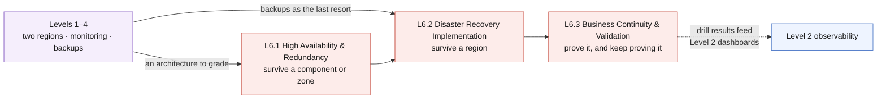

# Level 6 — Disaster Recovery & Redundancy 🔴

**📍 [Curriculum overview](https://github.com/saulpatinojr/Demo-IaC_Demo_with_VSCode/wiki/Curriculum-Redesign)** · Level 6 of 6 &nbsp;·&nbsp; Previous: [Level 5 · Detect](https://github.com/saulpatinojr/Demo-IaC_Demo_with_VSCode/wiki/Curriculum-Level-5-Detect) &nbsp;·&nbsp; Next: [Cleanup & Reset](https://github.com/saulpatinojr/Demo-IaC_Demo_with_VSCode/wiki/Cleanup-and-Reset)

---

**Theme: Recover.** Answer the question L1.4 raised and did not settle: this
environment is deployed in two regions, but would it survive losing one?

Level 6 is an **extra-credit parallel track**: the main path ends at L4.1, and
this level can be taken after it — before or after Level 5, or skipped
entirely. It does not depend on Level 5, and its chapters carry lighter
prerequisites than they look: **L6.1 needs nothing at all** (a $0
zone-redundancy audit that runs any time), **L6.2 needs L4.1's vault**, and
**L6.3 needs L1.3's workspace and L2.3's action group**.

**Chapters in this level**

| Chapter | One line |
|---|---|
| [L6.1 — High Availability & Redundancy](https://github.com/saulpatinojr/Demo-IaC_Demo_with_VSCode/wiki/Curriculum-L6-1-High-Availability) | Grade the estate's zone posture with a $0 audit workbook — no prerequisites, no new redundancy. |
| [L6.2 — Disaster Recovery Implementation](https://github.com/saulpatinojr/Demo-IaC_Demo_with_VSCode/wiki/Curriculum-L6-2-Disaster-Recovery) | Match each tier to its recovery mechanism and lay Site Recovery groundwork on L4.1's vault. |
| [L6.3 — Business Continuity & Validation](https://github.com/saulpatinojr/Demo-IaC_Demo_with_VSCode/wiki/Curriculum-L6-3-Continuity-Validation) | Prove the recovery with an SLO alert and a drill workbook that turns exercises into evidence. |

Full grid of both extra-credit tracks: [🗺️ Curriculum Map](https://github.com/saulpatinojr/Demo-IaC_Demo_with_VSCode/wiki/Curriculum-Map).

| | |
|---|---|
| **Builds on** | Lighter than "Levels 1–4": **L6.1 — nothing** (deployable any time) · **L6.2 — L4.1's vault** · **L6.3 — L1.3's workspace + L2.3's action group**; the rest of the estate enriches the audit but is not required |
| **Chapters** | L6.1 · L6.2 · L6.3 |
| **Existing assets reused** | L1.4's second region, SQL failover group and Front Door; L2.2's availability tests; L4.1's Recovery Services vault |
| **New Azure resources** | Site Recovery replication, zone-redundant variants — mostly reconfiguration |
| **Running cost at end of level** | **~$2.20/hr** with the recommended scope (Level 5 not included) |

> [!NOTE]
> **Build status:** Level 6 is fully built — three templates, one workflow, three
> walkthroughs.

## Where this level sits

Text description of this diagram

Levels 1 to 4 feed this level twice: they supply an architecture to grade for
resilience, and the backups that are the last line of defence when replication
cannot help. The three chapters escalate by blast radius — L6.1 handles losing a
component or an availability zone, L6.2 handles losing a whole region, and L6.3
proves the claims with drills instead of assertions.

The dotted line back to Level 2 is the point of the level: a recovery capability
that is not measured is a recovery hope. Drill results, RTO and RPO evidence
belong on the same dashboards as everything else.

## L6.1 — High Availability & Redundancy

**Built:** [`curriculum/L6.1-high-availability`](https://github.com/saulpatinojr/Demo-IaC_Demo_with_VSCode/blob/main/curriculum/L6.1-high-availability/main.bicep) ·
**walkthrough:** [L6.1 — High Availability & Redundancy](https://github.com/saulpatinojr/Demo-IaC_Demo_with_VSCode/wiki/Curriculum-L6-1-High-Availability)

**Objective.** Grade the Level 1 architecture honestly against availability
zones and component-level redundancy, and fix what is cheap to fix.

**Learning objectives**

- Define availability sets, availability zones and regions precisely, and state
  the SLA each one delivers.
- Audit every Level 1 resource for zone redundancy and produce a table of what
  is zonal, what is zone-redundant, and what is neither.
- Identify the single points of failure that survived L1.4: one Bastion host,
  one firewall instance, one container replica per region, and a Basic-tier SQL
  database that cannot be made zone-redundant at all.
- Distinguish an SLA from an SLO from an actual measured availability number,
  using L2.2's availability tests as the evidence.
- Apply the redundancy upgrades that are cheap (extra replicas, zone-redundant
  configuration) and cost the ones that are not.

**Builds on.** Nothing, strictly — the audit grades whatever the resource group
contains. Level 1 gives it a subject worth grading, and L2.2 supplies the
measured half.

**Azure services.** Availability zones · zone-redundant Standard Load Balancer ·
Container Apps replica scaling · zone-redundant storage · Azure SQL service tier
comparison · Azure Firewall zone deployment.

**Estimated cost.** **+$0.06/hr · running total ~$2.16/hr.** A second container
replica is $0.054/hr; zone-redundant disks and storage add roughly 1.4× on
storage lines (a few dollars a month here). Deploying the firewall across zones
costs nothing extra beyond the existing $1.25/hr. Making the database
zone-redundant means leaving Basic for a General Purpose tier — roughly
+$0.25/hr — which the chapter should price and then decline.

**Cost optimization.** Redundancy is priced per nine, and the curve is steep at
the end. The chapter's exercise is to spend a fixed hypothetical budget on the
redundancy that buys the most availability for this workload — which usually
means a second replica and zone-redundant configuration, not a database tier
upgrade.

## L6.2 — Disaster Recovery Implementation

**Built:** [`curriculum/L6.2-disaster-recovery`](https://github.com/saulpatinojr/Demo-IaC_Demo_with_VSCode/blob/main/curriculum/L6.2-disaster-recovery/main.bicep) ·
**walkthrough:** [L6.2 — Disaster Recovery Implementation](https://github.com/saulpatinojr/Demo-IaC_Demo_with_VSCode/wiki/Curriculum-L6-2-Disaster-Recovery)

**Objective.** Build a real regional recovery capability for each tier, and know
which mechanism applies to which.

**Learning objectives**

- Match each tier to its correct DR mechanism: Azure Site Recovery for the VMs,
  the failover group for SQL, Front Door for traffic redirection, and redeploy
  from IaC for everything stateless.
- Configure Site Recovery replication for a Level 1 VM and read the replication
  health signals.
- Build a recovery plan that sequences the tiers correctly — data before app,
  app before traffic — and explain what a wrong order costs.
- Distinguish planned failover, unplanned failover and test failover, and know
  the data-loss profile of each.
- Explain why "redeploy from the repository" is a legitimate DR strategy for
  stateless tiers, and what it requires to stay true — version-pinned modules,
  parameters in source, no manual portal changes.
- Understand region pairing and what it does and does not guarantee.

**Builds on.** L4.1 (the vault — the one hard prerequisite); L6.1 for the
redundancy-first framing; L1.4's failover group and Front Door where they
exist.

**Azure services.** Azure Site Recovery · recovery plans · Azure SQL failover
groups (reused from L1.4) · Azure Front Door origin health and priority
(reused) · paired regions · Bicep redeployment as recovery.

**Estimated cost.** **+$0.04/hr · running total ~$2.20/hr.** Site Recovery is
**$25/month per protected VM** (~$0.034/hr) plus replica managed disks in the
target region (~$1.54/month per 32 GiB Standard HDD), a cache storage account,
and egress for replication traffic. Protecting one VM is enough to teach the
mechanism; all four would be ~$0.14/hr plus storage.

**Cost optimization.** Protect one VM, not the fleet — the per-instance meter is
the whole cost and the learning is identical. The larger point belongs on a
slide: for stateless tiers, redeploying from this repository costs **$0/month**
in standby and beats paying for warm infrastructure that does nothing. DR
strategy is a cost-versus-RTO curve, and IaC moves the curve.

## L6.3 — Business Continuity & Validation

**Built:** [`curriculum/L6.3-continuity-validation`](https://github.com/saulpatinojr/Demo-IaC_Demo_with_VSCode/blob/main/curriculum/L6.3-continuity-validation/main.bicep) ·
**walkthrough:** [L6.3 — Business Continuity & Validation](https://github.com/saulpatinojr/Demo-IaC_Demo_with_VSCode/wiki/Curriculum-L6-3-Continuity-Validation)

**Objective.** Prove the recovery capability, write down what it actually
delivers, and make the proof repeatable.

**Learning objectives**

- Derive RTO and RPO from a business requirement, not from what the technology
  happens to provide, and reconcile the two.
- Run a test failover for both the VM tier and the database tier without
  affecting production, and measure the real RTO against the target.
- Write a runbook someone else can execute under pressure at 03:00, and have
  somebody else execute it.
- Inject controlled failure with Azure Chaos Studio and observe whether the
  monitoring from Level 2 actually detects it.
- Report drill outcomes as evidence — what worked, what did not, what the
  measured numbers were — and feed the gaps back as a backlog.
- Assess the whole estate against the Well-Architected reliability pillar and
  close the curriculum with a prioritised, costed improvement list.

**Builds on.** L1.3's workspace and L2.3's action group (the hard
prerequisites); L6.1 and L6.2 (there is nothing to validate otherwise); L2.2
and L4.3's restore drill discipline, applied to region loss.

**Azure services.** Site Recovery test failover · SQL failover group forced and
planned failover · Azure Chaos Studio · Azure Monitor workbooks for drill
reporting · Azure Business Continuity center.

**Estimated cost.** **+$0.00/hr steady state · running total ~$2.20/hr.** Drills
are event costs, not running costs: a test failover bills the temporary VM and
disks while they exist (~$0.05/hr per VM), and Chaos Studio bills
**$0.10 per action-minute** — a 10-minute experiment is about $1. Budget $2–5
per full drill and delete everything afterwards.

**Cost optimization.** The cheapest possible DR posture is an untested one, and
this chapter exists to say why that is a false saving. The defensible position:
drills are inexpensive and scheduled; standby capacity is expensive and should
be sized to a measured RTO rather than to anxiety.

## Cost summary for Level 6

| Chapter | Adds | Running total | Dominant meter |
|---|---|---|---|
| L6.1 High Availability & Redundancy | +$0.06/hr | ~$2.16/hr | Second container replica $0.054/hr |
| L6.2 Disaster Recovery Implementation | +$0.04/hr | ~$2.20/hr | Site Recovery $25/VM/month |
| L6.3 Business Continuity & Validation | +$0.00/hr | ~$2.20/hr | Per-drill: test failover + Chaos Studio |

**Level 6 adds roughly $0.10/hr in steady state** — the cheapest of the four
operational levels, because most of its content is design, measurement and
drills rather than deployed capacity. That is the closing lesson of the whole
curriculum: resilience is bought mostly with discipline, and only partly with
money.

>  **GitHub feature spotlight · Redeploy from source as a recovery path**
>
> **You already have it:** every template in `curriculum/` pins its Azure Verified
> Module versions, and every parameter comes from the environment rather than
> from a portal click. That combination is what makes "redeploy the region from
> `main`" a recovery plan instead of a wish.
> **Find it:** the `br/public:avm/res/...` version pins, and the
> `readEnvironmentVariable` calls in each `.bicepparam`.
> **Beyond the lab:** the day you need this, the difference between a pinned
> module and a floating tag is the difference between recreating the environment
> and creating a new one.
> [Docs →](https://docs.github.com/actions/using-workflows/manually-running-a-workflow)

## What carries forward

Level 6 closes the lifecycle: **Deploy → Monitor → Secure → Protect → Detect →
Recover**.

> [!WARNING]
> Tear down in reverse order of creation, and check three things that outlive a
> resource-group cleanup: Site Recovery replication (disable it, or it keeps
> billing per instance), Recovery Services vault contents from Level 4, and
> retained Log Analytics data from Levels 2 and 5.

## 🧭 Where next?

| Your situation | Go to |
|---|---|
| Start the first chapter | **[L6.1 — High Availability & Redundancy](https://github.com/saulpatinojr/Demo-IaC_Demo_with_VSCode/wiki/Curriculum-L6-1-High-Availability)** |
| Curriculum complete — tear it down | [Cleanup & Reset](https://github.com/saulpatinojr/Demo-IaC_Demo_with_VSCode/wiki/Cleanup-and-Reset) |
| Skipped Level 5? It only needs L1.3's workspace (plus an instructor-granted Sentinel role) | [Level 5 · Detect](https://github.com/saulpatinojr/Demo-IaC_Demo_with_VSCode/wiki/Curriculum-Level-5-Detect) |
| What does the whole curriculum cost? | [Cost model](https://github.com/saulpatinojr/Demo-IaC_Demo_with_VSCode/wiki/Curriculum-Cost-Model) |
