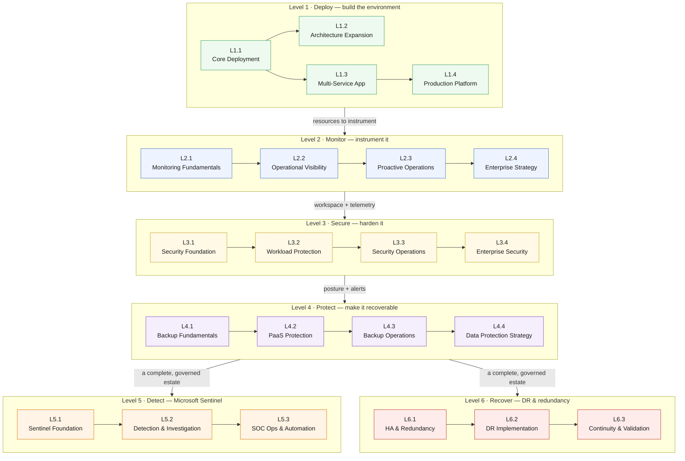

# Curriculum Redesign — the Azure operational maturity path 🧭

**Status: proposal, being built.** The six level pages define chapter structure,
learning objectives, dependencies, service inventory and cost. Chapters gain a
**Built** line and a walkthrough page as their code lands.

| Level | Outline | Code |
|---|---|---|
| Level 1 · Deploy | ✅ | ✅ — the existing labs, unchanged |
| Level 2 · Monitor | ✅ | ✅ L2.1 · L2.2 · L2.3 · L2.4 |
| Levels 3–6 | ✅ | outline only so far |

Nothing on this branch changes the four labs that exist today. The existing
[L1](https://github.com/saulpatinojr/Demo-IaC_Demo_with_VSCode/wiki/L1-Hub-and-Spoke)–[L4](https://github.com/saulpatinojr/Demo-IaC_Demo_with_VSCode/wiki/L4-Global-Scale)
pages, their Bicep and their workflows are untouched and still deployable. The
redesign *re-frames* them as the first level of a longer path.

## The problem this fixes

Today's four labs are four ways to **deploy**. A learner finishes L4 knowing how
to stand infrastructure up, and nothing about what happens for the rest of that
infrastructure's life. Real Azure environments spend a few hours being deployed
and then years being watched, hardened, backed up, investigated and recovered.

The redesign keeps a single environment alive across the whole curriculum and
walks it through the operational lifecycle:

**Deploy → Monitor → Secure → Protect → Detect → Recover**

Every level operates on the *same* resources the previous levels created. No
level deploys a parallel environment to demonstrate a feature in isolation.

## The six levels

| Level | Theme | Chapters | Builds on | Guide |
|---|---|---|---|---|
| **Level 1** | Azure Foundation & Deployment | L1.1 – L1.4 | — | [Level 1 · Deploy](https://github.com/saulpatinojr/Demo-IaC_Demo_with_VSCode/wiki/Curriculum-Level-1-Deploy) |
| **Level 2** | Operations, Monitoring & Observability | L2.1 – L2.4 | Level 1 | [Level 2 · Monitor](https://github.com/saulpatinojr/Demo-IaC_Demo_with_VSCode/wiki/Curriculum-Level-2-Monitor) |
| **Level 3** | Security & Microsoft Defender for Cloud | L3.1 – L3.4 | Levels 1–2 | [Level 3 · Secure](https://github.com/saulpatinojr/Demo-IaC_Demo_with_VSCode/wiki/Curriculum-Level-3-Secure) |
| **Level 4** | Backup, Protection & Recovery Readiness | L4.1 – L4.4 | Levels 1–3 | [Level 4 · Protect](https://github.com/saulpatinojr/Demo-IaC_Demo_with_VSCode/wiki/Curriculum-Level-4-Protect) |
| **Level 5** | Microsoft Sentinel | L5.1 – L5.3 | Levels 1–4 | [Level 5 · Detect](https://github.com/saulpatinojr/Demo-IaC_Demo_with_VSCode/wiki/Curriculum-Level-5-Detect) |
| **Level 6** | Disaster Recovery & Redundancy | L6.1 – L6.3 | Levels 1–4 | [Level 6 · Recover](https://github.com/saulpatinojr/Demo-IaC_Demo_with_VSCode/wiki/Curriculum-Level-6-Recover) |

Levels 5 and 6 are **parallel tracks**. Both assume Levels 1–4 are complete, and
neither depends on the other, so a class can run either one, both, or neither.

## Full chapter hierarchy

```
Level 1 · Azure Foundation & Deployment          (the environment everything else uses)
  L1.1  Core Deployment                          ← today's L1 — Hub & Spoke
  L1.2  Architecture Expansion                   ← today's L2 — Web Tier & Firewall
  L1.3  Multi-Service Application Architecture   ← today's L3 — Containers & Data
  L1.4  Production-Ready Platform Deployment     ← today's L4 — Global Scale

Level 2 · Operations, Monitoring & Observability (instrument what Level 1 built)
  L2.1  Monitoring Fundamentals
  L2.2  Operational Visibility
  L2.3  Proactive Operations
  L2.4  Enterprise Monitoring Strategy

Level 3 · Security & Microsoft Defender for Cloud (harden it, using Level 2's telemetry)
  L3.1  Security Foundation
  L3.2  Workload Protection
  L3.3  Security Operations
  L3.4  Enterprise Security Architecture

Level 4 · Backup, Protection & Recovery Readiness (make it survivable)
  L4.1  Backup Fundamentals
  L4.2  PaaS Protection
  L4.3  Operational Backup Management
  L4.4  Enterprise Data Protection Strategy

Level 5 · Microsoft Sentinel                      (parallel track — needs Levels 1–4)
  L5.1  Sentinel Foundation
  L5.2  Detection & Investigation
  L5.3  SOC Operations & Automation

Level 6 · Disaster Recovery & Redundancy          (parallel track — needs Levels 1–4)
  L6.1  High Availability & Redundancy
  L6.2  Disaster Recovery Implementation
  L6.3  Business Continuity & Validation
```

## Dependency map



<details><summary>Text description of this diagram</summary>

Six level groups stacked top to bottom, each containing its chapters in order.

**Level 1** is the only level with internal branching, and it is inherited from
the labs as they exist today: L1.1 is a prerequisite for everything, L1.2 and
L1.3 both hang off L1.1 as siblings, and L1.4 extends L1.3. L1.3 does **not**
require L1.2, which is what lets a cost-constrained class tear the Azure
Firewall down and keep going.

Levels 2, 3 and 4 are strictly linear inside themselves, and each depends on the
level above it: Level 2 instruments the resources Level 1 created, Level 3
consumes Level 2's Log Analytics workspace to hold its security data, and Level 4
protects the resources while reporting through Level 2's alerting and Level 3's
governance.

Levels 5 and 6 both branch off Level 4 and are independent of each other. Level 5
(Microsoft Sentinel) needs the workspace and the connected data sources that
Levels 2 and 3 produced. Level 6 (disaster recovery) needs an environment worth
recovering and a definition of what "healthy" means, which is Level 2's work.

The arrow labels name what actually carries forward, not just an ordering:
resources, then a workspace and telemetry, then posture and alerts, then a
complete governed estate.

</details>

## What every chapter page contains

The six level pages follow one shape, so a chapter can be lifted straight into
lab authoring later:

| Section | Purpose |
|---|---|
| **Objective** | One sentence: what the learner can do afterwards |
| **Learning objectives** | 4–6 verifiable outcomes, written as capabilities |
| **Builds on** | The exact chapters and resources this chapter consumes |
| **Azure services** | Service inventory — what is new, what is reused |
| **Estimated cost** | Incremental $/hr, running total, and the dominant meter |
| **Cost optimization** | The specific lever available in *this* chapter |

## Cost is a first-class topic, not an appendix

Every chapter states its own cost. Every level ends with a cost summary. The
whole model — unit rates, assumptions, the categories tracked across the
curriculum, and the optimization levers — lives on
**[Curriculum Cost Model](https://github.com/saulpatinojr/Demo-IaC_Demo_with_VSCode/wiki/Curriculum-Cost-Model)**.

Two facts shape the entire design:

- **Azure Firewall Standard ($1.25/hr) is still the single largest line item**,
  bigger than every monitoring, security, backup and DR component combined.
- **After Level 1, almost every new cost is usage-based, not resource-based.**
  Levels 2–5 bill mostly on log ingestion (GB/day), which means the learner
  controls the bill by choosing what to collect. That is itself a teachable
  skill, and it is the reason cost belongs in every chapter rather than in a
  footnote.

> [!IMPORTANT]
> Cost figures across these pages are **planning estimates** for East US 2 at US
> retail pay-as-you-go rates, verified against the Azure Retail Prices API on
> **8 August 2026**. Usage-based lines depend on assumptions that are stated
> where they are used. Confirm against Azure Cost Management before committing a
> budget.

## Recommendations for balancing scope, cost and learning

1. **Never re-deploy to demonstrate.** If a chapter needs a resource, it either
   exists from an earlier level or the chapter explains why a new one is
   justified. This is the rule that separates the redesign from what exists now.
2. **Make Level 1 tear-down-able, and say so in Level 1.** L1.2's firewall is
   the only optional-but-expensive component; the curriculum should keep the
   existing escape hatch (L1.3 needs only L1.1) rather than forcing a chain.
3. **Teach the free tier before the paid plan.** Defender's foundational CSPM,
   Azure Activity logs, Sentinel's free data sources and Azure Policy are all
   free. A chapter should reach its learning objective on free capability first,
   then enable one paid plan deliberately, with the meter on screen.
4. **Run Level 5 inside Microsoft Sentinel's 31-day free trial.** The first
   10 GB/day is waived for both ingestion and analysis, which turns the most
   expensive level in the curriculum into the cheapest — but only if the class
   schedule respects the window.
5. **Cap the estate at four VMs.** Per-node pricing (Defender for Servers, Azure
   Backup, Site Recovery) multiplies by node count. Four is enough to teach
   fleet behaviour and small enough to keep every per-node meter under $1/day.
6. **Prefer "design it, cost it, don't deploy it" for the premium tiers.**
   Azure Firewall Premium, Front Door Premium/WAF and zone-redundant SQL are
   architecturally important and disproportionately expensive. Model them,
   price them, and deploy them only in an instructor-led window.
7. **Put a cost checkpoint at the end of each level, not only at the end.** The
   existing teardown guidance is good; the redesign should add a "what is
   running right now, and what does it cost" review at four more places.
8. **Reuse the existing artifacts.** Level 1 is the existing Bicep unchanged.
   The cost model extends `unit cost/Build-CostDocs.ps1`'s rate table rather
   than starting a second source of truth. The wiki checker
   (`scripts/Publish-Wiki.ps1`) already enforces the page standard these pages
   follow.

>  **GitHub feature spotlight · Branches as proposals**
>
> **You are looking at one:** this curriculum lives on its own branch and its own
> set of wiki pages. Nothing about the current learning path changed, so the
> proposal can be read, reviewed and rejected without a single learner noticing.
> **Find it:** the branch selector on the repository home page, and the pull
> request that carries these pages.
> **Beyond the lab:** because `docs/wiki/` is published to the wiki from the
> repo, a documentation redesign gets the same review workflow as code — diffed,
> commented on line by line, and merged only when someone approves it.
> [Docs →](https://docs.github.com/pull-requests/collaborating-with-pull-requests/proposing-changes-to-your-work-with-pull-requests/about-branches)

## Where to go next

Start at **[Level 1 · Deploy](https://github.com/saulpatinojr/Demo-IaC_Demo_with_VSCode/wiki/Curriculum-Level-1-Deploy)**,
or jump to the **[Curriculum Cost Model](https://github.com/saulpatinojr/Demo-IaC_Demo_with_VSCode/wiki/Curriculum-Cost-Model)**
to see how every figure on these pages is derived.
