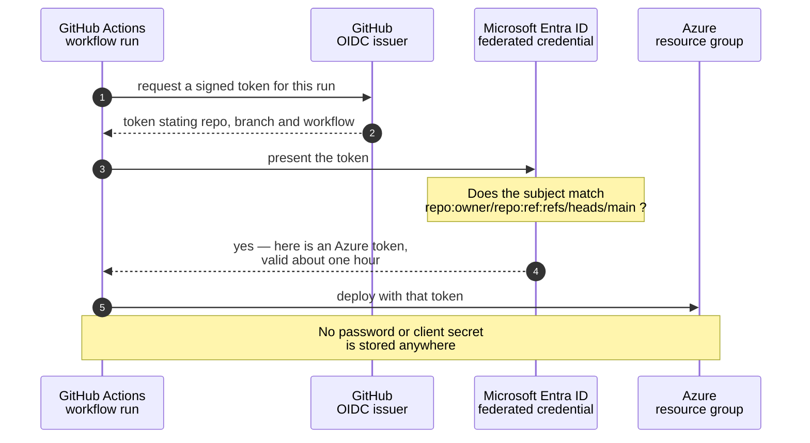

# Deployment Guide

Everything the workflows need to talk to Azure, end to end. Do this **once** before L1.

The goal of this page is a **passwordless "handshake"** between GitHub and Azure: GitHub Actions proves its identity to Microsoft Entra ID on every run using a short-lived token (OIDC), so there is **no cloud password stored anywhere** — not in the repo, not in a secret, nowhere to leak. This is the same one-time setup described in the repository README and driven by the setup script in the repo.



<details><summary>Text description of this diagram</summary>

Four steps, and no stored credential at any point.

The workflow asks GitHub for a **signed token describing itself** — which
repository, which branch, which workflow. It presents that token to Microsoft
Entra ID, which checks it against a **federated credential** you registered
once: a rule saying "trust tokens from this exact repository and branch."

If the subject matches, Entra issues an Azure access token valid for about an
hour, and the workflow deploys with it. If someone forks the repo, their
workflow's token names *their* repository, the subject doesn't match, and the
exchange fails.

That's the whole point: there is no client secret in the repository, nothing to
leak in a log, and nothing to rotate. `Setup-Oidc.ps1` registers the federated
credential for you.

</details>

---

## 🚀 Set it up — pick either way

Both produce exactly the same result: an Entra app, a federated credential, a role assignment, and your repo secrets. Choose by how much you want to see.

<table>
<tr>
<td align="center" width="360"><br><br><b>A · One command</b><br><sub>The script does all five steps</sub></td>
<td align="center" width="360"><br><br><b>B · Step by step</b><br><sub>Run each az and gh command yourself</sub></td>
</tr>
</table>

<br>

---

## &nbsp; Option A — the one-command setup (recommended)

From inside your clone (PowerShell 7, with `az` and `gh` already signed in):

### Classroom participant (assigned one resource group, unique prefix)
```powershell
# Preview first:
./scripts/Setup-Oidc.ps1 -ResourceGroup "rg-techdemo-<yourname>" -Prefix "<yourname>" -WhatIf

# Run for real:
./scripts/Setup-Oidc.ps1 -ResourceGroup "rg-techdemo-<yourname>" -Prefix "<yourname>"
```

### Self-hosted (own subscription)

`-ResourceGroup` is required here too — the workflows always deploy into a named group, and no lab creates it. Make it first:

```powershell
az group create --name "rg-techdemo-<yourname>" --location eastus2

./scripts/Setup-Oidc.ps1 -ResourceGroup "rg-techdemo-<yourname>" -Prefix "<yourname>" -WhatIf
./scripts/Setup-Oidc.ps1 -ResourceGroup "rg-techdemo-<yourname>" -Prefix "<yourname>"
```

That single script:

1. **Detects your fork** (`owner/repo`) from the `gh` CLI — you don't type it.
2. Creates (or reuses) an **Entra app registration + service principal** named `iac-demo-<prefix>`.
3. Adds the **federated credential** so Actions on your branch can log in with no secret.
4. Grants that identity **Contributor** on the resource group you passed. That is the only scope the script grants — there is no subscription-scoped mode, classroom or not.
5. Sets the repo **secrets and variables** — the IDs, your resource group, prefix, location, and strong throwaway VM/SQL passwords.

Optional flags:

| Flag | Use |
|---|---|
| `-WhatIf` | Dry run — prints every action, changes nothing. Always start here. Still requires `-ResourceGroup`, so that the preview matches what the real run will do. |
| `-ResourceGroup "rg-techdemo-<name>"` | **Required, classroom and self-hosted alike.** Scopes Contributor to this **pre-existing** group and sets the `AZURE_RESOURCE_GROUP` secret every workflow reads. |
| `-Prefix "<name>"` | Unique identifier for your resources (max 12 chars). Sets `AZURE_PREFIX` variable. |
| `-Location "eastus2"` | Override the default region. Sets `AZURE_LOCATION` variable. |
| `-GitHubRepo "owner/repo"` | Override auto-detection. |
| `-Branch dev` | Federate a branch other than `main`. |
| `-AlertEmail "me@example.com"` | Also set the `ALERT_EMAIL` variable used by L3. |
| `-SubscriptionId <id>` | Target a specific subscription instead of your default. |
| `-AppName "custom-name"` | Override the Entra app name (default: `iac-demo-<prefix>`). |

It is **idempotent** — safe to re-run. Re-running **rewrites** the identity and resource-group secrets, so they always match the app and group that run just configured, and **keeps** any `VM_ADMIN_PASSWORD` / `SQL_ADMIN_PASSWORD` you already have — a deployed VM or SQL server holds whatever password it was built with, so overwriting the secret would only put GitHub out of step with it. To force a fresh password, delete that secret in GitHub and re-run.

> **Prefer to see the moving parts, or on macOS/Linux?** Do Option B instead — it's the same steps by hand.

---

## &nbsp; Option B — the manual steps (what the script does)

**Best if you want to see every moving part**, or you are on macOS or Linux where the PowerShell script is less convenient.

### 1. App registration + service principal + federated credential

```bash
# 1) App registration + service principal
#    Use your prefix to keep the name unique in the tenant
PREFIX="alice"
APP_ID=$(az ad app create --display-name "iac-demo-$PREFIX" --query appId -o tsv)
az ad sp create --id $APP_ID

# 2) Federated credential for YOUR fork's main branch.
#    Replace <YOUR-GITHUB-USER> with your GitHub username or org.
az ad app federated-credential create --id $APP_ID --parameters '{
  "name": "gh-main",
  "issuer": "https://token.actions.githubusercontent.com",
  "subject": "repo:<YOUR-GITHUB-USER>/Demo-IaC_Demo_with_VSCode:ref:refs/heads/main",
  "audiences": ["api://AzureADTokenExchange"]
}'

# 3) Contributor on your resource group -- classroom and self-hosted alike.
#    Classroom: the group your instructor assigned, which already exists.
#    Self-hosted: create it first, because no lab creates it for you:
#      az group create --name "rg-techdemo-$PREFIX" --location eastus2
RG="rg-techdemo-$PREFIX"
az role assignment create --assignee $APP_ID --role Contributor \
  --scope /subscriptions/$(az account show --query id -o tsv)/resourceGroups/$RG

# Resource-group scope is deliberate: it is the classroom blast-radius boundary,
# and it is what Setup-Oidc.ps1 does too. Granting Contributor at subscription
# scope instead would work, but nothing in this workshop needs it.

echo "AZURE_CLIENT_ID=$APP_ID"
echo "AZURE_TENANT_ID=$(az account show --query tenantId -o tsv)"
echo "AZURE_SUBSCRIPTION_ID=$(az account show --query id -o tsv)"
```

> [!WARNING]
> The `subject` string must match your fork **exactly** — owner, repo name (`Demo-IaC_Demo_with_VSCode`), and branch. A typo here is the single most common cause of `AADSTS700213` errors, and the message does not tell you which part is wrong. See [Troubleshooting](https://github.com/saulpatinojr/Demo-IaC_Demo_with_VSCode/wiki/Troubleshooting).

**Deploying from a branch other than `main`, or from a Pull Request?** The token's `subject` changes, so add a matching credential:

```bash
# a specific branch:
"subject": "repo:<user>/Demo-IaC_Demo_with_VSCode:ref:refs/heads/<branch>"
# any pull request:
"subject": "repo:<user>/Demo-IaC_Demo_with_VSCode:pull_request"
# a GitHub Environment named "production":
"subject": "repo:<user>/Demo-IaC_Demo_with_VSCode:environment:production"
```

### 2. Repo secrets & variables

```bash
RG="rg-techdemo-<yourname>"
PREFIX="<yourname>"

gh secret set AZURE_CLIENT_ID       --body "<appId>"
gh secret set AZURE_TENANT_ID       --body "<tenantId>"
gh secret set AZURE_SUBSCRIPTION_ID --body "<subscriptionId>"
gh secret set AZURE_RESOURCE_GROUP  --body "$RG"
gh secret set VM_ADMIN_PASSWORD     --body "<Passw0rd-style throwaway>"
gh secret set SQL_ADMIN_PASSWORD    --body "<another throwaway>"

gh variable set AZURE_PREFIX        --body "$PREFIX"
gh variable set AZURE_LOCATION      --body "eastus2"
gh variable set ALERT_EMAIL         --body "you@yourdomain.com"
```

Notes:
- `AZURE_RESOURCE_GROUP` is required for **every** deployment, not just classroom ones — each workflow's preflight step fails immediately without it.
- `VM_ADMIN_PASSWORD` is used by L1/L2.
- `SQL_ADMIN_PASSWORD` is used by L3/L4.
- `ALERT_EMAIL` is optional (used by L3 alerting).

Not sure why some of these are **secrets** and some are **variables**? See [GitHub Essentials → Secrets vs. Variables](https://github.com/saulpatinojr/Demo-IaC_Demo_with_VSCode/wiki/GitHub-Essentials#-secrets-vs-variables).

Password rules: VM passwords need 12+ chars and 3 of 4 character classes; SQL forbids the login name inside the password. (The setup script generates compliant ones automatically.)

---

## 🚀 3. Running a deployment

Every workflow is manual (`workflow_dispatch`): **Actions → pick the lab → Run workflow**. Each run has a **preflight** check (fails early with a clear message if a secret is missing) and then three stages:

1. **Lint** — `az bicep build` (compile + linter).
2. **What-if** — a dry run printing `+ Create / ~ Modify / - Delete` per resource. **Read it** — this is IaC's safety net.
3. **Deploy** — `az deployment group create` targeting your assigned resource group.

CLI equivalents are on each lab page — handy when you let Copilot agent mode drive deployments locally.

---

## 🧭 4. Order & dependencies

All labs deploy into the **same resource group** (your `AZURE_RESOURCE_GROUP`). Each lab finds the previous lab's resources by name convention (using the same `AZURE_PREFIX`).

| Lab | Requires | Key resources added |
|-----|----------|---------------------|
| L1 | — | Hub VNet, Spoke VNet (peered), Bastion, test VM |
| L2 | L1 | Azure Firewall (in hub), 3 web VMs behind internal LB, NSG, route table |
| L3 | L1 | Container Apps, SQL, Key Vault, managed identity, monitoring |
| L4 | L3 | Secondary Container Apps (DR region), SQL failover group, Front Door |

Same `AZURE_PREFIX` and `AZURE_LOCATION` must be used throughout — the labs find each other's resources by naming convention.

---

## 🧹 5. Teardown

All four labs deploy into the **same** resource group, so one command clears all of them. The group itself is left in place — classroom students usually hold Contributor on the group and can't delete it.

```powershell
./scripts/Cleanup-Labs.ps1 -ResourceGroup "rg-techdemo-<yourname>" -WhatIf   # preview first
./scripts/Cleanup-Labs.ps1 -ResourceGroup "rg-techdemo-<yourname>"
```

If `AZURE_RESOURCE_GROUP` is already set in your terminal (`Load-LabSettings.ps1` sets it), you can leave `-ResourceGroup` off and the script picks it up.

**Self-hosted** — you own the group, so you can drop the whole thing once it's empty, and remove the deployment identity too:
```powershell
az group delete --name "rg-techdemo-<yourname>" --yes
./scripts/Cleanup-Labs.ps1 -Prefix "<yourname>" -RemoveOidc   # deletes the Entra app
```

Or via **Actions → "Teardown labs"** → type `DELETE`.

<br>

---

>  **GitHub feature spotlight · Short-lived credentials, and knowing when not to automate**
>
> **You just used it:** the OIDC handshake above replaced a stored cloud password with a token that expires in about an hour and only works from this repository.
> **Find it:** the **Azure login (OIDC)** step in any deploy run. There is no `client-secret` anywhere in these workflows.
> **Beyond the lab:** note what is *not* automated here: publishing this wiki. `GITHUB_TOKEN` cannot push to a wiki repo, so automating it would mean storing a long-lived key in a repo built to be forked. It is run from a machine instead. Knowing when the automation costs more than it saves is a real engineering skill.
> [Docs →](https://docs.github.com/actions/deployment/security-hardening-your-deployments/about-security-hardening-with-openid-connect)
