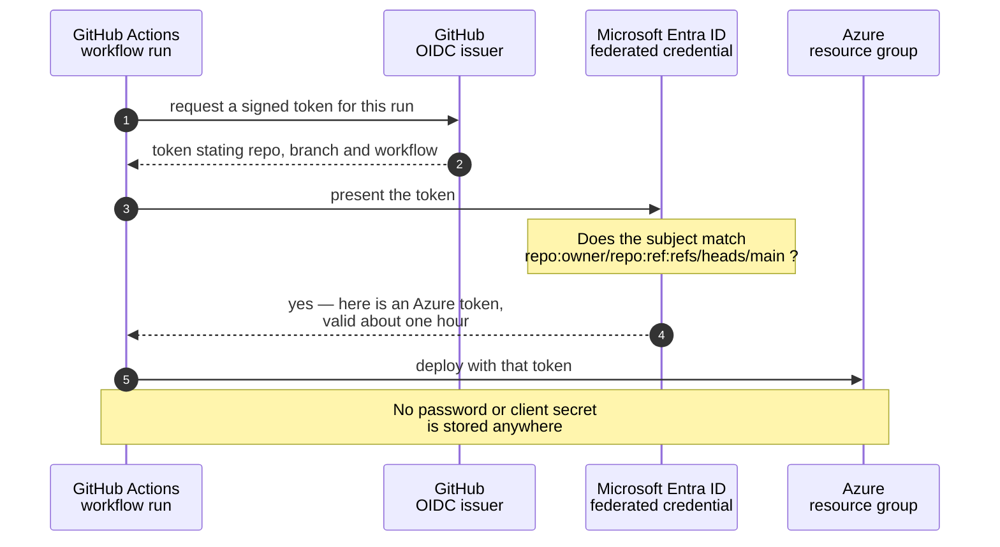

# Deployment Guide

How a deploy actually reaches Azure, end to end. In the classroom there is **nothing to set up** — this page explains what is already wired, how to run a deployment, and (in the appendix) how to build the same wiring yourself on your own subscription.

## 🏫 1. How classroom deploys work

Every deploy runs through a **passwordless "handshake"** between GitHub and Azure: GitHub Actions proves its identity to Microsoft Entra ID on every run using a short-lived token (OIDC), so there is **no cloud password stored anywhere** — not in the repo, not in a secret, nowhere to leak.

In the classroom, all forks share **one workshop deployment identity** (a single Entra app). Each student fork has its **own federated credential registered on that shared app**, so Actions runs on *your* fork exchange *your* fork's token for an Azure token — no per-student app, no per-student secrets.



<details><summary>Text description of this diagram</summary>

Four steps, and no stored credential at any point.

The workflow asks GitHub for a **signed token describing itself** — which
repository, which branch, which workflow. It presents that token to Microsoft
Entra ID, which checks it against a **federated credential** registered on the
app: a rule saying "trust tokens from this exact repository and branch."

If the subject matches, Entra issues an Azure access token valid for about an
hour, and the workflow deploys with it. In this workshop the shared app carries
**one federated credential per classroom fork** — forks are exactly what the
trust is built for. A token from a repository with *no* registered credential
(a fork nobody staged) finds no matching subject, and the exchange fails.

That's the whole point: there is no client secret in the repository, nothing to
leak in a log, and nothing to rotate.

</details>

### What the workflow resolves at run time

Classroom forks carry **zero secrets and zero variables** — `gh secret list` returning `no secrets found` is the normal, correct state. Every value the workflow needs resolves through a fallback chain, and a fork secret or variable (when present, e.g. self-hosted) always wins:

| Value | Resolution chain (first match wins) |
|---|---|
| **Resource group** | workflow input override → `AZURE_RESOURCE_GROUP` secret → **the fork owner's name** (your resource group is named exactly like your GitHub account, e.g. `User01-TechCon`) |
| **Prefix** | `AZURE_PREFIX` variable → **derived from the fork owner** (`User01-TechCon` → `user01`) |
| **VM / SQL passwords** | `VM_ADMIN_PASSWORD` / `SQL_ADMIN_PASSWORD` secret → **`<fork-owner>!!`** (e.g. `User01-TechCon!!`) |
| **Client / tenant / subscription IDs** | secrets → **in-code fallbacks** for the shared workshop identity (these are identifiers, not secrets — authentication is the federated credential above) |

The straight-line consequence: sign in as your workshop account, open your fork, click **Run workflow** — everything else resolves itself.

> [!NOTE]
> Your Azure role is **Reader**. The shared identity holds Contributor on your resource group and does the deploying; you verify results in the portal or the workflow logs. Local `az deployment ...` commands will fail under a Reader account — that is expected. Local `az bicep build` works for everyone (compiling needs no Azure access).

---

## 🚀 2. Running a deployment

Every workflow is manual (`workflow_dispatch`): **Actions → pick the lab → Run workflow → Run workflow**. Leave the optional *resource group override* input empty — it exists for instructors and testing. Each run has three stages:

1. **Lint** — `az bicep build` (compile + linter).
2. **What-if** — a dry run printing `+ Create / ~ Modify / - Delete` per resource. **Read it** — this is IaC's safety net, and it costs nothing.
3. **Deploy** — `az deployment group create` targeting your resource group.

CLI equivalents are on each lab page — handy when you let Copilot agent mode drive deployments locally (self-hosted; classroom accounts hold Reader and deploy through Actions only).

---

## 🧭 3. Lab order & dependencies

The **main curriculum path runs east: L1.1 → L2.1 → L3.1 → L4.1** — one foundation chapter per level (deploy, monitor, secure, protect). The full grid of all 22 chapters, including the optional side chapters, is on the **[Curriculum Map](https://github.com/saulpatinojr/Demo-IaC_Demo_with_VSCode/wiki/Curriculum-Map)**.

All labs deploy into the **same resource group**, and each finds the previous lab's resources by name convention (same prefix throughout). Within Level 1, the side chapters build on each other like this:

| Lab | Requires | Key resources added |
|-----|----------|---------------------|
| L1.1 | — | Hub VNet, Spoke VNet (peered), Bastion, test VM |
| L1.2 | L1.1 | Azure Firewall (in hub), 3 web VMs behind internal LB, NSG, route table |
| L1.3 | L1.1 | Container Apps, SQL, Key Vault, managed identity, monitoring |
| L1.4 | L1.3 | Secondary Container Apps (DR region), SQL failover group, Front Door |

The same prefix and location must be used throughout — in the classroom that happens automatically (both derive from your account).

---

## 🧹 4. Teardown

**Classroom (and the easiest path everywhere): Actions → "Teardown labs" → Run workflow.** It defaults to a **dry run** that only lists what would be deleted; to delete for real, un-check *dry run* and type `DELETE` into the confirmation input. All labs deploy into the same resource group, so one run clears all of them — the group itself stays (it is pre-created, and your Reader role could not recreate it anyway).

Self-hosted teardown options are in the [appendix below](#-appendix-self-hosted-setup).

---

## 🛠️ Appendix: self-hosted setup

Everything below is for running the workshop **on your own subscription** — classroom accounts need none of it. Goal: recreate the same wiring — an Entra app, a federated credential for *your* fork, Contributor on *your* resource group, and the repo secrets that override the workflows' classroom defaults.

Prerequisites: your own fork and clone ([Start Here Checklist — Part 2](https://github.com/saulpatinojr/Demo-IaC_Demo_with_VSCode/wiki/Start-Here-Checklist-Part-2)), `az` and `gh` signed in, and an account that can create app registrations and role assignments.

### Option A — the one-command setup (recommended)

The resource group must already exist — no lab creates it:

```powershell
az group create --name "<your-rg>" --location eastus2

# Preview first:
./scripts/Setup-Oidc.ps1 -ResourceGroup "<your-rg>" -Prefix "<yourname>" -WhatIf

# Run for real:
./scripts/Setup-Oidc.ps1 -ResourceGroup "<your-rg>" -Prefix "<yourname>"
```

That single script:

1. **Detects your fork** (`owner/repo`) from the `gh` CLI — you don't type it.
2. Creates (or reuses) an **Entra app registration + service principal** named `iac-demo-<prefix>`.
3. Adds the **federated credential** so Actions on your branch can log in with no secret.
4. Grants that identity **Contributor** on the resource group you passed — resource-group scope only, the same blast-radius boundary the classroom uses.
5. Sets the repo **secrets and variables** — the IDs, your resource group, prefix, location, and strong throwaway VM/SQL passwords.

Optional flags:

| Flag | Use |
|---|---|
| `-WhatIf` | Dry run — prints every action, changes nothing. Always start here. Still requires `-ResourceGroup`, so that the preview matches what the real run will do. |
| `-ResourceGroup "<your-rg>"` | Required. Scopes Contributor to this **pre-existing** group and sets the `AZURE_RESOURCE_GROUP` secret. |
| `-Prefix "<name>"` | Unique identifier for your resources (max 12 chars). Sets `AZURE_PREFIX` variable. |
| `-Location "eastus2"` | Override the default region. Sets `AZURE_LOCATION` variable. |
| `-GitHubRepo "owner/repo"` | Override auto-detection. |
| `-Branch dev` | Federate a branch other than `main`. |
| `-AlertEmail "me@example.com"` | Also set the `ALERT_EMAIL` variable used by L3. |
| `-SubscriptionId <id>` | Target a specific subscription instead of your default. |
| `-AppName "custom-name"` | Override the Entra app name (default: `iac-demo-<prefix>`). |

It is **idempotent** — safe to re-run. Re-running **rewrites** the identity and resource-group secrets, so they always match the app and group that run just configured, and **keeps** any `VM_ADMIN_PASSWORD` / `SQL_ADMIN_PASSWORD` you already have — a deployed VM or SQL server holds whatever password it was built with, so overwriting the secret would only put GitHub out of step with it. To force a fresh password, delete that secret in GitHub and re-run.

### Option B — the manual steps (what the script does)

**Best if you want to see every moving part.** These are the same steps the script performs, one command at a time.

#### 1. App registration + service principal + federated credential

```bash
# 1) App registration + service principal
#    Use your prefix to keep the name unique in the tenant
PREFIX="alice"
APP_ID=$(az ad app create --display-name "iac-demo-$PREFIX" --query appId -o tsv)
az ad sp create --id $APP_ID

# 2) Federated credential for YOUR fork's main branch.
#    Replace <YOUR-GITHUB-USER> with your GitHub username or org.
az ad app federated-credential create --id $APP_ID --parameters '{
  "name": "gh-main",
  "issuer": "https://token.actions.githubusercontent.com",
  "subject": "repo:<YOUR-GITHUB-USER>/Demo-IaC_Demo_with_VSCode:ref:refs/heads/main",
  "audiences": ["api://AzureADTokenExchange"]
}'

# 3) Contributor on your resource group. Create it first if needed:
#      az group create --name "<your-rg>" --location eastus2
RG="<your-rg>"
az role assignment create --assignee $APP_ID --role Contributor \
  --scope /subscriptions/$(az account show --query id -o tsv)/resourceGroups/$RG

# Resource-group scope is deliberate: it is the blast-radius boundary,
# and it is what Setup-Oidc.ps1 does too. Granting Contributor at subscription
# scope instead would work, but nothing in this workshop needs it.

echo "AZURE_CLIENT_ID=$APP_ID"
echo "AZURE_TENANT_ID=$(az account show --query tenantId -o tsv)"
echo "AZURE_SUBSCRIPTION_ID=$(az account show --query id -o tsv)"
```

> [!WARNING]
> The `subject` string must match your fork **exactly** — owner, repo name (`Demo-IaC_Demo_with_VSCode`), and branch. A typo here is the single most common cause of `AADSTS700213` errors, and the message does not tell you which part is wrong. See [Troubleshooting](https://github.com/saulpatinojr/Demo-IaC_Demo_with_VSCode/wiki/Troubleshooting).

**Deploying from a branch other than `main`, or from a Pull Request?** The token's `subject` changes, so add a matching credential:

```bash
# a specific branch:
"subject": "repo:<user>/Demo-IaC_Demo_with_VSCode:ref:refs/heads/<branch>"
# any pull request:
"subject": "repo:<user>/Demo-IaC_Demo_with_VSCode:pull_request"
# a GitHub Environment named "production":
"subject": "repo:<user>/Demo-IaC_Demo_with_VSCode:environment:production"
```

#### 2. Repo secrets & variables

```bash
RG="<your-rg>"
PREFIX="<yourname>"

gh secret set AZURE_CLIENT_ID       --body "<appId>"
gh secret set AZURE_TENANT_ID       --body "<tenantId>"
gh secret set AZURE_SUBSCRIPTION_ID --body "<subscriptionId>"
gh secret set AZURE_RESOURCE_GROUP  --body "$RG"
gh secret set VM_ADMIN_PASSWORD     --body "<Passw0rd-style throwaway>"
gh secret set SQL_ADMIN_PASSWORD    --body "<another throwaway>"

gh variable set AZURE_PREFIX        --body "$PREFIX"
gh variable set AZURE_LOCATION      --body "eastus2"
gh variable set ALERT_EMAIL         --body "you@yourdomain.com"
```

Notes:
- None of these is *required* to make a workflow start — every value has an in-code fallback (see [section 1](#what-the-workflow-resolves-at-run-time)). Self-hosted, you set them anyway, because the fallbacks point at the classroom identity and a resource group named after your GitHub account — neither of which exists in your subscription. A secret, once set, always overrides the fallback.
- `VM_ADMIN_PASSWORD` is used by L1.1/L2.
- `SQL_ADMIN_PASSWORD` is used by L1.3/L4.
- `ALERT_EMAIL` is optional (used by L1.3 alerting).

Not sure why some of these are **secrets** and some are **variables**? See [GitHub Essentials → Secrets vs. Variables](https://github.com/saulpatinojr/Demo-IaC_Demo_with_VSCode/wiki/GitHub-Essentials#-secrets-vs-variables).

Password rules: VM passwords need 12+ chars and 3 of 4 character classes; SQL forbids the login name inside the password. The setup script generates compliant ones automatically; the classroom in-code default is `<account>!!`, which the workshop accounts satisfy by construction.

### Self-hosted teardown

Same "Teardown labs" workflow as the classroom, or run the script locally:

```powershell
./scripts/Cleanup-Labs.ps1 -ResourceGroup "<your-rg>" -WhatIf   # preview first
./scripts/Cleanup-Labs.ps1 -ResourceGroup "<your-rg>"
```

If `AZURE_RESOURCE_GROUP` is already set in your terminal (`Load-LabSettings.ps1` sets it), you can leave `-ResourceGroup` off and the script picks it up.

You own the group, so you can drop the whole thing once it's empty, and remove the deployment identity too:

```powershell
az group delete --name "<your-rg>" --yes
./scripts/Cleanup-Labs.ps1 -Prefix "<yourname>" -RemoveOidc   # deletes the Entra app
```

> [!WARNING]
> **`-RemoveOidc` is self-hosted only.** In the classroom the deployment identity is the **shared app for the entire class** — deleting it would break every student's deploys at once. Students hold Reader and cannot run this anyway; instructors, see [Instructor Admin Tools](https://github.com/saulpatinojr/Demo-IaC_Demo_with_VSCode/wiki/Instructor-Admin-Tools).

<br>

---

>  **GitHub feature spotlight · Short-lived credentials, and knowing when not to automate**
>
> **You just used it:** the OIDC handshake above replaced a stored cloud password with a token that expires in about an hour and only works from a registered repository.
> **Find it:** the **Azure login (OIDC)** step in any deploy run. There is no `client-secret` anywhere in these workflows.
> **Beyond the lab:** note what is *not* automated here: publishing this wiki. `GITHUB_TOKEN` cannot push to a wiki repo, so automating it would mean storing a long-lived key in a repo built to be forked. It is run from a machine instead. Knowing when the automation costs more than it saves is a real engineering skill.
> [Docs →](https://docs.github.com/actions/deployment/security-hardening-your-deployments/about-security-hardening-with-openid-connect)
