# Deployment Guide

Everything the workflows need to talk to Azure, end to end. Do this **once** before L1.

The goal of this page is a **passwordless "handshake"** between GitHub and Azure: GitHub Actions proves its identity to Microsoft Entra ID on every run using a short-lived token (OIDC), so there is **no cloud password stored anywhere** — not in the repo, not in a secret, nowhere to leak. This is the same one-time setup described in the repository README and driven by the setup script in the repo.



---

## ✅ Option A — the one-command setup (recommended)

From inside your clone (PowerShell 7, with `az` and `gh` already signed in):

### Classroom participant (assigned one resource group, unique prefix)
```powershell
# Preview first:
./scripts/Setup-Oidc.ps1 -ResourceGroup "rg-lab-<yourname>" -Prefix "<yourname>" -WhatIf

# Run for real:
./scripts/Setup-Oidc.ps1 -ResourceGroup "rg-lab-<yourname>" -Prefix "<yourname>"
```

### Self-hosted (own subscription, full Contributor)
```powershell
./scripts/Setup-Oidc.ps1 -Prefix "<yourname>" -WhatIf
./scripts/Setup-Oidc.ps1 -Prefix "<yourname>"
```

That single script:

1. **Detects your fork** (`owner/repo`) from the `gh` CLI — you don't type it.
2. Creates (or reuses) an **Entra app registration + service principal** named `iac-demo-<prefix>`.
3. Adds the **federated credential** so Actions on your branch can log in with no secret.
4. Grants that identity **Contributor** on your resource group (classroom) or subscription (self-hosted).
5. Sets the repo **secrets and variables** — the IDs, your resource group, prefix, location, and strong throwaway VM/SQL passwords.

Optional flags:

| Flag | Use |
|---|---|
| `-WhatIf` | Dry run — prints every action, changes nothing. Always start here. |
| `-ResourceGroup "rg-lab-<name>"` | **Classroom:** scope Contributor to this pre-existing RG. |
| `-Prefix "<name>"` | Unique identifier for your resources (max 12 chars). Sets `AZURE_PREFIX` variable. |
| `-Location "eastus2"` | Override the default region. Sets `AZURE_LOCATION` variable. |
| `-GitHubRepo "owner/repo"` | Override auto-detection. |
| `-Branch dev` | Federate a branch other than `main`. |
| `-AlertEmail "me@example.com"` | Also set the `ALERT_EMAIL` variable used by L3. |
| `-SubscriptionId <id>` | Target a specific subscription instead of your default. |
| `-AppName "custom-name"` | Override the Entra app name (default: `iac-demo-<prefix>`). |

It is **idempotent** — safe to re-run. Re-running also **rotates** the throwaway passwords.

> **Prefer to see the moving parts, or on macOS/Linux?** Do Option B instead — it's the same steps by hand.

---

## 🔍 Option B — the manual steps (what the script does)

### 1. App registration + service principal + federated credential

```bash
# 1) App registration + service principal
#    Use your prefix to keep the name unique in the tenant
PREFIX="alice"
APP_ID=$(az ad app create --display-name "iac-demo-$PREFIX" --query appId -o tsv)
az ad sp create --id $APP_ID

# 2) Federated credential for YOUR fork's main branch.
#    Replace <YOUR-GITHUB-USER> with your GitHub username or org.
az ad app federated-credential create --id $APP_ID --parameters '{
  "name": "gh-main",
  "issuer": "https://token.actions.githubusercontent.com",
  "subject": "repo:<YOUR-GITHUB-USER>/Demo-IaC_Demo_with_VSCode:ref:refs/heads/main",
  "audiences": ["api://AzureADTokenExchange"]
}'

# 3a) Classroom: Contributor on your assigned resource group
RG="rg-lab-$PREFIX"
az role assignment create --assignee $APP_ID --role Contributor \
  --scope /subscriptions/$(az account show --query id -o tsv)/resourceGroups/$RG

# 3b) Self-hosted: Contributor on the subscription
# az role assignment create --assignee $APP_ID --role Contributor \
#   --scope /subscriptions/$(az account show --query id -o tsv)

echo "AZURE_CLIENT_ID=$APP_ID"
echo "AZURE_TENANT_ID=$(az account show --query tenantId -o tsv)"
echo "AZURE_SUBSCRIPTION_ID=$(az account show --query id -o tsv)"
```

> ⚠️ The `subject` string must match your fork **exactly** — owner, repo name (`Demo-IaC_Demo_with_VSCode`), and branch. A typo here is the #1 cause of `AADSTS700213` errors. See [Troubleshooting](Troubleshooting).

**Deploying from a branch other than `main`, or from a Pull Request?** The token's `subject` changes, so add a matching credential:

```bash
# a specific branch:
"subject": "repo:<user>/Demo-IaC_Demo_with_VSCode:ref:refs/heads/<branch>"
# any pull request:
"subject": "repo:<user>/Demo-IaC_Demo_with_VSCode:pull_request"
# a GitHub Environment named "production":
"subject": "repo:<user>/Demo-IaC_Demo_with_VSCode:environment:production"
```

### 2. Repo secrets & variables

```bash
RG="rg-lab-<yourname>"
PREFIX="<yourname>"

gh secret set AZURE_CLIENT_ID       --body "<appId>"
gh secret set AZURE_TENANT_ID       --body "<tenantId>"
gh secret set AZURE_SUBSCRIPTION_ID --body "<subscriptionId>"
gh secret set AZURE_RESOURCE_GROUP  --body "$RG"
gh secret set VM_ADMIN_PASSWORD     --body "<Passw0rd-style throwaway>"
gh secret set SQL_ADMIN_PASSWORD    --body "<another throwaway>"

gh variable set AZURE_PREFIX        --body "$PREFIX"
gh variable set AZURE_LOCATION      --body "eastus2"
gh variable set ALERT_EMAIL         --body "you@yourdomain.com"
```

Notes:
- `AZURE_RESOURCE_GROUP` is for classroom/shared-RG deployments.
- `VM_ADMIN_PASSWORD` is used by L1/L2.
- `SQL_ADMIN_PASSWORD` is used by L3/L4.
- `ALERT_EMAIL` is optional (used by L3 alerting).

Not sure why some of these are **secrets** and some are **variables**? See [GitHub Essentials → Secrets vs. Variables](GitHub-Essentials#secrets-vs-variables).

Password rules: VM passwords need 12+ chars and 3 of 4 character classes; SQL forbids the login name inside the password. (The setup script generates compliant ones automatically.)

---

## 🚀 3. Running a deployment

Every workflow is manual (`workflow_dispatch`): **Actions → pick the lab → Run workflow**. Each run has a **preflight** check (fails early with a clear message if a secret is missing) and then three stages:

1. **Lint** — `az bicep build` (compile + linter).
2. **What-if** — a dry run printing `+ Create / ~ Modify / - Delete` per resource. **Read it** — this is IaC's safety net.
3. **Deploy** — `az deployment group create` targeting your assigned resource group.

CLI equivalents are on each lab page — handy when you let Copilot agent mode drive deployments locally.

---

## 🧭 4. Order & dependencies

All labs deploy into the **same resource group** (your `AZURE_RESOURCE_GROUP`). Each lab finds the previous lab's resources by name convention (using the same `AZURE_PREFIX`).

| Lab | Requires | Key resources added |
|-----|----------|---------------------|
| L1 | — | Hub VNet, Spoke VNet (peered), Bastion, test VM |
| L2 | L1 | Azure Firewall (in hub), 3 web VMs behind internal LB, NSG, route table |
| L3 | L1 | Container Apps, SQL, Key Vault, managed identity, monitoring |
| L4 | L3 | Secondary Container Apps (DR region), SQL failover group, Front Door |

Same `AZURE_PREFIX` and `AZURE_LOCATION` must be used throughout — the labs find each other's resources by naming convention.

---

## 🧹 5. Teardown

**Classroom participants** (preserve the RG, just delete everything inside it):
```powershell
./scripts/Cleanup-Labs.ps1 -ResourceGroup "rg-lab-<yourname>" -WhatIf
./scripts/Cleanup-Labs.ps1 -ResourceGroup "rg-lab-<yourname>"
```

**Self-hosted** (delete whole resource groups):
```powershell
./scripts/Cleanup-Labs.ps1 -Prefix "<yourname>" -WhatIf
./scripts/Cleanup-Labs.ps1 -Prefix "<yourname>"
# Add -RemoveOidc to also delete the Entra app registration
```

Or via **Actions → "Teardown labs"** → type `DELETE`.
