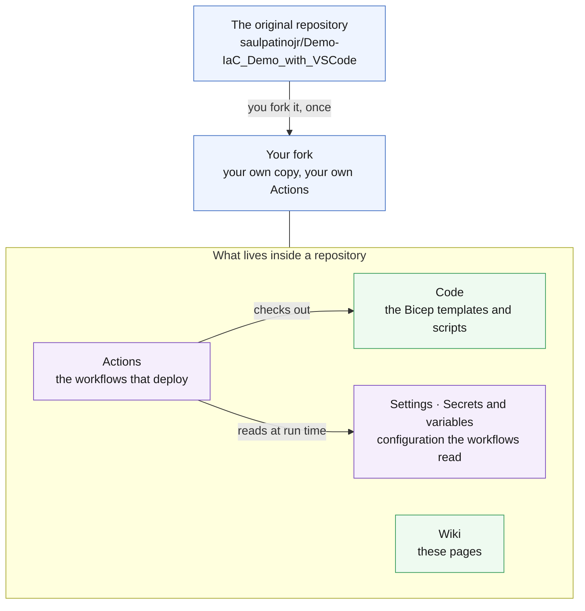

# GitHub Essentials

> **Why read this?** The workshop uses GitHub features as if you already know them. This is the 10-minute crash course — enough to be comfortable, with worked examples you can try on your own fork.

---

## 🧭 The mental model



<details><summary>Text description of this diagram</summary>

A **repository** is a project folder GitHub tracks with git. Forking makes your
own complete copy, with its own Actions runs and its own secrets — which is why
every participant works in a fork rather than sharing one repo.

Four things live inside it and matter here. **Code** is the Bicep templates and
scripts. **Actions** are the workflows that deploy them. **Settings → Secrets
and variables** holds the configuration those workflows read at run time —
secrets are masked in logs, variables are not. The **Wiki** is these pages.

One thing the picture can't show: a fork copies the code, but **GitHub does not
fork wikis**. Your fork has no wiki of its own, which is why these pages always
link back to the original repository.

</details>

---

## 📦 Repository

A **repository** ("repo") is a project folder that GitHub tracks with **git** — every change is a commit and the full history is kept forever.

| Term | What it means |
|------|--------------|
| **Fork** | Your personal copy of someone else's repo, under your account. You need a fork here because Actions run against *your* secrets and *your* Azure subscription. |
| **Clone** | Download the repo to your machine so you can edit it (`gh repo clone <owner>/<repo>` or GitHub Desktop). |
| **Commit / push** | Save a set of changes (commit) and upload them to GitHub (push). |
| **Branch** | A parallel line of work. This workshop deploys from `main`. |

**Try it:** on your fork, edit `README.md`, commit with a message like `docs: my first edit`, and push. Watch it appear under the repo's **Commits**.

---

## ⚙️ Actions (automation)

**GitHub Actions** runs automation defined in YAML files under `.github/workflows/`. Each file is a **workflow**; a workflow has **jobs**; a job has **steps**.

> [!NOTE]
> This repo's workflows are all **manual** — they use `on: workflow_dispatch`, so they only run when you click **Run workflow**. Nothing deploys by surprise.

Key anatomy (from `deploy-l1.yml`):

| Part | What it does |
|------|-------------|
| `on: workflow_dispatch` | Manual trigger — only runs when you click the button |
| `permissions: id-token: write` | Allows the run to request an OIDC token for passwordless Azure login |
| `concurrency:` | Prevents two runs of the same lab from clobbering each other |
| `steps:` | checkout → preflight secret check → Azure login → lint → what-if → deploy |

**Try it:** Actions → **Deploy L1** → **Run workflow** → expand the **What-if** step to see what would be created.

> **Actions on forks are disabled by default.** The first time you visit the Actions tab on your fork, GitHub will ask you to enable them — click the green button.

Learn more: https://docs.github.com/actions

---

## 📝 Wiki

The **Wiki** (what you are reading) is a separate git repository attached to the main repo, used for long-form docs. Pages are Markdown files and `_Sidebar.md` controls the navigation.

- Edit in the browser (**Edit** button on any page) or clone it: `git clone https://github.com/<owner>/<repo>.wiki.git`
- Links between pages: `[L1](https://github.com/saulpatinojr/Demo-IaC_Demo_with_VSCode/wiki/L1-Hub-and-Spoke)` (page name without extension)

---

## 🔐 Secrets vs. Variables

Both live under **Settings → Secrets and variables → Actions** in your fork, and both feed values into workflows. They are **not** interchangeable.

| | Secret | Variable |
|---|---|---|
| **Purpose** | Sensitive values | Non-sensitive config |
| **Visible after saving?** | **Never** — write-only, masked in logs | Yes, fully readable |
| **Used in YAML as** | `${{ secrets.NAME }}` | `${{ vars.NAME }}` |
| **Examples in this workshop** | `AZURE_CLIENT_ID`, `AZURE_RESOURCE_GROUP`, `VM_ADMIN_PASSWORD`, `SQL_ADMIN_PASSWORD` | `AZURE_PREFIX`, `AZURE_LOCATION`, `ALERT_EMAIL` |

> [!TIP]
> **Rule of thumb:** if someone leaking it could cause harm, it is a **secret**. If you would happily print it in a log, it is a **variable**.
>
> The IDs (`AZURE_CLIENT_ID`, `AZURE_TENANT_ID`, `AZURE_SUBSCRIPTION_ID`) are stored as secrets not because they are dangerous alone, but so they are auto-masked in logs. That is a common, sensible convention.

### Worked example — set a variable and a secret

```bash
# Variable (readable, appears in logs)
gh variable set AZURE_PREFIX  --body "alice"
gh variable set AZURE_LOCATION --body "eastus2"
gh variable set ALERT_EMAIL   --body "ops@example.com"

# Secret (write-only, masked in logs)
gh secret set AZURE_RESOURCE_GROUP  --body "rg-lab-alice"
gh secret set VM_ADMIN_PASSWORD     --body "S0me-Throwaway-Pass!"
```

```yaml
# Using them in a workflow:
env:
  AZURE_RESOURCE_GROUP: ${{ secrets.AZURE_RESOURCE_GROUP }}
  AZURE_PREFIX:         ${{ vars.AZURE_PREFIX || 'iacdemo' }}
  VM_ADMIN_PASSWORD:    ${{ secrets.VM_ADMIN_PASSWORD }}
```

### List what you have

```bash
gh secret list    # shows names and timestamps (never values)
gh variable list  # shows names and values
```

The `Setup-Oidc.ps1` script sets all secrets and variables for you automatically — this section explains *what* it did so you can manage them by hand if needed.

---

## ⌨️ Handy `gh` commands in this workshop

```bash
gh repo fork
gh repo clone <owner>/<repo>
gh secret set NAME     --body "value"
gh variable set NAME   --body "value"
gh secret list
gh variable list
gh workflow list
gh workflow run "Deploy L1 - Hub & Spoke"
gh run list
gh run watch
```

---

## 🔗 Going further

- GitHub Skills (interactive, free) — https://skills.github.com/
- Understanding OIDC in Actions — https://docs.github.com/actions/deployment/security-hardening-your-deployments/about-security-hardening-with-openid-connect
- Encrypted secrets — https://docs.github.com/actions/security-guides/using-secrets-in-github-actions
- Environments and protection rules — https://docs.github.com/actions/deployment/targeting-different-environments/using-environments-for-deployment