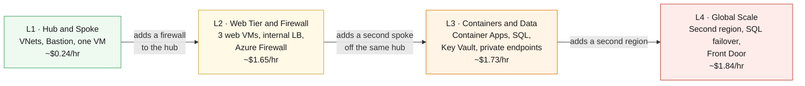

# IaC with GitHub Copilot — Workshop Home

> **First time here?** Follow this path:
> 1. 📖 [Understanding IaC](https://github.com/saulpatinojr/Demo-IaC_Demo_with_VSCode/wiki/Understanding-IaC) — the "why" and how the tools fit together *(10 min)*
> 2. 🛠️ [GitHub Essentials](https://github.com/saulpatinojr/Demo-IaC_Demo_with_VSCode/wiki/GitHub-Essentials) + [Getting Comfortable with the Tools](https://github.com/saulpatinojr/Demo-IaC_Demo_with_VSCode/wiki/Getting-Comfortable-with-the-Tools)
> 3. ✅ [Start-Here Checklist](https://github.com/saulpatinojr/Demo-IaC_Demo_with_VSCode/wiki/Start-Here-Checklist) — install everything, sign in, configure secrets
> 4. 🚀 [L1](https://github.com/saulpatinojr/Demo-IaC_Demo_with_VSCode/wiki/L1-Hub-and-Spoke) → [L2](https://github.com/saulpatinojr/Demo-IaC_Demo_with_VSCode/wiki/L2-Web-Tier-and-Firewall) → [L3](https://github.com/saulpatinojr/Demo-IaC_Demo_with_VSCode/wiki/L3-Containers-and-Data) → [L4](https://github.com/saulpatinojr/Demo-IaC_Demo_with_VSCode/wiki/L4-Global-Scale)

---

## 🧱 What you will build

Four cumulative lab stages, each adding to the infrastructure from the previous one. All labs deploy into **your single assigned resource group** — nothing is created or deleted between stages.



<details><summary>Text description of this diagram</summary>

Four labs, run in order, each building on what the last one deployed.

**L1** creates the network foundation — a hub and a peered spoke VNet, Azure
Bastion, and one Linux VM. **L2** puts an Azure Firewall in the hub's reserved
subnet and adds three web VMs behind an internal load balancer. **L3** adds a
*second* spoke off the same hub, running Container Apps with Azure SQL and Key
Vault reachable only through private endpoints. **L4** copies the app tier into
a second region, joins the databases in a failover group, and puts Azure Front
Door in front of both.

The running cost is cumulative and billed while deployed. The jump at L2 is
Azure Firewall, which is $1.25/hr on its own — more than everything else in all
four labs combined.

</details>

| Stage | Guide | What gets added | Difficulty | Deploy time |
|-------|-------|-----------------|-----------|-------------|
| **L1** | [Hub & Spoke](https://github.com/saulpatinojr/Demo-IaC_Demo_with_VSCode/wiki/L1-Hub-and-Spoke) | VNets, Bastion, test VM | 🟢 Beginner | ~15 min |
| **L2** | [Web Tier & Firewall](https://github.com/saulpatinojr/Demo-IaC_Demo_with_VSCode/wiki/L2-Web-Tier-and-Firewall) | Azure Firewall, 3 web VMs, internal LB | 🟡 Intermediate | ~20 min |
| **L3** | [Containers & Data](https://github.com/saulpatinojr/Demo-IaC_Demo_with_VSCode/wiki/L3-Containers-and-Data) | Container Apps, SQL, Key Vault, monitoring | 🟠 Advanced | ~20 min |
| **L4** | [Global Scale](https://github.com/saulpatinojr/Demo-IaC_Demo_with_VSCode/wiki/L4-Global-Scale) | Second region, SQL failover group, Front Door | 🔴 Expert | ~15 min |

---

## 🚀 Three ways to deploy (used in every lab)

Every lab gives you three deployment paths — pick the one that fits your style today. All three produce the same result.

| | 🔧 Bicep CLI | ⚙️ GitHub Actions | 🤖 GitHub Copilot |
|---|---|---|---|
| **How** | Copy-paste terminal commands | Click a button in the browser | Describe what you want in plain English |
| **Best for** | Seeing every step | Hands-off cloud deploy | Exploring and modifying the template |
| **One-time setup** | `Load-LabSettings.ps1 -Persist` | `Setup-Oidc.ps1` | `Load-LabSettings.ps1 -Persist` |

---

## 🤖 The Copilot workflow

Each lab provides **agent-mode prompts**. In VS Code:

1. Press **`Ctrl+Alt+I`** → switch the dropdown to **Agent**.
2. Paste the lab prompt. Copilot reads the repo, edits Bicep files, and runs `az bicep build` to verify.
3. **Review every diff** — you are the reviewer. Never accept blindly.
4. Commit via GitHub Desktop, push, then run the lab's GitHub Actions workflow.

> [!IMPORTANT]
> Copilot is your pair programmer, not an autopilot. Its suggestions may need adjustment — catching and fixing those is part of the learning.

---

## ✅ Prerequisites (short version)

The full step-by-step is on the **[Start-Here Checklist](https://github.com/saulpatinojr/Demo-IaC_Demo_with_VSCode/wiki/Start-Here-Checklist)**. In short:

- [ ] Tools installed — run `./scripts/Install-LabTools.ps1` *(one command, Windows with admin rights)*
- [ ] Repo **forked**, cloned, opened in VS Code, Copilot signed in
- [ ] `az login` + `gh auth login` done
- [ ] OIDC wired up via `./scripts/Setup-Oidc.ps1 -ResourceGroup "rg-lab-<yourname>" -Prefix "<yourname>"`
- [ ] `lab-settings.csv` filled in *(copy from `lab-settings.csv.example`)*

---

## 🛟 When things break

Check [Troubleshooting](https://github.com/saulpatinojr/Demo-IaC_Demo_with_VSCode/wiki/Troubleshooting). When you are done with all labs, tear down to avoid unnecessary charges:

```powershell
./scripts/Cleanup-Labs.ps1 -ResourceGroup $env:AZURE_RESOURCE_GROUP
```

> [!WARNING]
> Azure Firewall (~$1.25/hr), Bastion, Front Door, and SQL all bill while running. Do not leave them deployed overnight.