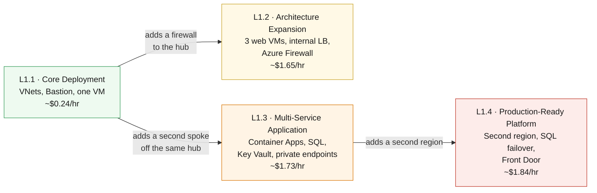

# IaC with GitHub Copilot — Workshop Home

Learn to author **Azure Bicep** with **GitHub Copilot**, and deploy it from **GitHub Actions** with no stored cloud credentials — across four cumulative labs.

> [!IMPORTANT]
> **Windows 11 only.** The setup and helper scripts target Windows 11 — they install the toolchain with `winget` and save settings to the Windows user environment store. macOS and Linux are **not supported today**. Everything after setup (the Bicep, the workflows, Azure) is platform-agnostic; it is the on-ramp that is Windows-bound.

## Start where you are

<table>
<tr>
<td align="center" width="240"><br><br><b>New to all of this</b><br><sub>Start with the "why", then set up</sub><br><br><a href="https://github.com/saulpatinojr/Demo-IaC_Demo_with_VSCode/wiki/Understanding-IaC">Understanding IaC →</a></td>
<td align="center" width="240"><br><br><b>I know Azure, new to GitHub</b><br><sub>Repos, Actions, secrets, OIDC</sub><br><br><a href="https://github.com/saulpatinojr/Demo-IaC_Demo_with_VSCode/wiki/GitHub-Essentials">GitHub Essentials →</a></td>
<td align="center" width="240"><br><br><b>Just let me deploy</b><br><sub>Set up, then straight to Lab 1</sub><br><br><a href="https://github.com/saulpatinojr/Demo-IaC_Demo_with_VSCode/wiki/Start-Here-Checklist">Start Here Checklist →</a></td>
</tr>
</table>

All three paths converge on the same place: the **[Start-Here Checklist](https://github.com/saulpatinojr/Demo-IaC_Demo_with_VSCode/wiki/Start-Here-Checklist)**, then [L1.1](https://github.com/saulpatinojr/Demo-IaC_Demo_with_VSCode/wiki/Curriculum-L1-1-Core-Deployment) → [L1.2](https://github.com/saulpatinojr/Demo-IaC_Demo_with_VSCode/wiki/Curriculum-L1-2-Architecture-Expansion) → [L1.3](https://github.com/saulpatinojr/Demo-IaC_Demo_with_VSCode/wiki/Curriculum-L1-3-Multi-Service-Application) → [L1.4](https://github.com/saulpatinojr/Demo-IaC_Demo_with_VSCode/wiki/Curriculum-L1-4-Production-Platform).

---

## 🧱 What you will build

Four lab stages that all deploy into **your single assigned resource group**. Every lab builds on **L1.1's hub**, but they do not form a single chain — **L1.3 does not need L1.2**, so you can tear the expensive firewall down before moving on.



<details><summary>Text description of this diagram</summary>

Four labs, run in order, all hanging off L1.1's hub.

**L1.1** creates the network foundation — a hub and a peered spoke VNet, Azure
Bastion, and one Linux VM. **L1.2** puts an Azure Firewall in the hub's reserved
subnet and adds three web VMs behind an internal load balancer. **L1.3** adds a
*second* spoke off **L1.1's** hub, running Container Apps with Azure SQL and Key
Vault reachable only through private endpoints. **L1.4** copies the app tier into
a second region, joins the databases in a failover group, and puts Azure Front
Door in front of both.

Note the shape: **L1.2 and L1.3 are siblings, not a chain.** Both attach to L1.1's
hub, and L1.3 never touches L1.2's firewall or route table. L1.1 is a prerequisite
for everything; L1.3 is a prerequisite for L1.4; L1.2 is a prerequisite for nothing.

The running cost is cumulative *only while you leave each lab deployed*. The
jump at L1.2 is Azure Firewall, which is $1.25/hr on its own — more than
everything else in all four labs combined.

</details>

| Stage | Guide | Requires | What gets added | Difficulty | Deploy time |
|-------|-------|----------|-----------------|-----------|-------------|
| **L1.1** | [Core Deployment](https://github.com/saulpatinojr/Demo-IaC_Demo_with_VSCode/wiki/Curriculum-L1-1-Core-Deployment) | — | VNets, Bastion, test VM | 🟢 Beginner | ~15 min |
| **L1.2** | [Architecture Expansion](https://github.com/saulpatinojr/Demo-IaC_Demo_with_VSCode/wiki/Curriculum-L1-2-Architecture-Expansion) | L1.1 | Azure Firewall, 3 web VMs, internal LB | 🟡 Intermediate | ~20 min |
| **L1.3** | [Multi-Service Application](https://github.com/saulpatinojr/Demo-IaC_Demo_with_VSCode/wiki/Curriculum-L1-3-Multi-Service-Application) | **L1.1** (not L1.2) | Container Apps, SQL, Key Vault, monitoring | 🟠 Advanced | ~20 min |
| **L1.4** | [Production-Ready Platform](https://github.com/saulpatinojr/Demo-IaC_Demo_with_VSCode/wiki/Curriculum-L1-4-Production-Platform) | L1.3 | Second region, SQL failover group, Front Door | 🔴 Expert | ~15 min |

> [!TIP]
> **Want to spend less?** Because L1.3 only needs L1.1, you can tear L1.2 down before starting L1.3 and keep going. L1.2's firewall and web tier are about **$1.41/hr** of the running totals above — so an L1.4 stack with L1.2 already removed costs roughly **$0.43/hr** instead of $1.84/hr. See [Cost & cleanup](https://github.com/saulpatinojr/Demo-IaC_Demo_with_VSCode/blob/main/README.md) in the README.

> [!NOTE]
> **There is more after L4.** These four labs are **Level 1** of a six-level path
> that follows an environment's operational lifecycle — deploy, monitor, secure,
> protect, detect, recover. Eighteen chapters, each with its own template and
> walkthrough, all operating on the environment you build above. Nothing on this
> page changes; Levels 2-6 pick up where L1.4 stops.
> [Curriculum Redesign →](https://github.com/saulpatinojr/Demo-IaC_Demo_with_VSCode/wiki/Curriculum-Redesign)

---

## 🚀 Three ways to deploy (used in every lab)

Every lab gives you three deployment paths — pick the one that fits your style today. All three produce the same result.

| | 🔧 Bicep CLI | ⚙️ GitHub Actions | 🤖 GitHub Copilot |
|---|---|---|---|
| **How** | Copy-paste terminal commands | Click a button in the browser | Describe what you want in plain English |
| **Best for** | Seeing every step | Hands-off cloud deploy | Exploring and modifying the template |
| **One-time setup** | `Load-LabSettings.ps1 -Persist` | `Setup-Oidc.ps1` † | `Load-LabSettings.ps1 -Persist` |
| **Deploys run on** | Your machine | GitHub's runners | Your machine |

† The Actions **deploys** are browser-only, but that one-time `Setup-Oidc.ps1` is not: it runs on your machine and needs PowerShell 7, `az` and `gh` signed in, and a clone of your fork. It has to authenticate to Azure as *you* in order to create the identity Actions will use afterwards. If your instructor pre-ran it, you can skip it entirely and never install a thing.

---

## 🤖 The Copilot workflow

Each lab provides **agent-mode prompts**. In VS Code:

1. Press **`Ctrl+Alt+I`** → switch the dropdown to **Agent**.
2. Paste the lab prompt. Copilot reads the repo, edits Bicep files, and runs `az bicep build` to verify.
3. **Review every diff** — you are the reviewer. Never accept blindly.
4. Commit via GitHub Desktop, push, then run the lab's GitHub Actions workflow.

> [!IMPORTANT]
> Copilot is your pair programmer, not an autopilot. Its suggestions may need adjustment — catching and fixing those is part of the learning.

---

## ✅ Prerequisites (short version)

The full step-by-step is on the **[Start-Here Checklist](https://github.com/saulpatinojr/Demo-IaC_Demo_with_VSCode/wiki/Start-Here-Checklist)**. In short:

- [ ] Tools installed — run `./scripts/Install-LabTools.ps1` *(one command, Windows with admin rights)*
- [ ] Repo **forked**, cloned, opened in VS Code, Copilot signed in
- [ ] `az login` + `gh auth login` done
- [ ] OIDC wired up via `./scripts/Setup-Oidc.ps1 -ResourceGroup "rg-techdemo-<yourname>" -Prefix "<yourname>"`
- [ ] `lab-settings.csv` filled in *(copy from `lab-settings.csv.example`)*

---

## 🛟 When things break

Check [Troubleshooting](https://github.com/saulpatinojr/Demo-IaC_Demo_with_VSCode/wiki/Troubleshooting). When you are done with all labs, tear down to avoid unnecessary charges:

```powershell
./scripts/Cleanup-Labs.ps1 -ResourceGroup $env:AZURE_RESOURCE_GROUP
```

> [!WARNING]
> Azure Firewall (~$1.25/hr), Bastion, Front Door, and SQL all bill while running. Do not leave them deployed overnight.

<br>

---

>  **GitHub feature spotlight · A wiki is a git repository**
>
> **You just used it:** every page you are reading is a markdown file. This one is `Home.md`.
> **Find it:** the **Clone this wiki locally** link at the bottom right of any wiki page. In this workshop the pages are edited in the main repo under `docs/wiki/` and published from there, so they get reviewed like code.
> **Beyond the lab:** wiki content that lives in git gets diffs, history and pull requests. Documentation stops being the thing nobody can review.
> [Docs →](https://docs.github.com/communities/documenting-your-project-with-wikis/adding-or-editing-wiki-pages)
