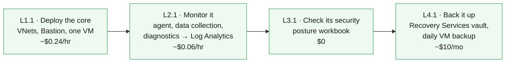

# IaC with GitHub Copilot — Workshop Home

Learn to author **Azure Bicep** with **GitHub Copilot**, and deploy it from **GitHub Actions** with no stored cloud credentials — one discipline per level: deploy, monitor, secure, protect.

> [!IMPORTANT]
> **Classroom students: everything is pre-staged.** Your GitHub account already
> holds a fork of this repo, your Azure resource group already exists (it has
> your username's name), and the deploy identity is already wired up. You can
> run the entire main path from the browser without installing anything.
> Running it on your own subscription instead? The self-hosted on-ramp is
> **Windows 11 only** (the helper scripts use `winget`); everything after
> setup is platform-agnostic.

## Start where you are

<table>
<tr>
<td align="center" width="240">  <b>New to all of this</b> Start with the "why", then deploy  <a href="https://github.com/saulpatinojr/Demo-IaC_Demo_with_VSCode/wiki/Understanding-IaC">Understanding IaC →</a></td>
<td align="center" width="240">  <b>I know Azure, new to GitHub</b> Repos, Actions, secrets, OIDC  <a href="https://github.com/saulpatinojr/Demo-IaC_Demo_with_VSCode/wiki/GitHub-Essentials">GitHub Essentials →</a></td>
<td align="center" width="240">  <b>Just let me deploy</b> Two checks, then straight to L1.1  <a href="https://github.com/saulpatinojr/Demo-IaC_Demo_with_VSCode/wiki/Start-Here-Checklist">Start Here Checklist →</a></td>
</tr>
</table>

All three paths converge on the **main path** — one foundation chapter per level, west to east:

**[L1.1 Deploy](https://github.com/saulpatinojr/Demo-IaC_Demo_with_VSCode/wiki/Curriculum-L1-1-Core-Deployment) → [L2.1 Monitor](https://github.com/saulpatinojr/Demo-IaC_Demo_with_VSCode/wiki/Curriculum-L2-1-Monitoring-Fundamentals) → [L3.1 Secure](https://github.com/saulpatinojr/Demo-IaC_Demo_with_VSCode/wiki/Curriculum-L3-1-Security-Foundation) → [L4.1 Protect](https://github.com/saulpatinojr/Demo-IaC_Demo_with_VSCode/wiki/Curriculum-L4-1-Backup-Fundamentals)**

Every level also goes **deeper** — optional chapters that raise the complexity, cost and prerequisites. The **[🗺️ Curriculum Map](https://github.com/saulpatinojr/Demo-IaC_Demo_with_VSCode/wiki/Curriculum-Map)** shows all 22 chapters, what each needs, and what each costs.

---

## 🧱 The main path

Four stops, all deploying into **your single assigned resource group**, each teaching a new discipline on the environment the previous stop left behind:

Text description of this diagram

Four chapters run left to right: L1.1 deploys the network core (hub and spoke
VNets, Azure Bastion, one Linux VM). L2.1 monitors it (Azure Monitor Agent, a
data collection rule, and diagnostic settings flowing into Log Analytics).
L3.1 checks its security (an Azure Resource Graph posture workbook, at no
cost). L4.1 protects it (a Recovery Services vault taking daily backups of
the VM). Each chapter builds directly on the previous one and none requires
anything else.

| Stop | Guide | Requires | What gets added | Deploy time |
|------|-------|----------|-----------------|-------------|
| **L1.1** | [Core Deployment](https://github.com/saulpatinojr/Demo-IaC_Demo_with_VSCode/wiki/Curriculum-L1-1-Core-Deployment) | — | VNets, Bastion, test VM | ~15 min |
| **L2.1** | [Monitoring Fundamentals](https://github.com/saulpatinojr/Demo-IaC_Demo_with_VSCode/wiki/Curriculum-L2-1-Monitoring-Fundamentals) | L1.1 | Monitor agent, data collection rule, Log Analytics | ~5 min |
| **L3.1** | [Security Foundation](https://github.com/saulpatinojr/Demo-IaC_Demo_with_VSCode/wiki/Curriculum-L3-1-Security-Foundation) | — | Security posture workbook | ~2 min |
| **L4.1** | [Backup Fundamentals](https://github.com/saulpatinojr/Demo-IaC_Demo_with_VSCode/wiki/Curriculum-L4-1-Backup-Fundamentals) | L1.1 | Recovery Services vault, daily VM backup | ~5 min |

> [!TIP]
> **Want more?** Each level goes deeper — L1.2 adds an Azure Firewall and web
> tier, L1.3 a full multi-service app, L2.2–L2.4 turn monitoring data into
> answers, and Levels 5 (Sentinel) and 6 (Recovery) are extra-credit tracks.
> Depth costs more and depends on more: the
> [Curriculum Map](https://github.com/saulpatinojr/Demo-IaC_Demo_with_VSCode/wiki/Curriculum-Map)
> shows every chapter's price and prerequisites before you commit. The
> expensive detour to know about: **L1.2's firewall is $1.25/hr on its own,
> and nothing requires it.**

---

## 🚀 Three ways to work (every chapter offers all three)

| | ⚙️ GitHub Actions | 🤖 GitHub Copilot | 🔧 Bicep CLI |
|---|---|---|---|
| **How** | Click **Run workflow** in your fork's Actions tab | Describe changes in plain English, review, push, then deploy via Actions | Copy-paste terminal commands |
| **Best for** | The classroom main path — zero setup | Exploring and modifying the templates | Seeing every step |
| **Deploys run on** | GitHub's runners, as the pre-staged workshop identity | GitHub's runners (Copilot edits, Actions deploys) | Your machine, as you |
| **Classroom?** | ✅ Yes — this is your path | ✅ Authoring yes; deploying goes through Actions | ⚠️ No — deploying locally needs Azure write access your classroom account doesn't have |

**Classroom accounts hold Reader in Azure.** You can *look at* everything in
the portal, but only the workshop's shared deploy identity — which your fork's
workflows use automatically — can create resources. That is why the Actions
button is the way, and why local `az deployment` commands from the chapter
pages are for self-hosted use. (Local `az bicep build` — compiling — works for
everyone; compiling needs no Azure at all.)

---

## 🤖 The Copilot workflow

Each chapter provides **agent-mode prompts**. In VS Code:

1. Press **`Ctrl+Alt+I`** → switch the dropdown to **Agent**.
2. Paste the chapter prompt. Copilot reads the repo, edits Bicep files, and runs `az bicep build` to verify.
3. **Review every diff** — you are the reviewer. Never accept blindly.
4. Commit, push to your fork, then run the chapter's GitHub Actions workflow.

> [!IMPORTANT]
> Copilot is your pair programmer, not an autopilot. Its suggestions may need adjustment — catching and fixing those is part of the learning.

---

## ✅ Before your first deploy

**Classroom** — three checks, no installs:

- [ ] Signed in to GitHub as your workshop account (`User<nn>-TechCon`)
- [ ] You can see your fork: `github.com/<your-account>/Demo-IaC_Demo_with_VSCode`
- [ ] On the fork's **Actions** tab, workflows are enabled (one green button click the first time)

Then open [L1.1](https://github.com/saulpatinojr/Demo-IaC_Demo_with_VSCode/wiki/Curriculum-L1-1-Core-Deployment) and run your first deployment. The workflow already knows your resource group (it is named after your account) and everything else it needs.

<b>Self-hosted</b> — running this on your own subscription

- [ ] Tools installed — run `./scripts/Install-LabTools.ps1` *(one command, Windows with admin rights)*
- [ ] Repo **forked**, cloned, opened in VS Code, Copilot signed in
- [ ] `az login` + `gh auth login` done
- [ ] A resource group created, and OIDC wired up via `./scripts/Setup-Oidc.ps1 -ResourceGroup "<your-rg>" -Prefix "<yourname>"`

The full walkthrough is in the [Deployment Guide](https://github.com/saulpatinojr/Demo-IaC_Demo_with_VSCode/wiki/Deployment-Guide).

---

## 🛟 When things break

Check [Troubleshooting](https://github.com/saulpatinojr/Demo-IaC_Demo_with_VSCode/wiki/Troubleshooting). Done for the day? Run the **"Teardown labs"** workflow in your fork's Actions tab — it deletes everything inside your resource group (dry-run first, by default). Self-hosted users can also run `./scripts/Cleanup-Labs.ps1 -ResourceGroup <your-rg>` locally.

> [!WARNING]
> Azure Firewall (~$1.25/hr), Bastion, Front Door, and SQL all bill while running. Do not leave them deployed overnight.

 

---

>  **GitHub feature spotlight · A wiki is a git repository**
>
> **You just used it:** every page you are reading is a markdown file. This one is `Home.md`.
> **Find it:** the **Clone this wiki locally** link at the bottom right of any wiki page. In this workshop the pages are edited in the main repo under `docs/wiki/` and published from there, so they get reviewed like code.
> **Beyond the lab:** wiki content that lives in git gets diffs, history and pull requests. Documentation stops being the thing nobody can review.
> [Docs →](https://docs.github.com/communities/documenting-your-project-with-wikis/adding-or-editing-wiki-pages)
