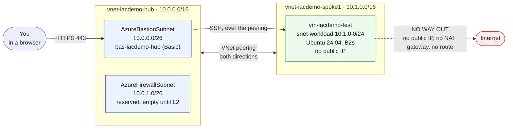

# L1 — Hub & Spoke Connectivity 🟢

**Goal:** deploy the network foundation every later lab builds on — a hub VNet, a peered spoke VNet, Azure Bastion for secure access, and one Linux test VM.

| Who this is for | Time | You need first | Cost while it runs |
|---|---|---|---|
| Lab 1 of 4 · everyone | ~15 min, 10 of it Bastion | Tools installed, and a resource group that already exists | 🟢 ~$0.24/hr running total |

> [!IMPORTANT]
> **Your resource group must already exist.** Every lab deploys *into* one; none of them create it. In a classroom your instructor has already made yours. Working on your own subscription, create it once:
> ```powershell
> az group create --name "rg-techdemo-<yourname>" --location eastus2
> ```

## What you're building



<details><summary>Text description of this diagram</summary>

Two virtual networks, peered in both directions. The **hub**
(`vnet-iacdemo-hub`, `10.0.0.0/16`) holds two subnets: `AzureBastionSubnet`
(`10.0.0.0/26`) running the Basic Bastion host, and `AzureFirewallSubnet`
(`10.0.1.0/26`), which L1 creates but leaves empty — L2 puts the firewall
there. The **spoke** (`vnet-iacdemo-spoke1`, `10.1.0.0/16`) holds
`snet-workload` (`10.1.0.0/24`) with one Ubuntu VM that has no public IP.

You reach the VM by browsing to Bastion over HTTPS; Bastion reaches the VM by
SSH across the peering. Nothing else can reach it.

The dashed red line is the point of this lab: the VM has **no route to the
internet at all**. No public IP, no NAT gateway, and no route table sending
traffic anywhere. `iacdemo` is the default `AZURE_PREFIX`; your resources use
whatever prefix you set.

</details>

**Source:** [`labs/L1-hub-spoke/main.bicep`](https://github.com/saulpatinojr/Demo-IaC_Demo_with_VSCode/blob/main/labs/L1-hub-spoke/main.bicep) · [`labs/L1-hub-spoke/main.bicepparam`](https://github.com/saulpatinojr/Demo-IaC_Demo_with_VSCode/blob/main/labs/L1-hub-spoke/main.bicepparam)

> [!NOTE]
> **Why Bastion and not a VPN Gateway?** A gateway is the real-world hybrid entry point, but takes 30–45 minutes to deploy. Bastion gives you the same "no public IP on the VM" story in about ten. The commented-out gateway module at the bottom of `main.bicep` shows what the real thing looks like.

<br>

## 🚀 Deploy it — pick any one of three ways

All three deploy the **same** template and give the **same** result. Choose the one you're most comfortable with.

<table>
<tr>
<td align="center" width="240"><br><br><b>1 · Bicep CLI</b><br><sub>Copy-paste in the terminal</sub></td>
<td align="center" width="240"><br><br><b>2 · GitHub Actions</b><br><sub>One button in the browser</sub></td>
<td align="center" width="240"><br><br><b>3 · GitHub Copilot</b><br><sub>Ask AI in plain English</sub></td>
</tr>
</table>

<br>

---

## &nbsp; Option 1 · Bicep from the terminal

**Best if you like the command line** and want to watch each step happen.

### Do this once

Fill in one small file instead of typing variables into every command. Copy `lab-settings.csv.example` to **`lab-settings.csv`** in the repo root and fill in the row — it opens in Excel or VS Code:

| Column | What goes in it |
|---|---|
| `AZURE_PREFIX` | Your short name. Lowercase, max 12 characters — it prefixes every resource name. |
| `AZURE_LOCATION` | `eastus2` unless told otherwise. |
| `AZURE_RESOURCE_GROUP` | The group from the callout above. |
| `VM_ADMIN_PASSWORD` | You choose it. **This is the password you SSH with below.** |
| `SQL_ADMIN_PASSWORD` | You choose it. Not used until L3, but set it now. |
| `ALERT_EMAIL` | Where L3 sends its alert. |

Then load it — `-Persist` keeps the values in future terminals too:

```powershell
./scripts/Load-LabSettings.ps1 -Persist
```

`lab-settings.csv` is in `.gitignore`, so your passwords are never committed.

### Then deploy

Preview first, then create. Run both from the repo root:

```powershell
az deployment group what-if --resource-group $env:AZURE_RESOURCE_GROUP --parameters labs/L1-hub-spoke/main.bicepparam
az deployment group create  --resource-group $env:AZURE_RESOURCE_GROUP --parameters labs/L1-hub-spoke/main.bicepparam
```

**You should see:** `what-if` lists the resources it would create and changes nothing. `create` takes about ten minutes — Bastion is the slow part — and ends with `"provisioningState": "Succeeded"`.

<br>

---

## &nbsp; Option 2 · GitHub Actions (push-button)

**Best if you'd rather click a button** and let the cloud do the work. No `lab-settings.csv` needed — Actions reads the GitHub secrets instead.

### Do this once — and this part *is* local

> [!NOTE]
> **The one-time setup runs on your machine, not in the cloud.** `Setup-Oidc.ps1` needs PowerShell 7, `az` and `gh` installed, both signed in, and a clone of your fork to run from — everything in [Start-Here Checklist](https://github.com/saulpatinojr/Demo-IaC_Demo_with_VSCode/wiki/Start-Here-Checklist) sections C, D and F. There is no browser-only path to it, because it has to talk to Azure as *you* to create the identity that GitHub will later use.
>
> **After it succeeds, every deploy really is browser-only** — that is the part Actions buys you. If your instructor pre-ran setup ([Instructor Setup](https://github.com/saulpatinojr/Demo-IaC_Demo_with_VSCode/wiki/Instructor-Setup) step 0C), you can skip straight to *Then deploy* and never install anything.

Store your credentials in GitHub. This registers the OIDC trust and pushes the secrets and variables the workflows read:

```powershell
./scripts/Setup-Oidc.ps1 -ResourceGroup "rg-techdemo-<yourname>" -Prefix "<yourname>"
```

### Then deploy

On GitHub: **Actions → "Deploy L1 - Hub & Spoke" → Run workflow**. Prefer the terminal? `gh workflow run deploy-l1.yml`.

**You should see:** three steps run in order — **Lint → What-if → Deploy** — and a green tick. It signs in with OIDC, so no password is stored anywhere.

<br>

---

## &nbsp; Option 3 · GitHub Copilot (plain English)

**Best if you'd rather describe what you want** and have AI change the template and deploy it for you.

Copilot runs the deploy **locally**, so load your values once first — same file as Option 1: `./scripts/Load-LabSettings.ps1`.

Open **Copilot Chat → Agent mode** and paste:

> Deploy `labs/L1-hub-spoke/main.bicep` to my lab resource group (`$env:AZURE_RESOURCE_GROUP`) with `az deployment group create`.

**Want to change something first?** Just ask — for example:

> Add a `snet-data` subnet `10.1.2.0/24` to the spoke VNet, run `az bicep build` to check it, then deploy.

Copilot edits the Bicep, verifies it compiles, and runs the deploy. If a command errors, paste the message back and it fixes it.

<br>

---

## ✅ Verify it

1. **Reach the VM through Bastion** — in the Portal, open `vm-<your prefix>-test` → **Connect → Bastion**, and sign in as `azureuser` with the `VM_ADMIN_PASSWORD` you set.

   **You should see:** a shell prompt in your browser. The VM has no public IP, so this is the only way in.

2. **Confirm there is no way out yet** — in that SSH session:

   ```bash
   curl -s -m 5 ifconfig.me || echo "NO EGRESS - as designed"
   ```

   **You should see:** the command hang for five seconds and print `NO EGRESS - as designed`. **That is the correct result.** The VM has no public IP, no NAT gateway and no route to a firewall, and [default outbound access was retired on 30 September 2025](https://azure.microsoft.com/en-us/updates?id=default-outbound-access-for-vms-in-azure-will-be-retired-transition-to-a-new-method-of-internet-access) — so a VM in a new VNet gets no internet unless you give it one explicitly. L2 is what gives it one. You will run this exact command again at the end of L2.

3. **Confirm the peering is live** — from your machine:

   ```powershell
   az network vnet peering list --resource-group $env:AZURE_RESOURCE_GROUP --vnet-name "vnet-$env:AZURE_PREFIX-spoke1" -o table
   ```

   **You should see:** one peering with `PeeringState` of `Connected`. Anything else means traffic between the VNets will not flow.

>  **GitHub feature spotlight · Manual workflows and the run log**
>
> **You just used it:** every deploy workflow here is `workflow_dispatch` only — it runs when a person clicks **Run workflow**, never automatically on a push. Nobody deploys to Azure by accident.
> **Find it:** the **Actions** tab → *Deploy L1 - Hub & Spoke* → your run. Expand any step to see the exact `az` command and everything it printed.
> **Beyond the lab:** that run is a permanent, timestamped, linkable record of who deployed what and when — an audit trail you get for free, instead of screenshots and "who ran the deploy?" in chat.
> [Docs →](https://docs.github.com/actions/using-workflows/manually-running-a-workflow)

<br>

---

## ➡️ What carries forward

L2 deploys an Azure Firewall into the hub's reserved `AzureFirewallSubnet`, adds a `snet-web` subnet to this spoke, and routes **this** subnet's traffic through the firewall too — which is what finally gives the test VM its internet access.

**Leave L1 deployed** → **[continue to L2](https://github.com/saulpatinojr/Demo-IaC_Demo_with_VSCode/wiki/L2-Web-Tier-and-Firewall)**.
