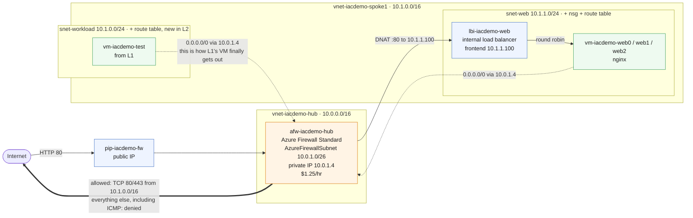

# L2 — Web Tier & Azure Firewall 🟡

**Goal:** add a real web tier to L1's network — three nginx VMs behind an **internal** load balancer — and put **Azure Firewall** in charge of all traffic in and out. That includes L1's test VM: L2 routes its subnet through the firewall too, which is what finally gives it internet access.

| Who this is for | Time | You need first | Cost while it runs |
|---|---|---|---|
| Lab 2 of 4 · everyone | ~20 min, 10 of it the firewall | L1 deployed, same prefix | 🟡 ~$1.65/hr running total |

> [!IMPORTANT]
> **L1 must already be deployed with the same prefix.** L2 writes a new subnet into L1's spoke VNet, and puts the firewall in the `AzureFirewallSubnet` that L1 reserved.

> [!WARNING]
> **This is the expensive lab.** Azure Firewall Standard is **$1.25/hr on its own** — more than everything else in all four labs combined — taking the running total from ~$0.24/hr to **~$1.65/hr**. It bills while deployed even when idle, so don't leave L2 up overnight.

## What you're building



<details><summary>Text description of this diagram</summary>

Inbound traffic arrives at the firewall's public IP on port 80. A **DNAT rule**
translates it to `10.1.1.100`, the private frontend of an **internal** load
balancer, which round-robins across three nginx VMs in `snet-web`
(`10.1.1.0/24`).

The load balancer is internal on purpose. A public one, combined with a route
table forcing egress through the firewall, would send return traffic out a
different path than it came in — asymmetric routing, and connections die
silently. Inbound via DNAT and outbound via the route table keeps both
directions on the firewall.

Outbound, both dashed lines are route tables sending `0.0.0.0/0` to the
firewall's private address `10.0.1.4`. The web subnet has one, and **L2 also
attaches the same route table to L1's `snet-workload`** — which is what finally
gives the L1 test VM internet access. The firewall allows TCP 80 and 443 from
`10.1.0.0/16` and denies everything else, so ICMP fails while HTTPS works.

Azure Firewall Standard costs **$1.25/hr on its own**, which is why the running
total jumps from about $0.24/hr to about $1.65/hr at this lab.

</details>

**Source:** [`labs/L2-web-tier/main.bicep`](https://github.com/saulpatinojr/Demo-IaC_Demo_with_VSCode/blob/main/labs/L2-web-tier/main.bicep) · [`labs/modules/subnet.bicep`](https://github.com/saulpatinojr/Demo-IaC_Demo_with_VSCode/blob/main/labs/modules/subnet.bicep)

> [!NOTE]
> **Why an internal load balancer?** A *public* LB in front of the VMs, while a route table forces egress through the firewall, causes asymmetric routing — return traffic leaves by a different path than it arrived, and connections die silently with no error to read. The correct hub-and-spoke pattern is the one used here: inbound through a firewall **DNAT rule** to an internal LB, outbound through the firewall via the route table. Both directions stay on the firewall.

<br>

## 🚀 Deploy it — pick any one of three ways

All three deploy the **same** template and give the **same** result.

<table>
<tr>
<td align="center" width="240"><br><br><b>1 · Bicep CLI</b><br><sub>Copy-paste in the terminal</sub></td>
<td align="center" width="240"><br><br><b>2 · GitHub Actions</b><br><sub>One button in the browser</sub></td>
<td align="center" width="240"><br><br><b>3 · GitHub Copilot</b><br><sub>Ask AI in plain English</sub></td>
</tr>
</table>

<br>

---

## &nbsp; Option 1 · Bicep from the terminal

**Best if you like the command line.** Your values are already loaded from `lab-settings.csv` (set up in L1) — nothing to re-type.

```powershell
az deployment group what-if --resource-group $env:AZURE_RESOURCE_GROUP --parameters labs/L2-web-tier/main.bicepparam
az deployment group create  --resource-group $env:AZURE_RESOURCE_GROUP --parameters labs/L2-web-tier/main.bicepparam
```

**You should see:** about ten minutes of work — the firewall is the slow part — ending with `"provisioningState": "Succeeded"` and a `testUrl` output holding the firewall's public IP.

> [!TIP]
> New terminal? Re-run `./scripts/Load-LabSettings.ps1`, or use `-Persist` once so it happens automatically.

<br>

---

## &nbsp; Option 2 · GitHub Actions (push-button)

**Best if you'd rather click a button.** Needs the one-time `Setup-Oidc.ps1` from L1 — and no `lab-settings.csv`, because Actions reads the GitHub secrets instead.

On GitHub: **Actions → "Deploy L2 - Web Tier & Firewall" → Run workflow** (or `gh workflow run deploy-l2.yml`).

**You should see:** **Lint → What-if → Deploy** run in order, then a final step printing your test URL.

<br>

---

## &nbsp; Option 3 · GitHub Copilot (plain English)

**Best if you'd rather describe the change** and have AI edit and deploy it.

Copilot runs the deploy **locally**, so load your values once first (same file as Option 1): `./scripts/Load-LabSettings.ps1`.

Open **Copilot Chat → Agent mode**:

> Deploy `labs/L2-web-tier/main.bicep` to my lab resource group (`$env:AZURE_RESOURCE_GROUP`) with `az deployment group create`.

**Want to harden it first?** Ask:

> Limit the firewall's outbound rule to port 443 only (remove 80), run `az bicep build`, then deploy.

Copilot edits, verifies, and deploys — and fixes any error you paste back.

<br>

---

## ✅ Verify it

1. **Traffic reaches all three VMs through the firewall** — grab the firewall's public IP and hit it six times:

   ```powershell
   $FW_IP = az network public-ip show -g $env:AZURE_RESOURCE_GROUP -n "pip-$env:AZURE_PREFIX-fw" --query ipAddress -o tsv
   1..6 | ForEach-Object { curl.exe -s "http://$FW_IP/" }
   ```

   **You should see:** six `Hello from ...` lines naming `vm-<prefix>-web0`, `web1` and `web2` in rotation. That single public IP is the firewall DNAT-ing to the internal load balancer, which is spreading requests across the three VMs.

2. **Outbound is filtered, not open** — run both from a web VM:

   ```powershell
   az vm run-command invoke -g $env:AZURE_RESOURCE_GROUP -n "vm-$env:AZURE_PREFIX-web0" `
     --command-id RunShellScript `
     --scripts "curl -s -m 5 https://ifconfig.me || echo HTTPS-BLOCKED; ping -c 2 -W 2 8.8.8.8 || echo ICMP-BLOCKED"
   ```

   **You should see:** an IP address from the `curl` — the **firewall's** public IP, not the VM's, because the firewall SNATs outbound traffic — followed by `ICMP-BLOCKED`. HTTPS matches the allow rule; ping matches nothing, and the default is deny.

3. **L1's VM can now reach the internet** — the same command that timed out at the end of L1:

   ```powershell
   az vm run-command invoke -g $env:AZURE_RESOURCE_GROUP -n "vm-$env:AZURE_PREFIX-test" `
     --command-id RunShellScript `
     --scripts "curl -s -m 5 https://ifconfig.me"
   ```

   **You should see:** an IP address instead of a timeout — and the *same* IP as test 2, matching `$FW_IP` from test 1. L2 attached the web tier's route table to L1's `snet-workload`, so that VM's traffic now leaves through the firewall. This is the L1 → L2 payoff.

4. **The NSG permits firewall-to-web traffic** — ask Azure to trace the flow rather than guessing:

   ```powershell
   $WEB_IP = az vm list-ip-addresses -g $env:AZURE_RESOURCE_GROUP -n "vm-$env:AZURE_PREFIX-web0" `
     --query "[0].virtualMachine.network.privateIpAddresses[0]" -o tsv
   az network watcher test-ip-flow -g $env:AZURE_RESOURCE_GROUP --vm "vm-$env:AZURE_PREFIX-web0" `
     --direction Inbound --protocol TCP --local "${WEB_IP}:80" --remote 10.0.1.4:40000
   ```

   **You should see:** `"access": "Allow"` and the rule that permitted it. `10.0.1.4` is the firewall's address inside `AzureFirewallSubnet` — the source the web VMs actually see, because Azure Firewall SNATs DNAT'd traffic. That is why the NSG rule allows `10.0.0.0/8` rather than the whole internet.

>  **GitHub feature spotlight · Concurrency groups**
>
> **You just used it:** the L2 workflow declares `concurrency: { group: deploy-l2 }`, so two people can't deploy into the same resource group at once — the second run queues instead of colliding mid-deployment.
> **Find it:** [`.github/workflows/deploy-l2.yml`](https://github.com/saulpatinojr/Demo-IaC_Demo_with_VSCode/blob/main/.github/workflows/deploy-l2.yml), and a queued run shows as *Pending* in the **Actions** tab.
> **Beyond the lab:** this is the cheapest deployment lock you will ever configure — no state file, no advisory lock, about three lines of YAML.
> [Docs →](https://docs.github.com/actions/using-jobs/using-concurrency)

<br>

---

## ➡️ What carries forward

L3 does **not** build on this lab. It creates its own spoke, peers it straight to L1's hub, and never routes through the firewall — so L2 is not a prerequisite for anything that follows. What carries forward is the **hub**, and the pattern you have just seen: put something in front of your workloads and make all traffic go through it.

**[Continue to L3](https://github.com/saulpatinojr/Demo-IaC_Demo_with_VSCode/wiki/L3-Containers-and-Data)** — or, if cost is a concern, tear L2 down first. L3 will be fine without it.

> [!CAUTION]
> **Don't delete only the firewall.** Both spoke subnets now route `0.0.0.0/0` at its private IP, so removing it on its own black-holes all their outbound traffic — the web tier and L1's test VM go dark while still billing. Tear down **all of L2**, route table included, or run the full teardown. See [Cost & cleanup](https://github.com/saulpatinojr/Demo-IaC_Demo_with_VSCode/blob/main/README.md) in the README.
