# L2 — Web Tier & Azure Firewall 🟡

**Goal:** add a real web tier to L1's network — 3 nginx VMs behind an **internal** load balancer — and put **Azure Firewall** in charge of all traffic in and out. That includes L1's test VM: L2 routes its subnet through the firewall too, which is what finally gives it internet access.



Files: [`labs/L2-web-tier/main.bicep`](../blob/main/labs/L2-web-tier/main.bicep) · [`labs/modules/subnet.bicep`](../blob/main/labs/modules/subnet.bicep)

> **Design note — why an internal LB?** A *public* LB in front of the VMs while a route table forces egress through the firewall causes asymmetric routing — return traffic takes a different path than inbound and connections silently die. The correct hub/spoke pattern used here: inbound through a firewall **DNAT rule** to an internal LB, egress through the firewall via the route table.

> ⚠️ **L1 must already be deployed with the same prefix** — L2 builds on that network.

> 💰 **This is the expensive lab.** Azure Firewall Standard is **$1.25/hr on its own**, taking the running total from ~$0.24/hr after L1 to **~$1.65/hr**. It bills while deployed even when idle, so don't leave L2 up overnight.

<br>

## 🚀 Deploy L2 — pick any one of three ways

All three deploy the **same** template and give the **same** result.

<table>
<tr>
<td align="center" width="240"><br><br><b>1 · Bicep CLI</b><br><sub>Copy-paste in the terminal</sub></td>
<td align="center" width="240"><br><br><b>2 · GitHub Actions</b><br><sub>One button in the browser</sub></td>
<td align="center" width="240"><br><br><b>3 · GitHub Copilot</b><br><sub>Ask AI in plain English</sub></td>
</tr>
</table>

<br>

---

## &nbsp; Option 1 · Bicep from the terminal

> [!NOTE]
> **Best if you like the command line.** Your values are already loaded from `lab-settings.csv` (set up in L1) — nothing to re-type.

```powershell
az deployment group what-if --resource-group $env:AZURE_RESOURCE_GROUP --parameters labs/L2-web-tier/main.bicepparam
az deployment group create  --resource-group $env:AZURE_RESOURCE_GROUP --parameters labs/L2-web-tier/main.bicepparam
```

The Azure Firewall is the slow part (~10 min); the output includes your test URL (the firewall's public IP). *(New terminal? Re-run `./scripts/Load-LabSettings.ps1`, or use `-Persist` once so it's automatic.)*

<br>

---

## &nbsp; Option 2 · GitHub Actions (push-button)

> [!TIP]
> **Best if you'd rather click a button.** Needs the one-time `Setup-Oidc.ps1` from L1.
> No `lab-settings.csv` needed — Actions uses the GitHub secrets from that setup.

On GitHub: **Actions → "Deploy L2 - Web Tier & Firewall" → Run workflow** (or `gh workflow run deploy-l2.yml`). Signs in with OIDC, runs Lint → What-if → Deploy.

<br>

---

## &nbsp; Option 3 · GitHub Copilot (plain English)

> [!IMPORTANT]
> **Best if you'd rather describe the change** and have AI edit + deploy it.

Copilot runs the deploy **locally**, so load your values once first (same file as Option 1): `./scripts/Load-LabSettings.ps1`.

Open **Copilot Chat → Agent mode**:

> Deploy `labs/L2-web-tier/main.bicep` to my lab resource group (`$env:AZURE_RESOURCE_GROUP`) with `az deployment group create`.

**Want to harden it first?** Ask:

> Limit the firewall's outbound rule to port 443 only (remove 80), run `az bicep build`, then deploy.

Copilot edits, verifies, and deploys — and fixes any error you paste back.

<br>

---

## ✅ Test it (4 ways)

```powershell
$RG = $env:AZURE_RESOURCE_GROUP; $PREFIX = $env:AZURE_PREFIX
```

1. **Round-robin through the firewall** — the page alternates `vm-$PREFIX-web0/1/2`:
   ```powershell
   $FW_IP = az network public-ip show -g $RG -n "pip-$PREFIX-fw" --query ipAddress -o tsv
   1..6 | ForEach-Object { curl -s "http://$FW_IP/" }
   ```
2. **Blocked vs allowed egress** — run on a web VM (source IP is the **firewall's** public IP):
   ```powershell
   az vm run-command invoke -g $RG -n "vm-$PREFIX-web0" `
     --command-id RunShellScript `
     --scripts "curl -s -m 5 https://ifconfig.me || echo HTTPS-BLOCKED; ping -c 2 -W 2 8.8.8.8 || echo ICMP-BLOCKED"
   ```
   HTTPS succeeds (allowed rule); ICMP is blocked (no rule).
3. **L1's VM can now reach the internet** — the same `curl` that timed out at the end of L1:
   ```powershell
   az vm run-command invoke -g $RG -n "vm-$PREFIX-test" `
     --command-id RunShellScript `
     --scripts "curl -s -m 5 https://ifconfig.me"
   ```
   It returns the **firewall's** public IP, not the VM's — L2 attached the same route table to L1's `snet-workload`, so its traffic is now SNAT'd by the firewall. That IP should match `$FW_IP` from test 1.
4. **IP flow verify** — confirm the NSG permits firewall-to-web traffic on 80:
   ```powershell
   $WEB_IP = az vm list-ip-addresses -g $RG -n "vm-$PREFIX-web0" `
     --query "[0].virtualMachine.network.privateIpAddresses[0]" -o tsv
   az network watcher test-ip-flow -g $RG --vm "vm-$PREFIX-web0" `
     --direction Inbound --protocol TCP --local "${WEB_IP}:80" --remote 10.0.1.4:40000
   ```
   `10.0.1.4` is the firewall's address inside `AzureFirewallSubnet` — the source the web VMs actually see, because Azure Firewall SNATs DNAT'd traffic.

<br>

---

## ➡️ What carries forward

L3 keeps the hub and firewall, but replaces "VMs for apps" with containers and adds the data tier. → **[continue to L3](L3-Containers-and-Data)**.

> [!WARNING]
> **Don't delete just the firewall to save money.** Both spoke subnets now have a `0.0.0.0/0` route pointing at its private IP, so deleting it alone black-holes all their outbound traffic — the web tier and L1's test VM go dark while still billing. L3 doesn't depend on L2, so if cost is the concern tear down **all of L2** (`rt-<prefix>-web` included) or run the full teardown — see [Cost & cleanup](../blob/main/README.md) in the README.
