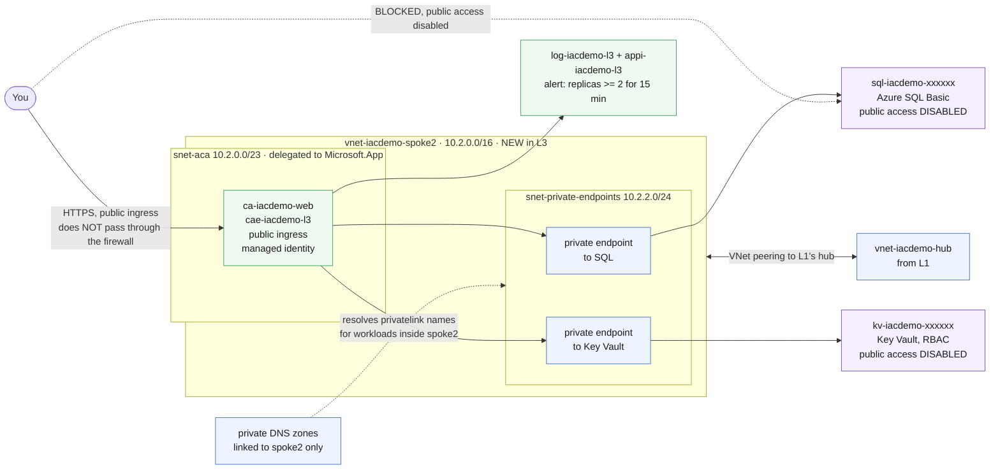

# L3 — Containers, Data & Private Networking 🟠

**Goal:** modernize the app tier — Azure Container Apps instead of VMs, an Azure SQL backend, Key Vault and a managed identity for secrets, and Log Analytics / Application Insights monitoring with an email alert. This is where **private networking** arrives: SQL and Key Vault have public access **disabled** and are reachable only through private endpoints.

| Who this is for | Time | You need first | Cost while it runs |
|---|---|---|---|
| Lab 3 of 4 · everyone | ~20 min | L1 deployed. **L2 is not required.** | 🟠 ~$1.73/hr running total |

> [!IMPORTANT]
> **L1 must already be deployed** — L3 peers a new spoke to L1's hub. It also uses the **`SQL_ADMIN_PASSWORD`** from your `lab-settings.csv`, the one you set back in L1 and haven't needed until now.

## What you're building



<details><summary>Text description of this diagram</summary>

L3 creates a **second spoke** — `vnet-iacdemo-spoke2` (`10.2.0.0/16`) — and
peers it to L1's hub. It does not reuse L1's spoke, and it does not route
through L2's firewall: this stack branches off the hub on its own. L2 is not a
prerequisite.

The spoke holds two subnets. `snet-aca` (`10.2.0.0/23`) is delegated to
`Microsoft.App/environments` and runs the Container Apps environment and the
web app. `snet-private-endpoints` (`10.2.2.0/24`) holds one private endpoint
for SQL and one for Key Vault.

Both data services have **public network access disabled**, so a connection
from your laptop fails. The app reaches them over private endpoints using its
managed identity. The private DNS zones are what make that work — they resolve
the `privatelink` hostnames to private addresses, and they are linked to
**spoke2 only**, so the name resolves privately from inside that VNet and
nowhere else.

One thing worth being explicit about: the container app itself is **publicly
reachable** (`ingressExternal: true`). "Private networking" here applies to the
data tier, not the front door.

</details>

**Source:** [`labs/L3-containers/main.bicep`](https://github.com/saulpatinojr/Demo-IaC_Demo_with_VSCode/blob/main/labs/L3-containers/main.bicep) · [`labs/L3-containers/main.bicepparam`](https://github.com/saulpatinojr/Demo-IaC_Demo_with_VSCode/blob/main/labs/L3-containers/main.bicepparam)

> [!NOTE]
> **Why a second spoke instead of reusing L1's?** Because these workloads have different needs. The Container Apps environment requires a subnet **delegated** to `Microsoft.App/environments` — Azure hands that subnet over and you can't put anything else in it — and the private endpoints want their own space. Giving L3 its own spoke off the same hub is the standard pattern: shared services in the hub, each workload in its own spoke, none of them entangled.
>
> It also means L3 doesn't depend on L2. If you tore the firewall down to save money, this lab still works.

<br>

## 🚀 Deploy it — pick any one of three ways

All three deploy the **same** template and give the **same** result.

<table>
<tr>
<td align="center" width="240"><br><br><b>1 · Bicep CLI</b><br><sub>Copy-paste in the terminal</sub></td>
<td align="center" width="240"><br><br><b>2 · GitHub Actions</b><br><sub>One button in the browser</sub></td>
<td align="center" width="240"><br><br><b>3 · GitHub Copilot</b><br><sub>Ask AI in plain English</sub></td>
</tr>
</table>

<br>

---

## &nbsp; Option 1 · Bicep from the terminal

**Best if you like the command line.** Your values are already loaded from `lab-settings.csv` (set up in L1) — nothing to re-type.

```powershell
az deployment group what-if --resource-group $env:AZURE_RESOURCE_GROUP --parameters labs/L3-containers/main.bicepparam
az deployment group create  --resource-group $env:AZURE_RESOURCE_GROUP --parameters labs/L3-containers/main.bicepparam
```

**You should see:** an `appUrl` output ending in `.azurecontainerapps.io`. The alert email goes to whatever you put in the `ALERT_EMAIL` column.

<br>

---

## &nbsp; Option 2 · GitHub Actions (push-button)

**Best if you'd rather click a button.** Needs the one-time `Setup-Oidc.ps1` from L1 — and no `lab-settings.csv`, because Actions reads the GitHub secrets instead.

On GitHub: **Actions → "Deploy L3 - Containers & Data" → Run workflow** (or `gh workflow run deploy-l3.yml`).

**You should see:** **Lint → What-if → Deploy**, then a final step printing the app URL.

<br>

---

## &nbsp; Option 3 · GitHub Copilot (plain English)

**Best if you'd rather describe the change** and have AI edit and deploy it.

Copilot runs the deploy **locally**, so load your values once first (same file as Option 1): `./scripts/Load-LabSettings.ps1`.

Open **Copilot Chat → Agent mode**:

> Deploy `labs/L3-containers/main.bicep` to my lab resource group (`$env:AZURE_RESOURCE_GROUP`) with `az deployment group create`.

**Want to scale it first?** Ask:

> In `labs/L3-containers/main.bicep`, raise `maxReplicas` to 5 and add an env var `GREETING=Hello L3` to the container, run `az bicep build`, then deploy.

Copilot edits, verifies, and deploys — and fixes any error you paste back.

<br>

---

## ✅ Verify it

1. **The app is up** — open the `appUrl` from the deploy output, or fetch it:

   ```powershell
   az containerapp show -g $env:AZURE_RESOURCE_GROUP -n "ca-$env:AZURE_PREFIX-web" `
     --query "properties.configuration.ingress.fqdn" -o tsv
   ```

   **You should see:** the Container Apps quickstart page. Note that this front end is deliberately **public** — the private networking in this lab protects the data tier, not the app.

2. **SQL is unreachable from outside** — from your machine:

   ```powershell
   $SQL = az sql server list -g $env:AZURE_RESOURCE_GROUP `
     --query "[?starts_with(name, 'sql-$env:AZURE_PREFIX-')].name | [0]" -o tsv
   nslookup "$SQL.database.windows.net"
   ```

   **You should see:** the name resolve to a **public** address, and any connection attempt refused — public network access is disabled. Resolution working while connection fails is the expected split.

3. **The same name resolves privately from inside the spoke** — this is the half that proves private endpoints work, and it has to run *inside* the VNet, because the private DNS zones are linked to `spoke2` only:

   ```powershell
   az containerapp exec -g $env:AZURE_RESOURCE_GROUP -n "ca-$env:AZURE_PREFIX-web" `
     --command "getent hosts $SQL.database.windows.net"
   ```

   **You should see:** a **`10.2.2.x`** address — inside `snet-private-endpoints`. Same hostname, different answer depending on where you ask. That is exactly what a private endpoint plus a private DNS zone does, and why running this from L1's Bastion VM would fail: it sits in a different VNet with no link to those zones.

4. **Monitoring fires** — scale up and wait for the alert:

   ```powershell
   az containerapp update -g $env:AZURE_RESOURCE_GROUP -n "ca-$env:AZURE_PREFIX-web" --min-replicas 2
   ```

   **You should see:** a `HighReplicaCount` email at your `ALERT_EMAIL` within about 15 minutes — the rule evaluates over a 15-minute window. Scale back down afterwards with `--min-replicas 1` so you stop paying for the second replica.

>  **GitHub feature spotlight · OIDC federated credentials**
>
> **You just used it:** if you deployed with Option 2, GitHub deployed private networking into your Azure subscription and **there is no cloud password stored anywhere** — not in the repo, not in a secret, not on your machine. The workflow asked GitHub for a signed token describing itself, and Entra ID traded it for a short-lived Azure token.
> **Find it:** **Settings → Secrets and variables → Actions**. `AZURE_CLIENT_ID` is an identifier, not a credential — publishing it would be harmless. There is no client secret to find.
> **Beyond the lab:** this is the modern answer to the oldest problem in CI. Nothing to leak, nothing to rotate, and a fork can't use it — its token names a different repository, so the subject check fails.
> [Docs →](https://docs.github.com/actions/deployment/security-hardening-your-deployments/about-security-hardening-with-openid-connect)

<br>

---

## ➡️ What carries forward

L4 treats everything you just built as the **primary region**. It adds a second-region copy of the app, joins your SQL database to a failover group, and puts Azure Front Door in front of both — then asks whether the result would actually survive an outage.

**Leave L3 deployed** → **[continue to L4](https://github.com/saulpatinojr/Demo-IaC_Demo_with_VSCode/wiki/L4-Global-Scale)**.
