# L4 — Global Scale 🔴

**Goal:** the "production upgrade" of L3 — survive a regional outage. A second-region app stack, an **Azure SQL failover group**, and **Azure Front Door** as the single global entry point with health-probed failover.



Files: [`labs/L4-global/main.bicep`](https://github.com/saulpatinojr/Demo-IaC_Demo_with_VSCode/blob/main/labs/L4-global/main.bicep) · [`labs/modules/sql-failover-group.bicep`](https://github.com/saulpatinojr/Demo-IaC_Demo_with_VSCode/blob/main/labs/modules/sql-failover-group.bicep)

> ⚠️ **L3 must already be deployed** — L4 reuses the **same** SQL password so the failover group's two servers match.

<br>

## 🚀 Deploy L4 — pick any one of three ways

All three deploy the **same** template and give the **same** result.

<table>
<tr>
<td align="center" width="240"><br><br><b>1 · Bicep CLI</b><br><sub>Copy-paste in the terminal</sub></td>
<td align="center" width="240"><br><br><b>2 · GitHub Actions</b><br><sub>One button in the browser</sub></td>
<td align="center" width="240"><br><br><b>3 · GitHub Copilot</b><br><sub>Ask AI in plain English</sub></td>
</tr>
</table>

<br>

---

## &nbsp; Option 1 · Bicep from the terminal

> [!NOTE]
> **Best if you like the command line.** Values are already loaded from `lab-settings.csv` (set up in L1) — nothing to re-type.

```powershell
az deployment group what-if --resource-group $env:AZURE_RESOURCE_GROUP --parameters labs/L4-global/main.bicepparam
az deployment group create  --resource-group $env:AZURE_RESOURCE_GROUP --parameters labs/L4-global/main.bicepparam
```

The output prints your Front Door endpoint (`<name>.azurefd.net`). Front Door propagation can take ~10 minutes after the first deploy.

<br>

---

## &nbsp; Option 2 · GitHub Actions (push-button)

> [!TIP]
> **Best if you'd rather click a button.** Needs the one-time `Setup-Oidc.ps1` from L1.
> No `lab-settings.csv` needed — Actions uses the GitHub secrets from that setup.

On GitHub: **Actions → "Deploy L4 - Global Scale" → Run workflow** (or `gh workflow run deploy-l4.yml`). Signs in with OIDC, runs Lint → What-if → Deploy.

<br>

---

## &nbsp; Option 3 · GitHub Copilot (plain English)

> [!IMPORTANT]
> **Best if you'd rather describe the change** and have AI edit + deploy it.

Copilot runs the deploy **locally**, so load your values once first (same file as Option 1): `./scripts/Load-LabSettings.ps1`.

Open **Copilot Chat → Agent mode**:

> Deploy `labs/L4-global/main.bicep` to my lab resource group (`$env:AZURE_RESOURCE_GROUP`) with `az deployment group create`.

**Want to change the routing first?** Ask:

> Switch the Front Door origin group in `labs/L4-global/main.bicep` to weighted round-robin between both regions instead of priority failover, run `az bicep build`, then deploy.

Copilot edits, verifies, and deploys — and fixes any error you paste back.

<br>

---

## ✅ Test it (3 ways)

```powershell
$RG = $env:AZURE_RESOURCE_GROUP; $PREFIX = $env:AZURE_PREFIX; $FDE = "<your-fde-endpoint>.azurefd.net"
```

1. **Global entry point** —
   ```powershell
   curl.exe -sI "https://$FDE/"
   ```
   You should see an HTTP success response from the primary region.
2. **Simulated regional failure** — stop the primary app and watch Front Door reroute to the secondary region (probes take 30–90 s):
   ```powershell
   $APP = "ca-$PREFIX-web"
   $REVISION = az containerapp revision list -g $RG -n $APP --query "[0].name" -o tsv
   az containerapp revision deactivate -g $RG -n $APP --revision $REVISION
   curl.exe -s "https://$FDE/"
   ```
   The endpoint still responds, now through the secondary region. Reactivate the revision afterwards.
3. **Database failover** —
   ```powershell
   $PRIMARY_SQL = az sql server list -g $RG --query "[?starts_with(name, 'sql-$PREFIX-') && !ends_with(name, '-dr')].name | [0]" -o tsv
   $DR_SQL      = az sql server list -g $RG --query "[?starts_with(name, 'sql-$PREFIX-') &&  ends_with(name, '-dr')].name | [0]" -o tsv
   $FOG         = az sql failover-group list -g $RG --server $PRIMARY_SQL --query "[0].name" -o tsv
   az sql failover-group set-primary -g $RG --server $DR_SQL --name $FOG
   ```
   The secondary is now primary; fail back the same way in reverse.

<br>

---

## 🎉 You're done

Tear everything down when finished — Front Door, Firewall, Bastion and SQL all bill while idle:

```powershell
./scripts/Cleanup-Labs.ps1 -ResourceGroup $env:AZURE_RESOURCE_GROUP -WhatIf
./scripts/Cleanup-Labs.ps1 -ResourceGroup $env:AZURE_RESOURCE_GROUP
```

Then check **[Troubleshooting](https://github.com/saulpatinojr/Demo-IaC_Demo_with_VSCode/wiki/Troubleshooting)** and **[Tools and References](https://github.com/saulpatinojr/Demo-IaC_Demo_with_VSCode/wiki/Tools-and-References)** for going further.
